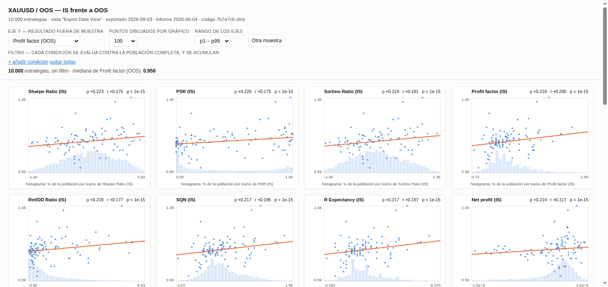
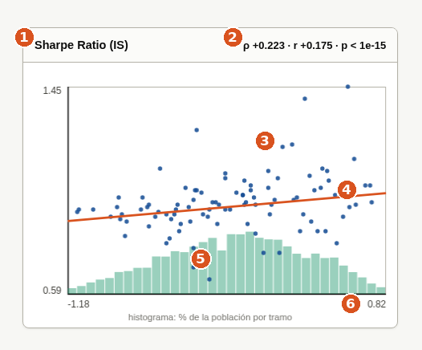
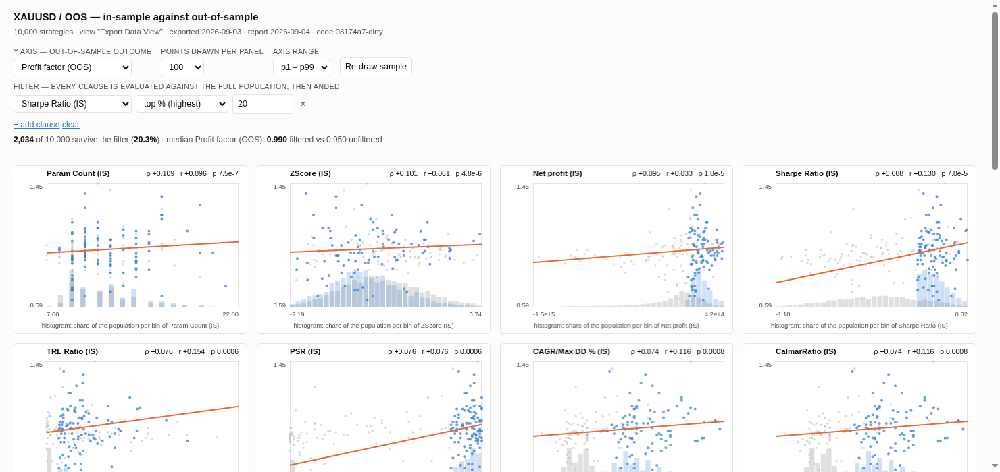

# 1. Análisis IS/OOS — qué métrica del histórico predice el futuro

## Qué pregunta responde

Cuando SQX genera miles de estrategias, todas se ven bien en el periodo con el que se construyeron
(**IS**, *in-sample*, el histórico). La pregunta es cuáles siguen viéndose bien en el periodo que no
vieron nunca (**OOS**, *out-of-sample*, el futuro simulado).

Este análisis coge todas las estrategias de un databank y mide, métrica por métrica, **cuánta
información sobre el OOS hay en el IS**. Si el Sharpe del histórico no dice nada del futuro, filtrar
por Sharpe al generar es tirar el tiempo. Si dice algo, dice cuánto.

## Cuándo lo usas, y cuándo no

**Lo usas** cuando tienes un databank grande de estrategias generadas y quieres decidir con qué
criterio filtrarlas — o con qué criterio configurar la generación en SQX para el siguiente activo.

**No lo usas** si las estrategias del databank ya fueron seleccionadas por su resultado OOS. Ahí el
análisis mide tu propia selección, no la realidad, y sale un resultado bonito y falso. Necesita
estrategias generadas **al azar** y sin filtrar por el resultado que estás estudiando.

Tampoco sirve para elegir una estrategia concreta. Habla de la población entera.

## Antes de empezar

Necesitas dos cosas:

1. **Un databank con estrategias** en el proyecto de SQX, retesteado, con periodo IS y OOS.
2. **Una vista de databank llamada `Export Data View`** definida en SQX. Es la que decide qué
   columnas salen y si cada una es del periodo IS, del OOS o del total. Ya existe en esta máquina.

No hace falta cerrar SQX. Los scripts usan el worker, que es una instalación aparte.

## Cómo se ejecuta

Son dos comandos. El primero saca los datos de SQX; el segundo los analiza.

```bash
cd ~/Desktop/AlgoProject

# 1. refrescar el CSV desde SQX  (minutos: arranca el worker, exporta y lo para)
python3 -m sqx.export.export_metrics --project XAUUSD --databank OOS

# 2. analizar y generar el reporte  (~1 segundo, no toca SQX)
python3 -m tasks.reports.is_oos --project XAUUSD --databank OOS
```

**El paso 1 solo cuando quieras datos nuevos.** El paso 2 lo puedes repetir las veces que quieras.

### `export_metrics.py`

| flag | obligatorio | qué hace |
|---|---|---|
| `--project` | sí | nombre del proyecto tal y como aparece en SQX. Sin espacios: guiones bajos |
| `--databank` | sí | nombre del databank, p. ej. `OOS` |
| `--view` | no | vista de SQX que define las columnas. Por defecto `Export Data View` |

⚠️ **Borra la exportación anterior de ese databank antes de escribir la nueva.** A propósito: así
solo hay un CSV y nunca te preguntas cuál es el bueno. Lo que sí se conserva son los reportes.

### `is_oos.py`

| flag | obligatorio | qué hace |
|---|---|---|
| `--project` | sí | el mismo proyecto del paso 1 |
| `--databank` | sí | el mismo databank del paso 1 |

No toca SQX. Solo lee el CSV que dejó el paso 1.

## Qué produce

```
~/Desktop/AlgoData/reports/XAUUSD/OOS/2026-09-04/
    explorer.html    el panel interactivo. Lo abres con doble clic
    summary.md       las conclusiones escritas, en texto
    manifest.json    de qué exportación salió y de qué fecha
```

Una carpeta por día. Los reportes viejos no se borran nunca.

```bash
xdg-open ~/Desktop/AlgoData/reports/XAUUSD/OOS/2026-09-04/explorer.html
```

## Cómo se lee el panel



Arriba están los controles; abajo, un gráfico por cada métrica del IS. **Los gráficos se reordenan
solos**: el de arriba a la izquierda es siempre el que más relación tiene con lo que has puesto en
el eje Y.

### Anatomía de un gráfico



| | qué es |
|---|---|
| **1** | la métrica del **IS** que va en el eje X. La del eje Y es la que elegiste arriba, igual en todos |
| **2** | la fuerza de la relación. **ρ (rho)** es la que manda; va de −1 a +1 y **0 significa que no hay relación**. `r` es lo mismo calculado de otra forma: si las dos se parecen, fíate; si no, hay valores extremos distorsionando. `p` es la probabilidad de ver esto por pura casualidad — cuanto más pequeño, mejor |
| **3** | cada punto es una estrategia |
| **4** | la línea de tendencia. Si sube, más de esa métrica en el IS va con mejor resultado OOS |
| **5** | **el histograma: dónde están de verdad las estrategias.** Aquí casi todas están amontonadas a la izquierda, así que esa línea de tendencia la está estirando un puñado de puntos de la derecha. Sin el histograma no lo verías |
| **6** | los extremos del eje |

**Un ρ de 0,2 es una relación real pero floja.** Mueve las probabilidades, no decide el resultado.
No esperes 0,8: en este negocio no existe.

### Los controles

| control | qué hace |
|---|---|
| **Eje Y** | cambia la métrica de resultado OOS que estás intentando predecir |
| **Puntos dibujados por gráfico** | cuántos puntos se **dibujan**, por defecto 100. Dibujar 10.000 puntos tapa el gráfico entero. **Los números no cambian**: ρ, la línea y el histograma siempre usan todas las estrategias. Esto solo afecta a lo que ves |
| **Rango de los ejes** | por defecto recorta el 1% de cada extremo, porque cuatro estrategias absurdas te aplastan el gráfico. `completo` enseña todo |
| **Otra muestra** | otros 100 puntos al azar, por si te ha tocado una muestra rara |

### Filtrar

Aquí es donde el panel deja de describir y empieza a servir para decidir. `+ añadir condición`
añade una regla: por ejemplo *quédate solo con el 20% de mejor Sharpe en el IS*. Las opciones
`% mejores` y `% peores` cortan por percentil; `>`, `≥`, `<` y `≤` cortan por un valor que escribes tú.



- **Gris** = las 10.000 estrategias. **Azul** = las que pasan el filtro.
- Arriba te dice cuántas sobreviven y **cómo cambia el resultado OOS típico** frente a no filtrar.
- Todos los números se recalculan sobre las que sobreviven.

Cada condición se evalúa contra la población **completa**. "Top 20%" es el 20% de las 10.000, no el
20% de lo que quedaba de una condición anterior. Varias condiciones se acumulan (tienen que
cumplirse todas).

En el ejemplo de arriba: filtrando por el 20% de mejor Sharpe IS sobreviven 2.034 estrategias y la
mediana del Profit factor OOS sube de 0,950 a 0,990.

## Cómo se lee `summary.md`

Es lo mismo en texto, pero calculado sobre las 10.000 y sin poder filtrar. Tiene tres partes:

**Persistencia** — si cada métrica mantiene su valor del IS al OOS. La columna `OOS/IS` por debajo
de 1 significa que empeora al salir del histórico, que es lo normal.

**Predicción** — para cada resultado OOS, el ranking de métricas del IS que lo anticipan.

**La columna `BH`** — un ✓ significa que ese resultado aguanta la corrección por haber probado
muchas métricas a la vez. Sin ✓, ignóralo aunque el número se vea bien: probando 21 métricas, una
sale bien por azar.

```
| IS metric          |      ρ |      r |         p | BH |
| Sharpe Ratio (IS)  | +0.223 | +0.175 | 2.04e-113 | ✓  |
| PSR (IS)           | +0.220 | +0.175 | 3.14e-110 | ✓  |
| # of trades (IS)   | -0.019 | -0.052 |    0.0519 |    |
```

## Un ejemplo completo

Pregunta: **¿me sirve el Sharpe del histórico para elegir estrategias de oro?**

```bash
cd ~/Desktop/AlgoProject
python3 -m tasks.reports.is_oos --project XAUUSD --databank OOS
```

```
10000 strategies, 21 IS metrics x 13 OOS
  /home/sergioguslw/Desktop/AlgoData/reports/XAUUSD/OOS/2026-09-04/explorer.html
  /home/sergioguslw/Desktop/AlgoData/reports/XAUUSD/OOS/2026-09-04/summary.md
```

Abres el panel, dejas `Profit factor (OOS)` en el eje Y y miras el primer gráfico: `Sharpe Ratio
(IS)`, ρ +0.223. Hay señal, pero floja.

Añades el filtro *Sharpe Ratio (IS) — top % — 20*. Arriba aparece:

> **2034** de 10.000 pasan el filtro (**20.3%**) · mediana de Profit factor (OOS): **0.990**
> filtrado vs 0.950 sin filtrar

Respuesta: **sí, pero poco.** Descartando el 80% de las estrategias, la mediana del profit factor
OOS pasa de 0,950 a 0,990 — sigue por debajo de 1. Sirve como un filtro más, no como *el* filtro.

Y algo que solo se ve haciéndolo: **con el filtro puesto, el ρ del propio Sharpe se desploma de
+0.223 a +0.088**, y pasa a mandar otra métrica. Dentro del 20% bueno, el Sharpe ya no distingue.
Ese es el motivo de que el panel recalcule todo al filtrar en vez de enseñarte siempre los mismos
números.

## Qué NO te dice

- **No dice que una estrategia sea buena.** Habla de tendencias en miles de estrategias. Una
  concreta puede estar en cualquier sitio de esa nube.
- **No dice que la métrica cause el resultado.** Dice que van juntas.
- **Solo vale para este activo y este periodo.** Que el Sharpe funcione en XAUUSD no dice nada de
  los índices. Hay que repetirlo por activo.
- **No te dice si el filtro merece la pena.** Ves que la mediana sube y cuántas estrategias pierdes,
  pero no si esa subida aguanta o es ruido de haber probado muchos filtros. Eso es el módulo
  *improvement*, descrito en `tasks/TODO.md` y todavía sin programar.
- **No hay costes reales metidos.** Son los números que da SQX con su configuración de comisiones.

## Si algo falla

**`FileNotFoundError: .../metrics/XAUUSD/OOS/metrics.csv`**
No has hecho el paso 1 para ese databank, o escribiste otro nombre. Los nombres son los de SQX,
con mayúsculas y todo.

**El CSV sale con una sola línea**
El worker exportó antes de terminar de cargar las estrategias. Vuelve a lanzar el paso 1.

**`explorer.html` tarda en abrir**
Normal: son unos megas porque lleva dentro las 10.000 estrategias, que es lo que le permite
recalcular al filtrar sin volver a pedir nada.

**El panel se ve en blanco**
Ábrelo con doble clic o con `xdg-open`. Arrastrarlo a una pestaña también funciona.
