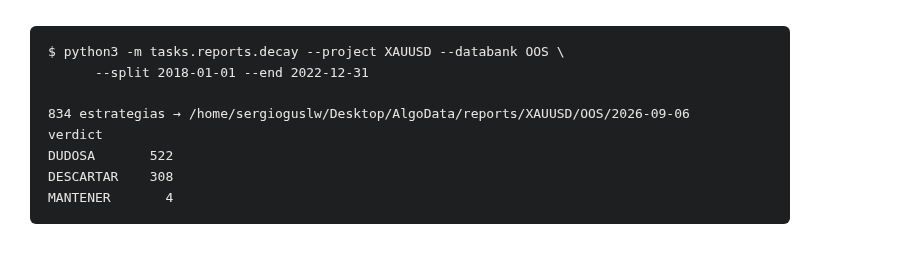
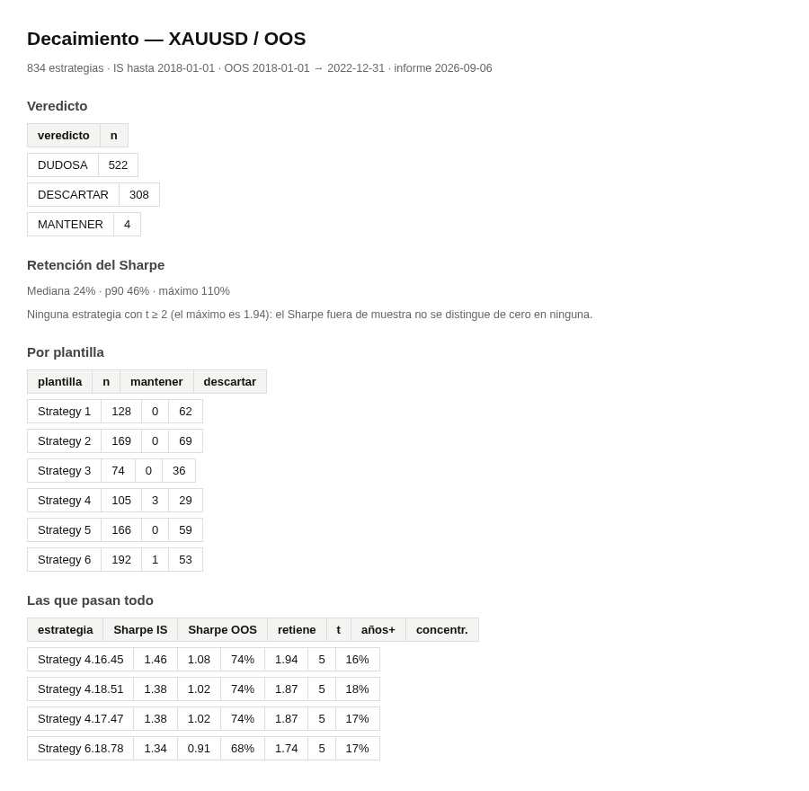

# 4. Decaimiento — cuánto del edge sobrevive fuera de muestra, y si te la quedas o no

### Qué pregunta responde

Generas estrategias sobre el histórico y luego las pruebas en un tramo que no vieron. Casi todas
empeoran. Este análisis te dice, **estrategia por estrategia**, cuánto empeoró y si lo que le queda
es un edge de verdad o el rastro de una racha con suerte. Termina con una sentencia por estrategia:
`MANTENER`, `DUDOSA` o `DESCARTAR`.

La pregunta que hay detrás es la de Marcos López de Prado: una caída fuerte de rendimiento al salir
de la muestra es el síntoma clásico del sobreajuste. Pero la caída sola engaña, y por eso aquí no
se decide con ella. Se decide con tres cosas a la vez:

1. **¿El Sharpe fuera de muestra se distingue de cero?** Un Sharpe de 0,4 medido sobre cinco años
   tiene un error de ±0,45. Es decir: podría ser cero. La columna `t` es el Sharpe dividido por su
   propio error; por debajo de 1,65 no puedes afirmar que haya nada.
2. **¿Ganó todos los años, o solo alguno?** Con cinco años por delante, ganar tres es lo que sale
   tirando una moneda.
3. **¿De dónde sale el beneficio?** Si más de la mitad viene de un solo trimestre, no tienes una
   estrategia: tienes un billete de lotería premiado. La columna `concentración` por encima del
   100% significa que fuera de ese trimestre la estrategia **pierde**.

### Cuándo lo usas, y cuándo no

Úsalo cuando ya tienes un databank con estrategias que llevan resultado guardado en dos tramos —
un IS y un OOS — y quieres saber con cuáles quedarte.

**Cuándo NO sirve:**

- Si el databank no tiene tramo fuera de muestra, no hay nada que comparar.
- Si ya filtraste ese mismo tramo OOS por rendimiento (por ejemplo "net profit > 0" sobre todo el
  OOS), el veredicto es **descriptivo, no predictivo**. Te dice lo que pasó, no lo que pasará: las
  estrategias que están ahí lo están precisamente porque ese tramo les salió bien. Para que fuera
  predictivo, el tramo con el que juzgas tendría que no haberse usado nunca para filtrar.
- No sirve para comparar plantillas entre sí sobre el papel. Agrupa por plantilla solo para que
  veas de dónde salen las supervivientes; no promedia nada, porque estrategias de plantillas
  distintas no son la misma población.

### Antes de empezar

- El databank tiene que estar **volcado a disco**. SQX guarda las estrategias en memoria y solo
  escribe los `.sqx` al sincronizar; si la carpeta está vacía, abre SQX, entra en el databank y
  deja que sincronice.
- **No hace falta arrancar nada.** Este comando lee los `.sqx` directamente y no usa SQX ni el
  worker, así que puedes lanzarlo con la GUI abierta sin ningún riesgo.

### Cómo se ejecuta

```bash
python3 -m tasks.reports.decay --project XAUUSD --databank OOS \
        --split 2018-01-01 --end 2022-12-31
```

| flag | obligatorio | qué hace |
|---|---|---|
| `--project` | sí | nombre del proyecto tal y como aparece en SQX |
| `--databank` | sí | nombre del databank, con sus espacios si los tiene |
| `--split` | sí | primer día del tramo fuera de muestra. Todo lo anterior es IS |
| `--end` | sí | último día que se mira. Lo posterior se ignora |

Tarda unos segundos para 834 estrategias. No toca SQX.



### Qué produce

En `~/Desktop/AlgoData/reports/<proyecto>/<databank>/<fecha>/`:

| archivo | qué es |
|---|---|
| `decay.csv` | una fila por estrategia con todas las columnas y su veredicto |
| `decay.md` | el resumen escrito: recuento, retención, desglose por plantilla y las que pasan todo |
| `manifest.json` | qué se analizó, con qué fechas y con qué versión del código |

Los informes se acumulan por fecha: uno nuevo no borra el anterior.

### Cómo se lee el resultado



**Las columnas del CSV**, de izquierda a derecha:

| columna | qué es | qué valor es bueno |
|---|---|---|
| `sharpe_is` | Sharpe anualizado en el tramo de entrenamiento | contexto, no criterio |
| `sharpe_oos` | Sharpe anualizado fuera de muestra | cuanto más alto, mejor |
| `retention` | `sharpe_oos / sharpe_is`: la fracción del edge que sobrevivió | 100% sería no perder nada; en la práctica la mediana ronda el 25% |
| `t` | `sharpe_oos` dividido por su error típico | **la columna que manda.** Por debajo de 1,65 no hay evidencia de edge |
| `years_positive` | años del tramo OOS que cerró en verde | 4 o 5 de 5 |
| `worst_year` | el peor año, en dinero | mide lo que tendrías que aguantar |
| `concentration` | qué parte del beneficio salió de su mejor trimestre | por debajo del 40%. Por encima del 100%, pierde el resto del tiempo |
| `verdict` | la sentencia | ver abajo |

**Las tres sentencias:**

- **`DESCARTAR`** — el Sharpe fuera de muestra es negativo, o perdió en la mitad de los años, o más
  del 60% del beneficio viene de un solo trimestre. Cualquiera de las tres basta.
- **`MANTENER`** — `t` ≥ 1,65, ganó en 4 de 5 años y ninguna concentración por encima del 40%.
- **`DUDOSA`** — todo lo demás. No es un aprobado flojo: es "los datos no dan para decidir".
  La mayoría cae aquí, y eso **es** el resultado, no un fallo del análisis.

### Un ejemplo completo

Sobre el databank `OOS` de XAUUSD, 834 estrategias que ya habían pasado un filtro de net profit
positivo fuera de muestra:

```
$ python3 -m tasks.reports.decay --project XAUUSD --databank OOS \
        --split 2018-01-01 --end 2022-12-31

834 estrategias → /home/sergioguslw/Desktop/AlgoData/reports/XAUUSD/OOS/2026-09-06
verdict
DUDOSA       522
DESCARTAR    308
MANTENER       4
```

Cómo se lee esto:

- **La retención mediana es del 24%.** De cada estrategia sobrevive una cuarta parte de su Sharpe.
  Eso no es una anomalía de unas pocas: es lo que le pasa a la población entera.
- **308 se descartan**, y el motivo dominante no es perder dinero — todas ganaban — sino la
  concentración: 283 sacan más del 60% de su beneficio de un solo trimestre, y 175 de ellas pierden
  dinero fuera de ese trimestre.
- **Ninguna llega a `t` = 2.** El máximo es 1,94. Traducido: ni una sola de las 834 tiene un
  rendimiento fuera de muestra que se distinga de la suerte con el criterio habitual del 5%.
- **Las 4 que pasan todo retienen entre el 68% y el 74% de su Sharpe**, ganan los cinco años y no
  concentran. Y 3 de las 4 salen de la misma plantilla.

### Qué NO te dice

- **No te dice que las 4 supervivientes funcionen.** Dice que son las únicas que no puedes
  descartar con estos datos. Con 834 candidatas, que 4 destaquen es aproximadamente lo que produce
  el azar: si pruebas suficientes cosas, algunas salen bien solas. La confirmación tiene que venir
  de un tramo que estas estrategias no hayan visto nunca — un walk-forward hacia delante.
- **La retención por sí sola no clasifica.** Una estrategia que retiene el 90% de un edge que ya
  era ruido no vale más que una que retiene el 10% de uno bueno. Por eso la sentencia se apoya en
  `t`, en los años y en la concentración, y la retención se informa pero no decide.
- **No corrige por el número de intentos.** Si generaste 50 000 estrategias para quedarte con 834,
  el rendimiento de las mejores está inflado por esa búsqueda, y este informe no lo descuenta.
- **No mira las operaciones, mira la curva de equity diaria.** Un Sharpe calculado sobre P&L diario
  no es idéntico al que muestra SQX en el databank, que se calcula por operación. Las conclusiones
  no cambian, los decimales sí.

### Si algo falla

- **`StopIteration` al leer un `.sqx`** — ese archivo no tiene curva de equity guardada, casi
  siempre porque la estrategia nunca llegó a ejecutarse en un backtest completo. Reconstrúyela en
  SQX o sácala del databank.
- **Salen 0 estrategias** — la carpeta del databank está vacía en disco. Es lo normal si SQX no ha
  sincronizado todavía: abre el databank en la GUI y espera a que escriba.
- **`years_positive` sale siempre 1** — te has equivocado con `--split` o `--end` y el tramo fuera
  de muestra cabe en un solo año natural.
