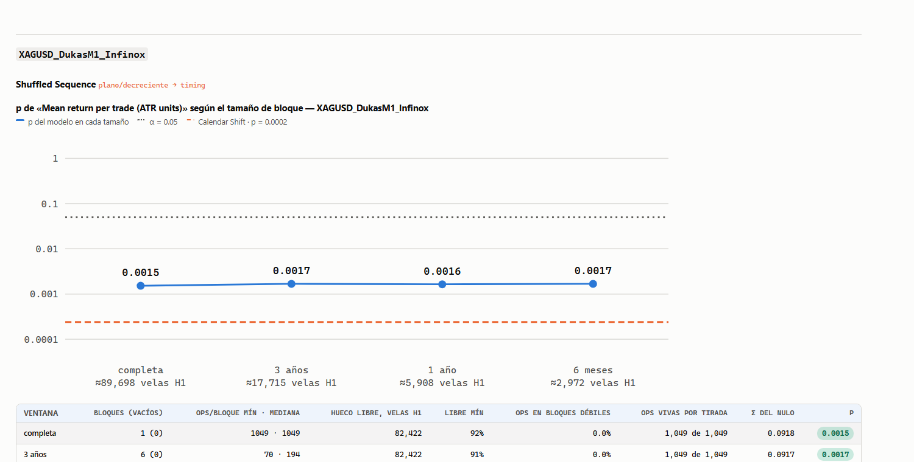
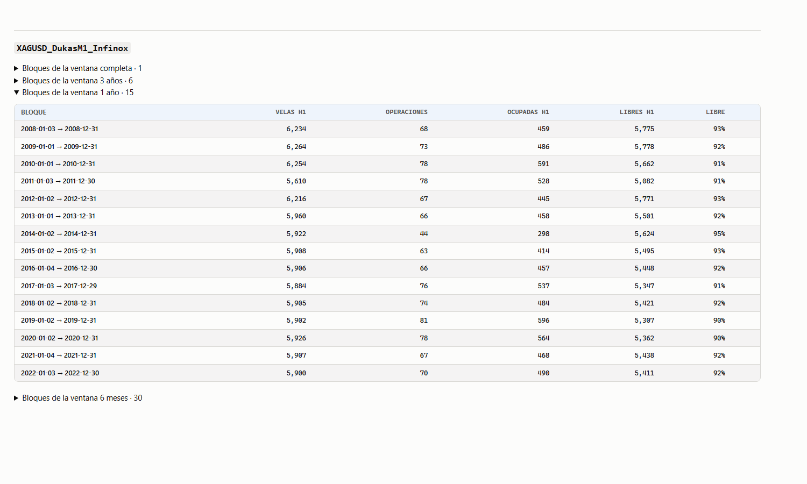

# 5. Retest en mercados adicionales — ¿el sistema gana por acertar CUÁNDO entra, o por estar comprado?

### Qué pregunta responde

Una estrategia long-only que opera en un mercado que sube gana dinero casi haga lo que haga. Eso no
es habilidad: es estar comprado. La pregunta que responde este módulo es otra, y es la única que
importa:

> Si cogemos exactamente el mismo ritmo de operar —el mismo número de operaciones, la misma duración
> de cada una, los mismos huecos entre ellas, el mismo día de la semana y la misma hora— y lo
> colocamos en momentos **al azar** del mismo mercado, ¿habría ganado lo mismo?

Se generan miles de esas versiones al azar y se mira dónde queda la de verdad. Si la de verdad queda
entre las mejores, sus entradas llevan información. Si queda en el montón, lo que había era la
deriva del mercado y nada más.

Se hace sobre mercados que la estrategia **nunca vio** cuando se optimizó. Ahí sus entradas son
efectivamente ciegas, y batir al azar en varios de ellos es algo que el sobreajuste no puede fabricar.

### Cuándo lo usas, y cuándo no

**Lo usas** después de haber pasado tus estrategias por un retest multi-mercado en SQX, para decidir
cuáles siguen adelante.

**No lo usas** para saber si una estrategia está sobreajustada al oro. No lo detecta, y decirlo al
revés es el error más fácil de cometer con este informe. Lo que mide es si el acierto **se traslada**
a otros mercados.

**No lo usas** sobre el propio activo base. La estrategia se optimizó ahí, así que gana a lo aleatorio
por construcción: en la prueba de este módulo sobre oro, las ocho estrategias probadas salieron con
p entre 0.0002 y 0.007. Eso no dice nada bueno de ellas, sólo dice que el código funciona. Por eso el
activo base no es un mercado más: sale en el informe como **referencia**, nunca como evidencia.

**No esperes un veredicto.** Este módulo no dice MANTENER ni DESCARTAR, y no esconde ningún mercado.
Te da los números y, al lado de cada uno, la lista de motivos para desconfiar de él. La decisión la
tomas tú. Antes no era así: un mercado con menos de 30 operaciones o con órdenes pendientes se caía
entero del análisis, y eso costó tirar un resultado de Brent con p = 0,005 por culpa de un 8% de
entradas que no caían en apertura de vela.

### Antes de empezar

Tres cosas, en este orden:

1. **En SQX**, pasa tus estrategias por una tarea de retest sobre mercados adicionales, y deja el
   resultado en una databank. Los mercados que elijas ahí son los que manda: el módulo **descubre**
   de la exportación en qué mercados se retesteó de verdad, leyendo la columna `Symbol` de las
   propias operaciones. `markets.yaml` sólo les pone categoría y nombre.
2. **Exporta en cuanto termine.** Varias databanks se vacían en cada ciclo de la cadena de tareas, y
   la sincronización horaria borra del disco lo que no está en memoria. Si el retest queda ahí una
   noche, puede no estar por la mañana.
3. **Fija la lista de mercados antes de mirar resultados.** Elegir los mercados después de ver dónde
   funciona convierte la prueba en una selección y los p-valores en decoración.

Comprueba lo que vas a aplicar de costes:

```bash
python3 -m core.assets XAUUSD
```

Que salga `UNDECIDED` **no bloquea este módulo**, y es la única excepción a esa regla en todo el
proyecto. El motivo: aquí no se autoriza nada, se reproduce lo que SQX ya simuló. El coste se recupera
operación a operación de los propios datos exportados (`precio bruto − beneficio reportado`), no se
elige. En el oro eso mide 8 $ por lote y lado, que es exactamente lo que SQX tiene configurado.

### Dónde se clasifican los mercados

En `strategies/crossmarket/markets.yaml`, un bloque por activo base y, dentro, una lista por
categoría:

```yaml
XAUUSD:
  main: XAUUSD_DukasM1_Infinox
  timeframe: M30
  categories:
    family:
      - {feed: XAGUSD_DukasM1_Infinox, data_from: 2003-08-08}
      - {feed: BRENTCMDUSD_ftmo, data_from: unknown}
    structure: []
```

**Este fichero clasifica; no decide qué existe.** Lo que se analiza sale de la exportación: la
carpeta `trades/<mercado>/` que dejó el paso 2 se construye desde la columna `Symbol` de las
operaciones, así que no puede mentir. Si un mercado aparece en el export y no está aquí, se analiza
igual y sale marcado como `sin clasificar`. Si está aquí y el export no trae operaciones suyas, el
panel lo imprime al arrancar como ausente. Antes, un desajuste entre los dos salía como un mercado
con cero estrategias, que no parece un error y lo es.

`feed` tiene que estar escrito **exactamente** como lo llama SQX. `data_from` es la primera fecha con
datos de ese mercado: no filtra nada, está para que veas cuánta ventana común te queda de verdad.
Las categorías (`family`, `structure`, y las que vengan) son etiquetas: salen en las tablas y no
cambian ningún cálculo.

La lista sigue fijándose **antes** de mirar resultados. Elegir mercados después de ver dónde funciona
convierte la prueba en una selección.

### Cómo se ejecuta

Dos comandos preparan los datos, y el tercero abre el panel — que es la **única** forma de correr la
prueba, y corre **una estrategia cada vez**.

```bash
# 1. Las barras de todos los mercados (una arranca de SQX por mercado, ~1 min cada una)
python3 -m sqx.export.export_bars --asset XAUUSD --from 2003.01.01 --to 2026.01.01

# 2. Los trades del retest, partidos por mercado (~4 min por cada 200 estrategias)
python3 -m sqx.export.export_retest --project XAUUSD --databank "Retest Markets - Family"

# 3. El panel
python3 -m strategies.crossmarket.explorer.serve --project XAUUSD \
    --databank "Retest Markets - Family" --asset XAUUSD --export 2026-09-14
```

| flag | obligatorio | qué hace |
|---|---|---|
| `--asset` | sí | activo base. Es la clave que se busca en `markets.yaml` |
| `--project` | sí | proyecto en el master |
| `--databank` | sí | la databank donde dejaste el retest |
| `--export` | sí (paso 3) | la fecha del export del paso 2, `AAAA-MM-DD` |
| `--limit` | no (paso 2) | exporta una muestra aleatoria reproducible de N estrategias en vez de todas |
| `--set` | no (paso 3) | cambia un knob de `config.yaml` al arrancar, p. ej. `--set nulls.draws=20000` |
| `--port` | no (paso 3) | puerto del panel. Por defecto 8766 |

Los pasos 1 y 2 **arrancan SQX** (el worker, nunca el master) y se pueden ejecutar con tu interfaz
abierta. El paso 3 no toca SQX: sólo lee ficheros.

**Nada se guarda.** No hay caché, no hay fichero de resultados y no hay informe. Cada número que ves
sale del botón que acabas de pulsar, y al cerrar el panel se pierde. Al arrancar borra además
cualquier resultado que versiones anteriores dejaran en `AlgoData/derived/crossmarket/`. Es
deliberado: un resultado guardado siempre se acaba leyendo como respuesta a una pregunta que no era
la suya. El precio es real — unos **36-52 segundos por estrategia** con las 25.000 tiradas por defecto sobre dos
mercados, y se paga otra vez si cierras el panel.

### El panel, de arriba abajo

**Arriba**: el desplegable de estrategias. Al elegir una aparece debajo **la lista de los mercados
adicionales en los que SQX la retesteó**, cada uno con su categoría y un punto que se pone verde
cuando ya está analizado.

| botón | qué corre |
|---|---|
| **Run analysis** | La estrategia entera: todos los mercados, los cuatro modelos nulos (cinco si activas Regime Strata), el barrido de ventana y todas las pruebas |
| **run**, al lado de un mercado | Sólo ese mercado, con la configuración que tenga el cajón en ese momento. **Se fusiona** con lo que ya hubiera: puedes re-ejecutar plata a 50.000 tiradas sin perder el Brent que ya tenías |

Un mercado en el que esa estrategia **nunca disparó** sale en gris, como `sin operaciones` y sin
botón. El export sólo escribe el fichero de un mercado si hubo operaciones ahí, así que esa ausencia
es un resultado sobre la estrategia, no un dato que falte.

**La barra de progreso** avanza de forma continua, no a saltos: los backtests aleatorios se sortean
por lotes y la barra se mueve varias veces dentro de cada modelo. La línea de debajo dice qué
mercado y qué modelo está corriendo ahora mismo.

### El cajón de configuración

El triángulo ▸ abre **los 46 knobs de `config.yaml`**, agrupados por sección y cada uno con su
explicación al pasar el ratón. Cambiar un valor afecta a la **siguiente** ejecución: nada se escribe
a disco.

| grupo | lo que controla |
|---|---|
| **Modelos nulos** | cuántos backtests aleatorios, la semilla, el bloque de régimen, qué modelos correr, si se replica el cierre del viernes, y el tamaño de lote |
| **Barrido de ventana** | qué tamaños de bloque, qué modelos se barren, cuál es la referencia, y los umbrales de potencia: meses mínimos, operaciones mínimas por bloque, hueco libre mínimo y qué parte de las operaciones puede caer en bloques débiles |
| **Estratos de régimen** | sólo para Regime Strata: cuántos cuantiles de ATR y cuántas velas para el signo de la tendencia |
| **Equity** | la cuenta de partida, cuántos puntos tiene cada curva, qué percentiles dibuja el cono y cuáles salen en las tablas |
| **Bootstrap** | tiradas, operaciones por bloque y percentiles de los intervalos de confianza |
| **Exposición (1c)** | el t mínimo de la deriva para que E se muestre, y qué hacer con las operaciones de MFE cero |
| **Test pareado (1b)** | el lado del test de Wilcoxon |
| **Propiedades del mercado** | lags de Hurst, horizonte del variance ratio, y los parámetros de ADX y eficiencia |
| **Coste y ejecución** | múltiplos de coste, desplazamiento en barras, fracciones de slippage, y los parámetros de la ejecución degradada |
| **Lectura y avisos** | alpha, los umbrales que disparan un aviso, la correlación supuesta y el umbral de PC1 |

**Ninguno de esos umbrales decide nada.** `alpha`, `min_trades` y `min_on_open` sólo colorean números
y disparan avisos; ningún mercado se cae por ellos.

### Las trece pestañas

| pestaña | qué muestra |
|---|---|
| **Resumen** | Tabla por mercado con el p de 1a y el de 1b, la categoría, cuántos avisos tiene cada uno, y las comprobaciones mecánicas |
| **Entrada aleatoria (1a)** | Sub-pestañas por **mercado**, y debajo por **modelo**. Dentro: la **curva de equity real sobre el cono de las aleatorias** y, a su lado, el histograma del indicador que elijas en el desplegable, con la mediana y el IC 95% marcados, su tabla de valores y el % de simulaciones que el real bate. Debajo, la tabla completa de percentiles |
| **Modelos** | El mismo p bajo las cuatro formas de aleatorizar (cinco con Regime Strata), y qué cambia cada una |
| **Barrido de ventana** | Para los tres modelos de colocación libre, el p con bloques de toda la ventana, 3 años, 1 año y 6 meses, con Calendar Shift como línea fija, la etiqueta de tendencia y cuántas operaciones sostienen cada punto |
| **Pareado (1b)** | El alfa medio por operación frente a su ventana ciega y el p de Wilcoxon |
| **Exposición (1c)** | A con su intervalo, y E — que sale como «no aplica» donde el mercado no tiene deriva |
| **Coste y ejecución** | El múltiplo de coste de equilibrio, y **las mismas operaciones ejecutadas peor miles de veces**: cono de equity e histogramas, igual que 1a pero contestando otra pregunta |
| **Significancia** | Sharpe, MinTRL, intervalos de PF y expectancy, y la amplitud entre mercados |
| **Huella** | Si la duración de las operaciones se parece a la del activo base, y la forma de los retornos |
| **El mercado** | Hurst, variance ratio, % de velas en tendencia, ATR% y eficiencia, con el activo base arriba |
| **Correlación** | Matriz semanal entre los mercados más el activo base, y qué parte de la varianza explica PC1 |
| **Avisos** | Cada motivo de desconfianza de cada mercado, en una frase. **Nada se excluye por esto** |
| **Glosario** | Qué significa cada número |

*(Capturas de pantalla del panel real pendientes de añadir aquí — la regla 8 exige que sean de una
ejecución real, no inventadas.)*

### Cómo se leen los dos gráficos nuevos

**El cono de equity.** La línea naranja es el backtest real; la banda azul es donde corrieron los
5.000 aleatorios. El eje X es **tiempo de calendario**, no número de operación: las entradas
aleatorias caen en momentos distintos, así que sólo en ese eje la curva real y las suyas describen
el mismo tramo de mercado. Se lee por el **ancho** del cono y por **dónde** la real se sale de él,
nunca por una línea suelta de dentro.

**Los histogramas.** Las barras son los backtests aleatorios, la línea naranja el real, la
discontinua la mediana simulada y el sombreado la banda del 5 al 95. Ojo con la dirección: en
**drawdown** y **racha perdedora**, menos es mejor, así que un p pequeño significa que el real
sufrió **menos** que el azar. Cada fila de la tabla lo dice al lado.

Todos los backtests aleatorios se valoran **en dólares, con los mismos tamaños de posición y los
mismos costes** que las operaciones reales. Por eso el beneficio neto que ves es directamente el de
SQX: el P/L reconstruido desde las velas correlaciona 0,9996 con el que reporta la databank.

### El barrido de ventana: ¿acierto o suerte de régimen?

Shuffled, Resampled y Fitted Sequence colocan tu ritmo de operar en cualquier punto de la ventana del
backtest. Con eso rompen a la vez tres cosas: **en qué régimen** cae cada operación (una tendencia de
2011 o un lateral de 2019), **su calendario** (día, hora, fines de semana) y **sus rachas**. Si uno de
ellos da un p bajo, no sabes si es porque tus entradas aciertan o porque tus operaciones cayeron por
suerte en tramos buenos.

El barrido lo separa. Repite esos tres modelos, pero obligando a cada operación a quedarse dentro de
un bloque de calendario: primero la ventana entera, luego bloques de 3 años, de 1 año y de 6 meses.
Cuanto más pequeño el bloque, más cerca de su fecha real cae cada operación, así que **más régimen se
le devuelve** — y es lo único que cambia: el calendario y las rachas siguen rotos igual a todos los
tamaños.



**Cómo se lee la curva:**

- **p se mantiene bajo al encoger el bloque** → el acierto sobrevive aunque le quites la suerte de
  régimen. Es timing.
- **p sube al encoger el bloque** → el aprobado con la ventana entera era herencia de régimen.
- La **línea naranja discontinua** es el p de Calendar Shift, fijo. **La curva nunca va a llegar a
  ella**: Calendar Shift conserva también calendario y rachas, que el barrido sigue rompiendo. Es otra
  cosa; está ahí como referencia.
- La **línea punteada** es alpha. El eje es logarítmico: cada raya es un orden de magnitud.

Encima de cada gráfico hay una etiqueta automática: **plano/decreciente → timing**, **creciente →
régimen** (p sube más de un orden de magnitud del bloque más ancho al más estrecho), **sin pass a
ningún tamaño** (ningún punto llega a alpha, así que no hay aprobado que descomponer) o **no
evaluable**. Es un pie de foto, no la lectura.

**Nunca leas el p solo.** Con bloques pequeños hay menos sitio donde recolocar, el nulo se ensancha y
p pierde resolución. Por eso la tabla de debajo de cada gráfico da, para cada tamaño, cuántos bloques
hay, cuántas operaciones tiene cada uno, cuánto hueco libre queda, qué parte de las operaciones cae en
bloques débiles, cuántas operaciones sobreviven por tirada y la σ del nulo. Si demasiadas operaciones
caen en bloques con menos de 10 operaciones o con menos de un 25% de velas libres, ese tamaño **no se
calcula** y sale como ✕. Debajo de todo, desplegable, la lista de bloques de cada tamaño:



Un aviso sobre la columna de operaciones vivas: en Resampled y Fitted Sequence baja un poco al
encoger el bloque (en plata, de 98% a 94% entre la ventana entera y 6 meses), porque lo que no cabe en
un bloque se descarta. Shuffled Sequence no tiene ese efecto.

Medido sobre 6 estrategias, 2 mercados y los 3 modelos, a 10.000 tiradas:

```
estrategia           mercado  modelo            completa     3y      1y      6m    etiqueta
Strategy 2.29.29     XAGUSD   segment_permute    0.0017   0.0012  0.0013  0.0023  timing
Strategy 1.10.80     XAGUSD   segment_permute    0.0507   0.0463  0.0482  0.0421  timing
Strategy 14.15.26(2) BRENT    segment_permute    0.0752   0.0873  0.0953  0.1167  sin pass
Strategy 14.15.26(2) XAGUSD   segment_permute    0.1048   0.1211  0.1321  0.1387  sin pass
Strategy 15.17.41    XAGUSD   segment_permute    0.1924   0.1974  0.1819     ✕    sin pass
```

La primera es un acierto que aguanta a todos los tamaños. La tercera y la cuarta tienen justo la forma
del régimen — p sube al encoger — pero nunca bajaron de alpha. La última no tiene potencia a 6 meses:
el 13% de sus operaciones cae en bloques débiles.

**Regime Strata**, apagado por defecto, es otra forma de hacer lo mismo sin elegir «un año»: recoloca
cada operación en una vela del mismo tipo de mercado (cuantil de volatilidad y signo de la tendencia
reciente). Para activarlo, añade `regime_strata` a `nulls.models` en el cajón; aparece como un modelo
más en Entrada aleatoria y Modelos, no dentro del barrido.

### Cómo se lee el resultado

**El orden en que hay que leer el panel:**

1. **Las comprobaciones.** `fill_error` tiene que ser 0 y `calendar_kept` 1,00 en `block_shift`. Si no
   lo son, el backtest real y los aleatorios no están valorados igual y no hay nada que interpretar.
   Para ahí.
2. **La pestaña de avisos.** Dice de qué desconfiar en cada mercado antes de que te enamores de un
   número.
3. **La tabla por mercado** del Resumen.
4. **Sólo entonces**, el cono y los histogramas.

Y una cosa que no cambia por tener mejores gráficos: estás mirando **una estrategia de 757**, que
además ya pasaron por la búsqueda de SQX. Con alpha en 0,05, de 757 estrategias unas 38 darían un
p ≤ 0,05 en un mercado por puro azar. Un resultado bonito aquí no es un descubrimiento hasta que
sepas contra cuántos intentos lo estás comparando.

Las columnas de la tabla por mercado que hay que saber leer:

| columna | qué es | cómo se lee |
|---|---|---|
| `real_r` | lo que ganó de verdad por operación, en "barras típicas de ese mercado" | **no significa nada solo** |
| `null_r` | lo que ganó la versión aleatoria mediana | es la vara de medir; suele rondar cero |
| `edge_r` | la diferencia entre las dos | es el tamaño del efecto, y es lo que hay que mirar cuando el p sale ajustado |
| `p` | qué fracción de las versiones al azar igualó o superó a la real, bajo el primer modelo | es el número principal del test 1a |
| `p_<modelo>` | lo mismo bajo cada forma alternativa de aleatorizar | comprobación, no segunda opinión |
| `paired_p` | el p del test pareado (1b) | **no depende de ningún modelo nulo ni de ninguna suposición de coste** |
| `paired_beat` | qué porcentaje de operaciones batió a su ventana ciega | 50% es el azar |
| `a` / `a_ci_lo` / `a_ci_hi` | el exceso por vela sobre la vela media del mercado, con su intervalo | si el intervalo cruza el cero, el exceso no está demostrado |
| `e` / `e_meaningful` | la concentración E, y si el mercado tiene deriva suficiente para que E signifique algo | cuando `e_meaningful` es falso, **ignora E** |
| `mu_t` | el t de la deriva del propio mercado | por debajo de 2 en valor absoluto, ese mercado no tiene tendencia que dividir |
| `breakeven` | a cuántas veces el coste real deja de ganar | el PDF pide 2,0 o más |
| `trades` / `off_grid` | operaciones usables, y cuántas se cayeron por no encajar en la rejilla de velas | `off_grid` alto significa que las barras y las operaciones no cubren la misma ventana |
| `on_bar_open` | fracción de entradas al inicio de barra | por debajo de 0,95 hay órdenes pendientes: dispara aviso, **no** excluye |
| `calendar_kept` | fracción de entradas aleatorias en el mismo día y hora que la real | 1,00 en `block_shift`; vacío en `renewal`, que no empareja operaciones |
| `null_trades` | operaciones por backtest aleatorio | igual a las reales salvo en `renewal` |
| `atr_ratio` | volatilidad en las entradas reales frente a la media del mercado | cerca de 1. Lejos de 1 significa que la estrategia elige barras raras |
| `warnings` | la lista de motivos para desconfiar de esa fila | está para leerse, no para filtrar |
| `net` / `dd` / `ret_dd` | beneficio neto, drawdown máximo y su cociente, en dólares | son los de SQX: el P/L reconstruido correlaciona 0,9996 con el suyo |
| `p_net` / `p_dd` | dónde cae cada uno dentro de los backtests aleatorios | en `p_dd`, pequeño es **bueno**: el real aguantó mejor que el azar |

**Sobre `family`, en el Resumen.** Cuando la estrategia sale siempre por el tope de barras, la
duración no dependía del precio y esto es una prueba limpia de la entrada. Cuando sale por señal, la
duración sí lleva información y el nulo la reutiliza sin poder reproducir de dónde salía: para esas,
el resultado mide entrada **y** salida a la vez. No es peor, es otra cosa.

**Dos avisos que vas a ver mucho y qué significan de verdad:**

- `no_drift` — ese mercado no tiene una deriva distinguible de cero en la ventana medida. Medido:
  oro t = +3,13, plata t = +1,61, Brent t = −0,11. Sólo en el oro tiene sentido E. Es por esto que
  la lectura principal es **A**, que resta la deriva en vez de dividir por ella.
- `short_sample` — el Sharpe por operación observado necesitaría más operaciones de las que hay para
  distinguirse de cero (MinTRL). Es casi universal con Sharpes por operación de 0,03-0,15: dice que
  la evidencia de *rentabilidad* es débil, no que el test de *timing* esté mal.

### Un ejemplo completo

Prueba del módulo sobre el propio oro (2007-2018, 5000 versiones al azar por estrategia). Recuerda
que aquí se espera que gane: es el mercado en el que se optimizaron.

```
8 estrategias en 3.9s (5000 tiradas)

estrategia        n   real_r   null_r    edge  p_shift   p_perm    cal   atr  barcap
1.17.44.csv    1101    0.156   -0.013   0.169   0.0006   0.0010   1.00  1.02    0.48
1.25.34.csv    1038    0.129   -0.003   0.132   0.0072   0.0052   1.00  1.10    0.59
10.15.25.cs    1144    0.133   -0.018   0.151   0.0004   0.0022   1.00  1.03    1.00
14.16.34.cs    1035    0.236   -0.033   0.269   0.0002   0.0004   1.00  1.03    1.00
15.24.36.cs    1230    0.184   -0.010   0.194   0.0002   0.0004   1.00  1.08    0.40
16.20.43.cs     933    0.205   -0.006   0.211   0.0002   0.0002   1.00  1.05    0.17
```

Y la comprobación de que el número mide lo que dice medir: se cogen las operaciones de una estrategia
y se retrasan todas unas cuantas barras, sin tocar nada más. Si el módulo mide acierto en el momento
de entrar, moverlas tiene que estropearlo — y lo hace, de forma ordenada:

```
 desplazo   real_r     edge   p_shift
        0    0.236    0.269    0.0002     <- la real
        1    0.207    0.226    0.0010     <- una hora tarde
        3    0.120    0.120    0.0240     <- tres horas tarde: ya casi no significa nada
        8    0.064    0.072    0.1580     <- ocho horas tarde: indistinguible del azar
       24    0.065    0.098    0.1262
```

### Qué NO te dice

- **No te dice que la estrategia esté sobreajustada o no al activo base.** Mide traslado, no ajuste.
- **No valida la curva de capital.** El número está construido a propósito sin tamaño de posición,
  para que la comparación sea justa. Dice que entra en barras mejores que el azar; no dice que la
  gestión monetaria funcione.
- **No convierte un mercado fallado en un problema.** Que falle en un mercado es información sobre
  dónde vive la ventaja, y es la materia prima del estudio de propiedades de mercado.
- **No corrige por haber probado cientos de estrategias a la vez.** Declara cuántas saldrían así por
  suerte; no las quita. Ese es el número que tienes que mirar tú.
- **No decide nada.** No hay veredicto, no hay lista de supervivientes y no hay ningún mercado
  escondido. Es una herramienta de medida; la decisión es tuya.

### Si algo falla

- **Un tamaño del barrido sale como ✕** — no es un error: ese tamaño no tiene potencia para esa
  estrategia en ese mercado. La tabla dice por qué. Si quieres verlo igualmente, baja
  `sweep.min_trades` o sube `sweep.max_weak_share` en el cajón, y léelo sabiendo lo que has hecho.
- **`FileNotFoundError` sobre un fichero de `bars/`** — ese mercado no está exportado. Ejecuta el
  paso 1, o quítalo de `strategies/crossmarket/markets.yaml`.
- **`KeyError` con el nombre del activo** — el activo no tiene bloque en `strategies/crossmarket/markets.yaml`.
- **Un mercado sale como `sin clasificar`** — está en el export pero no en `markets.yaml`. Se analiza
  igual; añádelo a la categoría que le toque cuando quieras que salga etiquetado.
- **Un mercado declarado sale como ausente al arrancar** — está en `markets.yaml` pero el export no
  trae operaciones suyas. O el nombre del feed no coincide con el que usó la tarea de retest, o la
  estrategia no operó ahí.
- **`ValueError: cross-market pricing is long-only`** — alguna estrategia lleva operaciones en corto.
  Todo el retorno de este módulo es `log(salida/entrada)`, que para un corto tiene el signo al revés,
  así que se niega a valorarlo en vez de dar un número equivocado.
- **`fill_error` distinto de 0** — las barras y las operaciones no son del mismo mercado o de la
  misma ventana. El resultado no vale; no lo interpretes.
