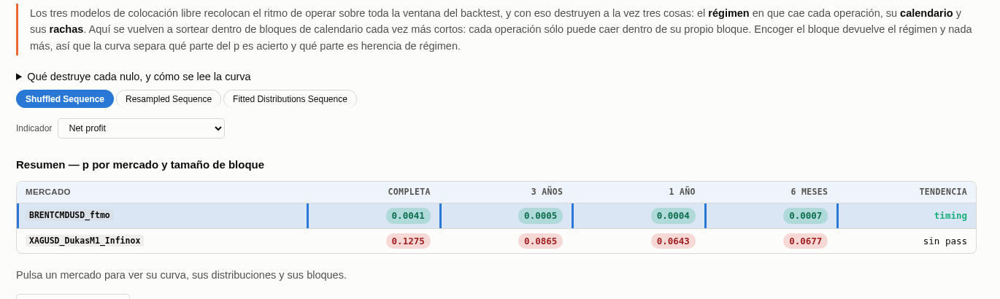
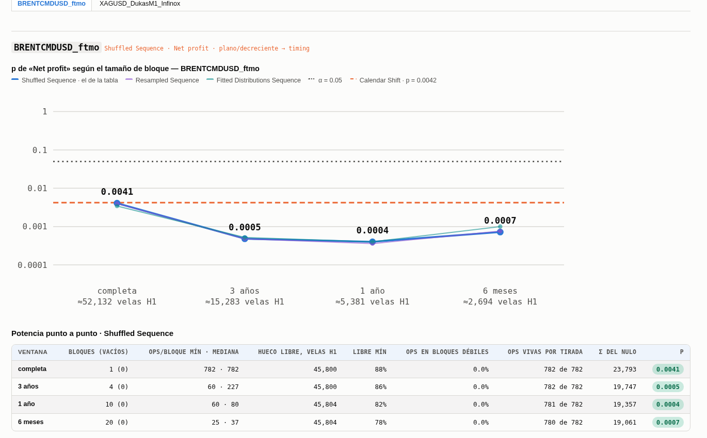
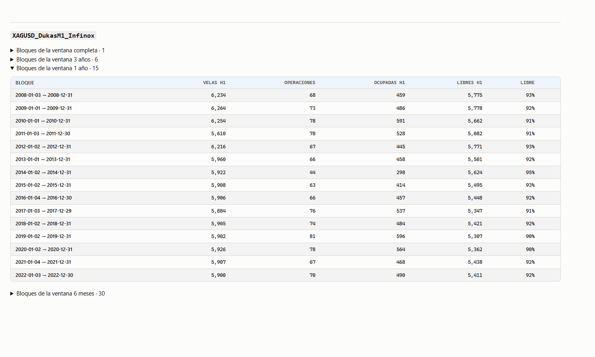
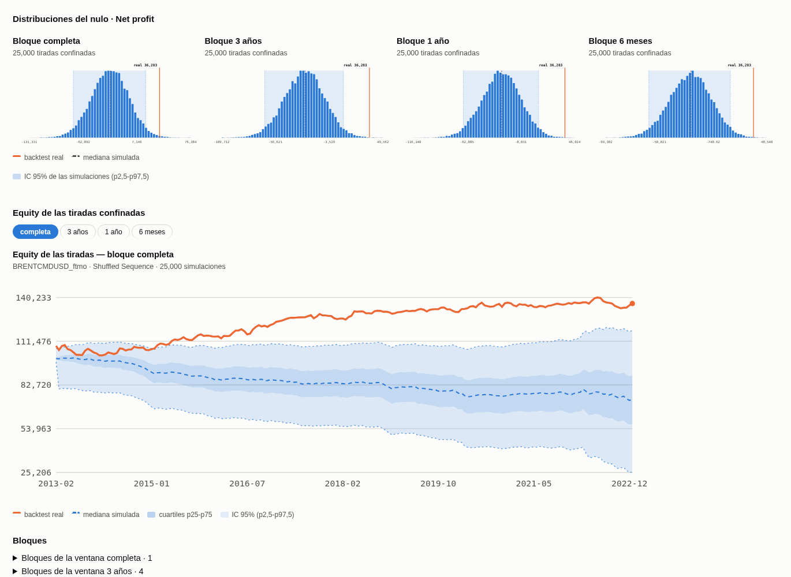
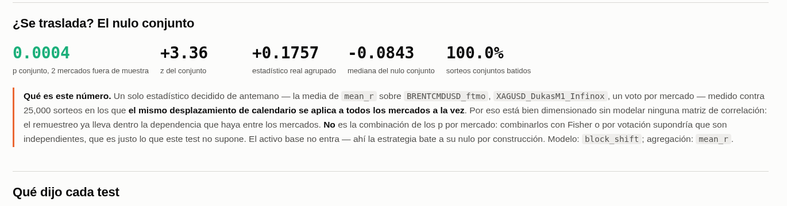
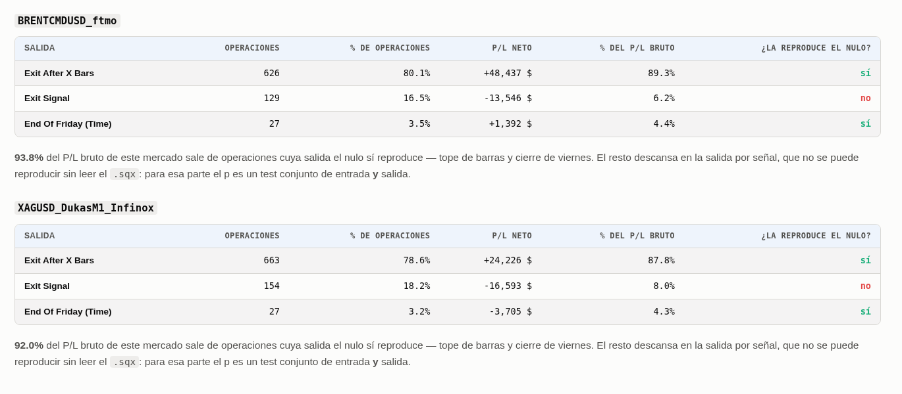

# 5. Retest en mercados adicionales — ¿el sistema gana por acertar CUÁNDO entra, o por estar comprado?

### Qué pregunta responde

Una estrategia long-only que opera en un mercado que sube gana dinero casi haga lo que haga. Eso no
es habilidad: es estar comprado. La pregunta que responde este módulo es otra, y es la única que
importa:

> Si cogemos exactamente el mismo ritmo de operar —el mismo número de operaciones, la misma duración
> de cada una, los mismos huecos entre ellas, el mismo día de la semana y la misma hora— y lo
> colocamos en momentos **al azar** del mismo mercado, ¿habría ganado lo mismo?

Se generan miles de esas versiones al azar y se mira dónde queda la de verdad. Si la de verdad queda
entre las mejores, sus entradas llevan información. Si queda en el montón, lo que había era la
deriva del mercado y nada más.

Se hace sobre mercados que la estrategia **nunca vio** cuando se optimizó. Ahí sus entradas son
efectivamente ciegas, y batir al azar en varios de ellos es algo que el sobreajuste no puede fabricar.

### Cuándo lo usas, y cuándo no

**Lo usas** después de haber pasado tus estrategias por un retest multi-mercado en SQX, para decidir
cuáles siguen adelante.

**No lo usas** para saber si una estrategia está sobreajustada al oro. No lo detecta, y decirlo al
revés es el error más fácil de cometer con este informe. Lo que mide es si el acierto **se traslada**
a otros mercados.

**No lo usas** sobre el propio activo base. La estrategia se optimizó ahí, así que gana a lo aleatorio
por construcción: en la prueba de este módulo sobre oro, las ocho estrategias probadas salieron con
p entre 0.0002 y 0.007. Eso no dice nada bueno de ellas, sólo dice que el código funciona. Por eso el
activo base no es un mercado más: sale en el informe como **referencia**, nunca como evidencia.

**No esperes un veredicto.** Este módulo no dice MANTENER ni DESCARTAR, y no esconde ningún mercado.
Te da los números y, al lado de cada uno, la lista de motivos para desconfiar de él. La decisión la
tomas tú. Antes no era así: un mercado con menos de 30 operaciones o con órdenes pendientes se caía
entero del análisis, y eso costó tirar un resultado de Brent con p = 0,005 por culpa de un 8% de
entradas que no caían en apertura de vela.

### Antes de empezar

Tres cosas, en este orden:

1. **En SQX**, pasa tus estrategias por una tarea de retest sobre mercados adicionales, y deja el
   resultado en una databank. Los mercados que elijas ahí son los que manda: el módulo **descubre**
   de la exportación en qué mercados se retesteó de verdad, leyendo la columna `Symbol` de las
   propias operaciones. `assets/_markets.yaml` sólo les pone categoría y nombre.
2. **Exporta en cuanto termine.** Varias databanks se vacían en cada ciclo de la cadena de tareas, y
   la sincronización horaria borra del disco lo que no está en memoria. Si el retest queda ahí una
   noche, puede no estar por la mañana.
3. **Fija la lista de mercados antes de mirar resultados.** Elegir los mercados después de ver dónde
   funciona convierte la prueba en una selección y los p-valores en decoración.

Comprueba lo que vas a aplicar de costes:

```bash
python3 -m core.assets XAUUSD
```

Que salga `UNDECIDED` **no bloquea este módulo**, y es la única excepción a esa regla en todo el
proyecto. El motivo: aquí no se autoriza nada, se reproduce lo que SQX ya simuló. El coste se recupera
operación a operación de los propios datos exportados (`precio bruto − beneficio reportado`), no se
elige. En el oro eso mide 8 $ por lote y lado, que es exactamente lo que SQX tiene configurado.

### Dónde se clasifican los mercados

En `assets/_markets.yaml`, un bloque por activo base y, dentro, una lista por
categoría:

```yaml
XAUUSD:
  main: XAUUSD_DukasM1_Infinox
  timeframe: M30
  out_of_sample: {from: 2018-01-01, to: 2022-12-31}
  categories:
    family:
      - {feed: XAGUSD_DukasM1_Infinox, data_from: 2003-08-08}
      - {feed: BRENTCMDUSD_ftmo, data_from: unknown}
    structure: []
```

**Este fichero clasifica; no decide qué existe.** Lo que se analiza sale de la exportación: la
columna `Symbol` del `trades.parquet` que dejó el paso 2 dice qué mercados hubo, así que no puede
mentir. (Hasta el 23-09-2026 el paso 2 dejaba una carpeta `trades/<mercado>/` con un CSV por
estrategia; ahora es un solo parquet con todos los mercados dentro, 118 ficheros → 1.) Si un mercado aparece en el export y no está aquí, se analiza
igual y sale marcado como `sin clasificar`. Si está aquí y el export no trae operaciones suyas, el
comando lo imprime al arrancar como ausente. Antes, un desajuste entre los dos salía como un mercado
con cero estrategias, que no parece un error y lo es.

`feed` tiene que estar escrito **exactamente** como lo llama SQX. `data_from` es la primera fecha con
datos de ese mercado: no filtra nada, está para que veas cuánta ventana común te queda de verdad.
Las categorías (`family`, `structure`, y las que vengan) son etiquetas: salen en las tablas y no
cambian ningún cálculo.

La lista sigue fijándose **antes** de mirar resultados. Elegir mercados después de ver dónde funciona
convierte la prueba en una selección.

`out_of_sample` es otra cosa: es el tramo OOS del backtest **principal**, copiado del
`<OutOfSample><Range/>` del propio proyecto (en el XAUUSD está dentro de `Build-Task3.xml`, y vale
`2018.01.01 → 2022.12.31`). Sobre él se corre el mismo test de entrada aleatoria, en la pestaña
**Entrada aleatoria · OOS principal**.

**Hay que escribirlo a mano, porque el export no lo sabe.** Todas las operaciones que exporta el
retest salen marcadas `Sample type = IST`, estén dentro o fuera del tramo — comprobado en los tres
mercados de `Retest_Markets_-_Family`—, así que el corte no se puede leer de los datos y las fechas
son el único testigo que hay. Si un activo base no declara `out_of_sample`, la pestaña sale vacía
diciéndolo; no se inventa nada.

### Cómo se ejecuta

Dos comandos preparan los datos y el tercero corre la prueba. El tercero tiene dos formas: el
databank entero con un veredicto por estrategia, o **una estrategia en profundidad** con todas las
pestañas. La ventana de escritorio (`ui/`) llama a esta misma segunda forma y pinta su resultado;
el panel del navegador (`explorer.serve`) se retiró el 25-09.

```bash
# 1. Las barras de todos los mercados: la librería M1, y el resto de timeframes se calcula al vuelo
python3 -m sqx.export.sync_bars

# 2. Los trades del retest, partidos por mercado (~4 min por cada 200 estrategias)
python3 -m sqx.export.export_retest --project XAUUSD --databank "Retest Markets - Family"

# 3a. El databank entero: amplitud entre mercados y un veredicto por estrategia
python3 -m studies.transfer.crossmarket.report --project XAUUSD \
    --databank "Retest Markets - Family" --asset XAUUSD --day 2026-09-14

# 3b. Una estrategia, con todas las pestañas (y, con --only, un solo mercado)
python3 -m studies.transfer.crossmarket.report --project XAUUSD \
    --databank "Retest Markets - Family" --asset XAUUSD --day 2026-09-14 \
    --strategy "Strategy 24.14.35"
```

| flag | obligatorio | qué hace |
|---|---|---|
| `--asset` | sí | activo base. Es la clave que se busca en `assets/_markets.yaml` |
| `--project` | sí | proyecto en el master |
| `--databank` | sí | la databank donde dejaste el retest |
| `--day` | no (paso 3) | la fecha del export del paso 2, `AAAA-MM-DD`; hoy si no se pone |
| `--limit` | no (paso 2) | exporta una muestra aleatoria reproducible de N estrategias en vez de todas |
| `--strategy` | no (paso 3) | estudia esa estrategia entera en vez del databank |
| `--only` | no (paso 3, con `--strategy`) | sólo ese mercado, por su nombre de feed |
| `--floor` | no (paso 3a) | fracción de mercados que debe tener esperanza positiva para MANTENER. Lo mismo que `--set verdict.breadth_floor=`; por defecto 0,5 |
| `--set` | no (paso 3) | cambia un knob de `config.yaml` para esta ejecución, p. ej. `--set nulls.draws=20000` |
| `--workers` | no (paso 3) | procesos en paralelo. Por defecto, todos los núcleos |

Los pasos 1 y 2 **arrancan SQX** (el worker, nunca el master) y se pueden ejecutar con tu interfaz
abierta. El paso 3 no toca SQX: sólo lee ficheros.

### Qué produce

En `~/Desktop/AlgoData/reports/<proyecto>/<databank>/<export>/crossmarket/`:

| archivo | qué es |
|---|---|
| `crossmarket.html` / `.md` / `.json` | 3a: la pestaña **Amplitud** — cuántos mercados sostienen cada estrategia |
| `verdict.csv` | 3a: `strategy`, `identity`, `verdict` (MANTENER / DESCARTAR) y el motivo, para `/curate` |
| `estrategias/<nombre>.html` / `.json` | 3b: el estudio completo de una estrategia, con las pestañas de abajo |
| `manifest.json` | qué export se leyó, con qué configuración entera |

El precio es real — unos **107 segundos por estrategia** con las 25.000 tiradas por defecto sobre
dos mercados en 3b. En 3a el comando imprime `PROGRESS <n>` y una línea por estrategia:

```
PROGRESS 60 Strategy 47.20.34 MANTENER — 1 de 2 mercados con la esperanza por encima de cero (50% >= 50%)
PROGRESS 63 Strategy 30.9.23 DESCARTAR — solo 0 de 2 mercados con la esperanza por encima de cero (0% < 50%)
...
5 de 30 pasan el suelo de amplitud -> .../crossmarket/verdict.csv
```

Un mercado en el que esa estrategia **nunca disparó** sale como `sin operaciones`. El export sólo
escribe el fichero de un mercado si hubo operaciones ahí, así que esa ausencia es un resultado
sobre la estrategia, no un dato que falte.

### El cajón de configuración

**Los 46 knobs de `config.yaml`**, agrupados por sección; cada uno tiene su frase en `tooltips.py`, que
es lo que enseña el cajón de la ventana al pasar el ratón. Se cambian con `--set` o desde ese cajón,
y afectan sólo a esa ejecución: el `config.yaml` no se reescribe.

| grupo | lo que controla |
|---|---|
| **Modelos nulos** | cuántos backtests aleatorios, la semilla, el bloque de régimen, qué modelos correr, si se replica el cierre del viernes, y el tamaño de lote |
| **Barrido de ventana** | qué tamaños de bloque, qué modelos se barren, cuál es la referencia, y los umbrales de potencia: meses mínimos, operaciones mínimas por bloque, hueco libre mínimo y qué parte de las operaciones puede caer en bloques débiles |
| **Estratos de régimen** | sólo para Regime Strata: cuántos cuantiles de ATR y cuántas velas para el signo de la tendencia |
| **Cuenta y curvas** | la cuenta de partida, cuántos puntos tiene cada curva, qué percentiles dibuja el cono, y **la caída objetivo a la que se reescala cada mercado** para compararlos a riesgo igual |
| **Bootstrap** | tiradas, operaciones por bloque y percentiles de los intervalos de confianza |
| **Exposición (1c)** | el t mínimo de la deriva para marcar E como no interpretable, las velas por bloque del intervalo de Fieller, y qué hacer con las operaciones de MFE cero |
| **Test pareado (1b)** | el lado del test de Wilcoxon, **cómo se define «el mismo tramo de mercado»** (ventana centrada de ±N meses, o la partición en semestres) y con qué otras definiciones se corre además |
| **Portfolio** | semanas de calendario por bloque del remuestreo, cuántas tiradas, y operaciones por bloque al barajar el orden |
| **Coste y ejecución** | múltiplos de coste, desplazamiento en velas, fracciones de slippage, los parámetros de la ejecución degradada, y **si se calibran desde `execution.yaml`** |
| **Lectura y avisos** | alpha, los umbrales que disparan un aviso y la correlación supuesta |

**Ninguno de esos umbrales decide nada.** `alpha`, `min_trades`, `min_on_open`, `fill_tolerance` y
`max_fill_error` sólo colorean números y disparan avisos; ningún mercado se cae por ellos.

### Las doce pestañas

| pestaña | qué muestra |
|---|---|
| **Backtest** | **La que abre.** Lo que hizo de verdad cada backtest: beneficio, caída en dólares y en %, Ret/DD, Sharpe, PF y racha perdedora, con el activo base aparte y marcado como referencia. Debajo, **la misma comparación a riesgo igualado**; el **p conjunto** de todos los mercados fuera de muestra; **por dónde salieron las operaciones** y cuánto del beneficio descansa en cada salida; las **curvas de capital de todos los mercados solapadas**, cada uno con su cuenta independiente y en sus fechas reales; la matriz de correlación; lo que dijo cada test; lo que sostiene esos números (MinTRL y los CI); los avisos; las comprobaciones mecánicas; y un párrafo explicando cada estadístico |
| **Entrada aleatoria (1a)** | Sub-pestañas por **mercado**, y debajo por **modelo**. Dentro: la **curva de equity real sobre el cono de las aleatorias** y, a su lado, el histograma del indicador que elijas, con la mediana y el CI 95% marcados, su tabla de valores y el % de simulaciones que el real bate. Debajo, la tabla completa de percentiles |
| **Entrada aleatoria · OOS principal** | **El mismo test 1a, sobre el tramo OOS del backtest principal y nada más.** Un cono de equity y una tabla completa por cada modelo nulo, y debajo los avisos de esa fila. Es el único sitio donde el activo base cuenta como algo más que referencia — y el primer párrafo de la pestaña explica por qué tampoco ahí es dato virgen |
| **Modelos** | El mismo p bajo las cuatro formas de aleatorizar (cinco con Regime Strata), y qué cambia cada una |
| **Barrido de ventana** | Arriba, una **rejilla de mercados × tamaños de bloque** con el p de cada celda y la tendencia al lado. Pulsas un mercado y debajo se abre el suyo — los tres modelos de colocación libre en **una sola curva**, con Calendar Shift como línea fija, la tabla de potencia, un histograma por tamaño de bloque y el cono de equity del tamaño que elijas |
| **Pareado (1b)** | La pregunta explicada arriba del todo, el alfa de timing **en cinco unidades** (bps, %, R, $ por operación y **$ acumulado**), el p de Wilcoxon, y debajo **la tabla de sensibilidad**: el mismo test con ventanas centradas de ±3, ±6 y ±12 meses y con la partición en semestres |
| **Exposición (1c)** | La pregunta explicada y **en qué se diferencia de 1b**. A por unidad de riesgo preside; E sale siempre con su **intervalo de Fieller**, que dice «no acotado» cuando el mercado no tiene deriva, y con el % de réplicas en las que el denominador cambiaba de signo |
| **Coste y ejecución** | El múltiplo de coste de equilibrio, **de dónde sale cada supuesto** (y el coste que SQX cobró de verdad frente al que dice `execution.yaml`), y las mismas operaciones ejecutadas peor 25.000 veces: cono de equity e histogramas |
| **Huella** | Qué mide cada métrica, explicado una por una, y **cuatro histogramas solapados por mercado** contra el activo base: duraciones, retornos por operación, MAE/ATR y MFE/ATR. Más la captura de MFE, que mide la salida |
| **Portfolio** | Todos los mercados en **una sola cuenta**, el oro incluido. Qué aporta o qué resta cada mercado (Δ sobre la cartera entera), cuánto tiempo hubo dos o más posiciones abiertas, y dos formas distintas de preguntar cuánta suerte hay: remuestreo por bloques de calendario y barajado del orden |
| **Avisos** | Cada motivo de desconfianza, en **cuatro partes**: qué es y qué número lo disparó, **a qué afecta**, **a qué NO afecta**, y qué hacer. **Nada se excluye por esto** |
| **Glosario** | Qué significa cada número |

*(El barrido de ventana sí tiene capturas, más abajo, hechas con el panel ya retirado; el contenido
es el mismo. Las de las pestañas Backtest, Huella, Portfolio y Entrada aleatoria · OOS principal
están pendientes: la regla 8 exige que sean de una ejecución real, así que las pega quien abra la
estrategia en la ventana la próxima vez.)*

### Qué desapareció, y por qué

- **Resumen**, **Significancia** y **Correlación** eran tres pestañas para una sola pregunta. Ahora
  son la pestaña **Backtest**, que es la que abre.
- **El mercado** (Hurst, variance ratio, ADX, eficiencia) se ha quitado. Esos números existían para
  una regresión que necesita **seis mercados o más**; con dos, o con cuatro, no puede ajustarse.
- **El PCA** de la correlación se ha quitado: con dos o tres curvas, PC1 es casi una función de la
  correlación media, así que no añadía ningún eje que la matriz no enseñara ya.

### La tabla de riesgo igualado

Un mercado que gana el doble sufriendo el triple **no lo hizo mejor**: arriesgó más. Esa tabla
multiplica el tamaño de posición de cada mercado hasta que su peor caída es exactamente el 10% de la
cuenta (`equity.risk_target_dd`), y multiplica su retorno por ese mismo factor.

Su punto débil está escrito debajo de ella en la propia pestaña: el peor drawdown es **un** momento de
la muestra, así que el número es ruidoso. Se lee junto al **Ret/DD**, que usa los mismos dos números
sin depender del tamaño de la cuenta.

### La pestaña Portfolio

Contesta lo que el retest deja abierto: *vale, el oil no es una maravilla, pero ¿me rompe la
cartera?*

Todos los mercados se juntan en **una sola cuenta de 100.000 $**, con el oro dentro como posición
núcleo, y la caída se calcula sobre la curva **combinada** — nunca sumando las de cada mercado.

**El gráfico de equity de esta pestaña no es el de la principal.** Aquí la línea gruesa es la cuenta
combinada y las finas son lo que cada mercado metió **en esa misma cuenta**, así que las finas
*suman* la gruesa y se leen como «cuánto del resultado es este mercado». En la pestaña Backtest,
en cambio, cada mercado tiene su propia cuenta independiente y las alturas no se comparan entre sí.
Un mercado cuya línea pasa toda la muestra por debajo de cero es uno al que los demás estaban
sosteniendo.

No lleva cono de percentiles, y es a propósito: el remuestreo sortea bloques de calendario enteros y
los concatena en el orden en que salieron, así que sus caminos no viven sobre el eje de fechas de
ese gráfico. La incertidumbre está en la tabla de intervalos de debajo, no en una banda que
insinuaría una línea de tiempo que no tiene.

La
tabla que importa es la de **contribución marginal**: la cartera entera, la cartera sin cada
mercado, y la diferencia. **Δ positivo = ese mercado mejora la combinación.** Un mercado con Δ
Ret/DD negativo le está costando más de lo que aporta, por bien que se viera su p-valor.

Dos maneras de preguntar cuánta suerte hay, que no son la misma:

- **Remuestreo por bloques de calendario** (cuatro semanas por defecto): se sortean semanas enteras,
  así que las operaciones de todos los mercados dentro de un bloque viajan juntas y una semana mala
  para dos mercados a la vez sigue siéndolo. Remuestrear operaciones sueltas destruiría justo eso.
- **Barajado del orden**: las mismas operaciones en otro orden. La composición no cambia, así que el
  beneficio sale idéntico por construcción y sólo se mueven la caída, la racha y el Ret/DD.

Ojo con una cosa, y la pestaña lo dice: **el oro está sobreajustado**, así que la cartera base se ve
mejor de lo que es.

### La pestaña «Entrada aleatoria · OOS principal»

El retest en otros mercados es un OOS **de mercado**: la estrategia no se optimizó ahí. Pero el
backtest principal ya traía dentro un OOS **de tiempo**, el tramo que el proyecto reservó y sobre el
que el generador no optimizó nada. Esta pestaña le hace exactamente la misma pregunta:

> *Sobre 2018–2022, en oro, ¿las entradas eligieron momento mejor que el azar?*

Es el mismo test 1a, con los mismos modelos nulos, las mismas tiradas y las mismas posiciones y
costes reales. Lo único que cambia es qué se le da de comer: las operaciones del oro recortadas a ese
tramo, y **las velas recortadas con ellas**. Eso segundo importa tanto como lo primero: un nulo que
pudiera colocar una operación en 2010 no estaría probando el OOS, estaría probando el backtest entero
con menos operaciones, con la deriva y el régimen de otros años metidos dentro.

**Una operación a caballo del corte se descarta, no se recorta.** Recortarla le inventaría una salida
que la estrategia nunca tomó. 🔬 En `Strategy 24.14.35` no hay ninguna — el oro está plano en el
cambio de año— así que aquí no cuesta nada; en una estrategia que aguante más, costará.

**Por qué no suma con plata y Brent.** No es otro mercado: es el mismo, sobre fechas que solapan con
las suyas. El p conjunto de la pestaña Backtest está dimensionado para mercados distintos desplazados
a la vez, así que esta fila se reporta aparte y no entra ni en él, ni en el recuento de mercados, ni
en el portfolio, ni en la matriz de correlación. En la cuenta combinada el oro ya está entero.

**No tiene barrido de ventana**, y no es un olvido: el barrido parte la muestra en bloques de 3 años,
1 año y 6 meses, y cinco años con unos cientos de operaciones deja todos los bloques por debajo de
`sweep.min_trades`. Saldrían cuatro celdas vacías. El estrés de coste y ejecución sí se corre, que no
necesita ese hueco.

#### Lo que hay que leer antes que el p

🔬 **Ese tramo no es dato virgen.** Las condiciones de aceptación del proyecto lo leyeron igualmente,
dos veces: dentro de las 8 condiciones `sampleType=127`, porque el periodo completo lo contiene, y de
forma explícita por el beneficio neto OOS de la matriz walk-forward. Medido sobre `Build-Task3.xml`.

Eso no invalida el número: un p bajo aquí sigue diciendo que **en ese tramo** el momento de entrada
aporta por encima del azar, que es una afirmación sobre la mecánica de esa ventana y está bien
calculada. Lo que no dice es que la estrategia funcione sobre datos que nadie había mirado, y sobre
una población de estrategias seleccionadas está sesgado a la baja. 🔬 De las 30 de
`Retest Markets - Family`, **30 son rentables en oro entre 2018 y 2022**: ésa es la forma que tiene
una ventana seleccionada, no la que tiene una desconocida.

🔬 La única ventana fuera de muestra en sentido estricto de este proyecto empieza el **2023-01-01**:
ningún `dateTo` de ninguna tarea pasa de `2022.12.31`, mientras que los ficheros de velas llegan a
2026. Un retest desde ahí es lo que hace falta para una afirmación limpia, y lo diría del oro y de
los mercados adicionales a la vez. Está en `OPEN.md`.

El estudio dice todo esto solo: el aviso se llama `selected_window`, sale al final de la pestaña con
sus cuatro partes, y es el único de los nueve que no se comprueba sino que se **adjunta** — nada en
los datos puede delatarlo, es un hecho sobre el proyecto.

### Los costes del estrés salen de un fichero que tienes que revisar

`studies/transfer/crossmarket/execution.yaml` lleva, por cada mercado, el spread típico y el de estrés en
puntos, la comisión en dólares por lote y por lado, el slippage típico y el tamaño del punto. De ahí
salen el multiplicador de coste y la profundidad de fill del estrés, en vez de los números redondos
que había antes.

⚠️ **Los valores de hoy son de ejemplo**, escritos como los de un bróker CFD normal para que tengas
algo concreto que corregir. Cada bloque lleva `source: placeholder` y `reviewed_by_owner: false`, y
la tabla lo dice en la columna «origen». Cuando pongas los tuyos, cambia esa marca a `true`.

No están en `assets/*.yaml` a propósito: esos ficheros bloquean la creación de proyectos en todo el
repositorio y `assets/RULES.md` dice que un fichero con valores inventados es peor que no tener
fichero, porque parece decidido.

### Cómo se leen los dos gráficos nuevos

**El cono de equity.** La línea naranja es el backtest real; la banda azul es donde corrieron los
aleatorios. El eje X es **tiempo de calendario**, no número de operación: las entradas
aleatorias caen en momentos distintos, así que sólo en ese eje la curva real y las suyas describen
el mismo tramo de mercado. Se lee por el **ancho** del cono y por **dónde** la real se sale de él,
nunca por una línea suelta de dentro.

**Los histogramas.** Las barras son los backtests aleatorios, la línea naranja el real, la
discontinua la mediana simulada y el sombreado la banda del 5 al 95. Ojo con la dirección: en
**drawdown** y **racha perdedora**, menos es mejor, así que un p pequeño significa que el real
sufrió **menos** que el azar. Cada fila de la tabla lo dice al lado.

Todos los backtests aleatorios se valoran **en dólares, con los mismos tamaños de posición y los
mismos costes** que las operaciones reales. Por eso el beneficio neto que ves es directamente el de
SQX: el P/L reconstruido desde las velas correlaciona 0,9996 con el que reporta la databank.

### El barrido de ventana: ¿acierto o suerte de régimen?

Shuffled, Resampled y Fitted Sequence colocan tu ritmo de operar en cualquier punto de la ventana del
backtest. Con eso rompen a la vez tres cosas: **en qué régimen** cae cada operación (una tendencia de
2011 o un lateral de 2019), **su calendario** (día, hora, fines de semana) y **sus rachas**. Si uno de
ellos da un p bajo, no sabes si es porque tus entradas aciertan o porque tus operaciones cayeron por
suerte en tramos buenos.

El barrido lo separa. Repite esos tres modelos, pero obligando a cada operación a quedarse dentro de
un bloque de calendario: primero la ventana entera, luego bloques de 3 años, de 1 año y de 6 meses.
Cuanto más pequeño el bloque, más cerca de su fecha real cae cada operación, así que **más régimen se
le devuelve** — y es lo único que cambia: el calendario y las rachas siguen rotos igual a todos los
tamaños.

**Cómo se navega la pestaña.** Lo primero que ves es una rejilla: una fila por mercado, una columna
por tamaño de bloque, el p de cada celda coloreado y la tendencia a la derecha. Ahí está el barrido
entero sin bajar nada, y con varios mercados es donde se compara. Los **chips de arriba** eligen el
modelo de colocación libre y el desplegable **Indicador** el estadístico —abre en **Net profit**—:
entre los dos gobiernan toda la pestaña, rejilla incluida. Cada punto del barrido es ya un nulo
completo, así que el p, la tendencia, los histogramas y el cono se recalculan para el indicador que
elijas sin volver a correr nada.



Pulsando una fila —o usando las sub-pestañas de mercado— se abre ese mercado debajo: **una sola
curva con los tres modelos**, el seleccionado en trazo grueso y con sus valores escritos, los otros
dos detrás para ver si coinciden. Debajo, la tabla de potencia del modelo seleccionado, y al final
los bloques, plegados.



**Cómo se lee la curva:**

- **p se mantiene bajo al encoger el bloque** → el acierto sobrevive aunque le quites la suerte de
  régimen. Es timing.
- **p sube al encoger el bloque** → el aprobado con la ventana entera era herencia de régimen.
- La **línea naranja discontinua** es el p de Calendar Shift, fijo. **La curva nunca va a llegar a
  ella**: Calendar Shift conserva también calendario y rachas, que el barrido sigue rompiendo. Es otra
  cosa; está ahí como referencia.
- La **línea punteada** es alpha. El eje es logarítmico: cada raya es un orden de magnitud.

Al lado del nombre del mercado hay una etiqueta automática, y la rejilla la repite en su última
columna: **plano/decreciente → timing**, **creciente →
régimen** (p sube más de un orden de magnitud del bloque más ancho al más estrecho), **sin pass a
ningún tamaño** (ningún punto llega a alpha, así que no hay aprobado que descomponer) o **no
evaluable**. Es un pie de foto, no la lectura.

**Nunca leas el p solo.** Con bloques pequeños hay menos sitio donde recolocar, el nulo se ensancha y
p pierde resolución. Por eso la tabla de debajo del gráfico da, para cada tamaño, cuántos bloques
hay, cuántas operaciones tiene cada uno, cuánto hueco libre queda, qué parte de las operaciones cae en
bloques débiles, cuántas operaciones sobreviven por tirada y la σ del nulo. Si demasiadas operaciones
caen en bloques con menos de 10 operaciones o con menos de un 25% de velas libres, ese tamaño **no se
calcula** y sale como ✕. Debajo de todo, desplegable, la lista de bloques de cada tamaño:



**Las distribuciones y el cono.** Debajo de la tabla hay un histograma por tamaño de bloque, los
cuatro en fila y con el backtest real marcado en cada uno: ahí se ve —no se argumenta— cómo el nulo
se ensancha o se estrecha al encoger el bloque, que es de dónde sale la pérdida de resolución del p.
Y debajo, el **cono de equity** de las tiradas confinadas del tamaño que elijas con los chips, con
la curva real encima, igual que en «Entrada aleatoria» pero con las operaciones atadas a su bloque.



Un aviso sobre la columna de operaciones vivas: en Resampled y Fitted Sequence baja un poco al
encoger el bloque (en plata, de 98% a 94% entre la ventana entera y 6 meses), porque lo que no cabe en
un bloque se descarta. Shuffled Sequence no tiene ese efecto.

Medido sobre 6 estrategias, 2 mercados y los 3 modelos, a 10.000 tiradas:

```
estrategia           mercado  modelo            completa     3y      1y      6m    etiqueta
Strategy 2.29.29     XAGUSD   segment_permute    0.0017   0.0012  0.0013  0.0023  timing
Strategy 1.10.80     XAGUSD   segment_permute    0.0507   0.0463  0.0482  0.0421  timing
Strategy 14.15.26(2) BRENT    segment_permute    0.0752   0.0873  0.0953  0.1167  sin pass
Strategy 14.15.26(2) XAGUSD   segment_permute    0.1048   0.1211  0.1321  0.1387  sin pass
Strategy 15.17.41    XAGUSD   segment_permute    0.1924   0.1974  0.1819     ✕    sin pass
```

La primera es un acierto que aguanta a todos los tamaños. La tercera y la cuarta tienen justo la forma
del régimen — p sube al encoger — pero nunca bajaron de alpha. La última no tiene potencia a 6 meses:
el 13% de sus operaciones cae en bloques débiles.

**Regime Strata**, apagado por defecto, es otra forma de hacer lo mismo sin elegir «un año»: recoloca
cada operación en una vela del mismo tipo de mercado (cuantil de volatilidad y signo de la tendencia
reciente). Para activarlo, añade `regime_strata` a `nulls.models` en el cajón; aparece como un modelo
más en Entrada aleatoria y Modelos, no dentro del barrido.

### Cómo se lee el resultado

### El p conjunto: ¿se traslada, o acertó en un mercado?

Un p por mercado no contesta la pregunta del retest. Si miras cuatro mercados con alpha en 0,05,
que **uno** baje de 0,05 no dice casi nada — y contar cuántos bajan tampoco vale, porque esos
p-valores **no son independientes**: salen de los mismos sorteos y de mercados que se mueven
juntos. Combinarlos con Fisher, con Stouffer o por votación supone independencia justo donde no la
hay, y el resultado sale más generoso de lo que debería.

La pestaña Backtest trae por eso **un solo número decidido de antemano**: la media de `mean_r` sobre
los mercados fuera de muestra —un voto por mercado, el activo base fuera— medida contra esa misma
media en cada sorteo. Y lo que lo hace correcto no es la media, es que **el mismo desplazamiento de
calendario se aplica a todos los mercados a la vez**: si en el sorteo 412 el primer semestre de 2013
se mueve nueve semanas, se mueve nueve semanas en Brent y en plata. Así el remuestreo ya lleva
dentro la correlación que haya entre los mercados y no hay que modelar ninguna matriz.



Si lo ves **sin número**, es por una de tres razones y la pestaña la dice: sólo hay un mercado fuera
de muestra, los mercados se corrieron con distinto número de tiradas (te pasará si re-ejecutas uno
solo cambiando `nulls.draws`), o esta sesión no guardó los sorteos.

El desplegable `joint.pool` del cajón decide cómo se agregan los mercados. Por defecto, `mean_r`
crudo, que es lo correcto mientras las anchuras del nulo de cada mercado estén parecidas —medido,
0,1236 en Brent contra 0,1026 en plata, un factor de 1,20—. Cámbialo a `z` si algún día entra un
mercado cuyo nulo sea varias veces más ancho, porque entonces decidiría él solo.

### Por dónde salieron las operaciones

Estas estrategias salen por tres sitios: **tope de barras**, **cierre del viernes** y **señal**. Los
dos primeros el nulo los reproduce —uno cuenta barras, el otro mira el calendario—; el tercero no,
porque haría falta leer el `.sqx`. Por eso el p de una estrategia con salidas por señal es un test
conjunto de entrada **y** salida.

Lo que la pestaña añade ahora es **cuánto dinero** hay en cada tipo de salida, no sólo cuántas
operaciones. No es lo mismo: medido en `Strategy 24.14.35`, la salida por señal es el 16,5% de las
operaciones en Brent pero sólo el **6,2% del P/L bruto**, y encima pierde dinero (−13.546 $). El
**93,8% del resultado** descansa en salidas que el nulo sí reproduce, así que en ese mercado la
advertencia de «entrada + salida» cubre una esquina pequeña del resultado. En otra estrategia podría
ser al revés, y entonces el p diría mucho menos de lo que parece.



### La z, al lado del p

En la tabla «Qué dijo cada test» hay ahora una columna **z (1a)** junto al p. Existe por dos
motivos: el p **satura** —con 25.000 tiradas el más pequeño posible es 0,00004, así que dos
mercados excelentes salen iguales y no lo son—, y el nulo es **más ancho en el mercado con menos
operaciones**, lo cual no es edge. La z divide esa anchura: es (real − media del nulo) en
desviaciones típicas del nulo. Sirve para **comparar mercados y ordenarlos**, no para decidir: el
p exacto sigue siendo el test, y la z **no se convierte en un p** en ninguna parte, porque esa
conversión no vale para el drawdown ni para la racha perdedora.

**El orden en que hay que leer el estudio de una estrategia:**

1. **Las comprobaciones.** `fill_error` tiene que estar muy por debajo de `max_fill_error` (0,25 ATR)
   y `calendar_kept` valer 1,00 en `block_shift`. Si el primero se dispara, las velas no son las del
   backtest y no hay nada que interpretar: para ahí. Ojo con `fill_error`: **no tiene que ser 0**.
   Lleva dentro el spread de entrada, que es una constante que paga también cada corrida aleatoria
   —el oro marca 0,023 ATR—; lo que delata un problema es que sea grande, no que exista. El spread
   sale desglosado en su propia fila.
2. **Los avisos**, que ahora están dentro de la propia pestaña Backtest y también en la suya. Dicen
   de qué desconfiar en cada mercado antes de que te enamores de un número — y, sobre todo, **a qué
   NO afecta** cada uno: casi ninguno invalida la fila entera.
3. **La tabla maestra** de la pestaña Backtest: lo que hizo el backtest de verdad, antes de ninguna
   simulación. Y al lado, la de riesgo igualado.
4. **Lo que dijo cada test**, en la misma pestaña — el p de cada mercado con su z al lado.
5. **El p conjunto**, que es el que contesta si se traslada.
6. **Sólo entonces**, el cono y los histogramas de cada pestaña.

Y una cosa que no cambia por tener mejores gráficos: estás mirando **una estrategia de 757**, que
además ya pasaron por la búsqueda de SQX. Con alpha en 0,05, de 757 estrategias unas 38 darían un
p ≤ 0,05 en un mercado por puro azar. Un resultado bonito aquí no es un descubrimiento hasta que
sepas contra cuántos intentos lo estás comparando.

Las columnas de la tabla por mercado que hay que saber leer:

| columna | qué es | cómo se lee |
|---|---|---|
| `real_r` | lo que ganó de verdad por operación, en "barras típicas de ese mercado" | **no significa nada solo** |
| `null_r` | lo que ganó la versión aleatoria mediana | es la vara de medir; suele rondar cero |
| `edge_r` | la diferencia entre las dos | es el tamaño del efecto, y es lo que hay que mirar cuando el p sale ajustado |
| `p` | qué fracción de las versiones al azar igualó o superó a la real, bajo el primer modelo | es el número principal del test 1a |
| `p_<modelo>` | lo mismo bajo cada forma alternativa de aleatorizar | comprobación, no segunda opinión |
| `paired_p` | el p del test pareado (1b) | **no depende de ningún modelo nulo ni de ninguna suposición de coste** |
| `paired_beat` | qué porcentaje de operaciones batió a su ventana ciega | 50% es el azar |
| `a` / `a_ci_lo` / `a_ci_hi` | el exceso por vela sobre la vela media del mercado, con su intervalo | si el intervalo cruza el cero, el exceso no está demostrado |
| `e` / `e_ci` | la concentración E y su intervalo de Fieller | cuando el intervalo sale **«no acotado»**, E no está determinada: mira A por unidad de riesgo |
| `risk_normalised` | A dividida por el movimiento típico de una vela de ese mercado | **es el número principal de 1c**: está definido en todos los mercados |
| `paired_usd_total` | el alfa de timing acumulado en dólares sobre toda la muestra | cuánto del dinero que ganó lo puso el **momento** de entrar |
| `mu_t` | el t de la deriva del propio mercado | por debajo de 2 en valor absoluto, ese mercado no tiene tendencia que dividir |
| `breakeven` | a cuántas veces el coste real deja de ganar | el PDF pide 2,0 o más |
| `trades_all` | **todas** las operaciones que reporta SQX | es con las que cuadran el beneficio, la caída y el PF de la pestaña Backtest |
| `trades` / `off_grid` | las que ocupan al menos una vela, y las que no | las que no son, casi siempre, salidas `Exit Signal` de duración `0s`: son reales y su dinero cuenta, pero 1a, 1b y 1c necesitan una duración y no pueden usarlas |
| `on_open_price` | fracción de entradas ejecutadas **al precio** de su propia vela, descontado el spread constante | por debajo de 0,95 hay fills intravela que el azar no puede colocar: dispara aviso, **no** excluye. Si cae mucho (< 0,7) sospecha del timeframe antes que de las órdenes |
| `on_bar_open` | fracción de entradas cuyo **reloj** cae en el inicio de barra | informativo y nada más. 🔬 No dispara nada: de 960.705 operaciones, las 4.613 selladas a mitad de vela están al mismo precio que el resto. Que sea 0,91 mientras `on_open_price` es 1,00 es normal |
| `fill_error` | error mediano de precio contra las velas, en múltiplos del ATR | por encima de `max_fill_error` las velas no son las del backtest |
| `fill_offset` | el spread de entrada, en múltiplos del ATR | constante por mercado; lo paga también cada corrida aleatoria porque el coste se recupera operación a operación |
| `calendar_kept` | fracción de entradas aleatorias en el mismo día y hora que la real | 1,00 en `block_shift`; vacío en `renewal`, que no empareja operaciones |
| `null_trades` | operaciones por backtest aleatorio | igual a las reales salvo en `renewal` |
| `atr_ratio` | volatilidad en las entradas reales frente a la media del mercado | cerca de 1. Lejos de 1 significa que la estrategia elige barras raras |
| `warnings` | la lista de motivos para desconfiar de esa fila | está para leerse, no para filtrar |
| `net` / `dd` / `ret_dd` | beneficio neto, drawdown máximo y su cociente, en dólares | son los de SQX: el P/L reconstruido correlaciona 0,9996 con el suyo |
| `p_net` / `p_dd` | dónde cae cada uno dentro de los backtests aleatorios | en `p_dd`, pequeño es **bueno**: el real aguantó mejor que el azar |

**Sobre `family`, en la pestaña Backtest.** Cuando la estrategia sale siempre por el tope de barras, la
duración no dependía del precio y esto es una prueba limpia de la entrada. Cuando sale por señal, la
duración sí lleva información y el nulo la reutiliza sin poder reproducir de dónde salía: para esas,
el resultado mide entrada **y** salida a la vez. No es peor, es otra cosa.

**Dos avisos que vas a ver mucho y qué significan de verdad:**

- `no_drift` — ese mercado no tiene una deriva distinguible de cero en la ventana medida. Medido:
  oro t = +3,13, plata t = +1,61, Brent t = −0,11. Afecta **sólo a E**, que divide por esa deriva:
  su intervalo de Fieller sale entonces «no acotado», que es la verdad. **A no se ve afectada** —
  resta en vez de dividir — y de hecho Brent, que dispara este aviso, tiene la A más alta de los
  tres.
- `short_sample` — el Sharpe por operación observado necesitaría más operaciones de las que hay para
  distinguirse de cero (MinTRL). Es casi universal con Sharpes por operación de 0,03-0,15: dice que
  la evidencia de *rentabilidad* es débil, no que el test de *timing* esté mal.

### Un ejemplo completo

Prueba del módulo sobre el propio oro (2007-2018, 5000 versiones al azar por estrategia). Recuerda
que aquí se espera que gane: es el mercado en el que se optimizaron.

```
8 estrategias en 3.9s (5000 tiradas)

estrategia        n   real_r   null_r    edge  p_shift   p_perm    cal   atr  barcap
1.17.44.csv    1101    0.156   -0.013   0.169   0.0006   0.0010   1.00  1.02    0.48
1.25.34.csv    1038    0.129   -0.003   0.132   0.0072   0.0052   1.00  1.10    0.59
10.15.25.cs    1144    0.133   -0.018   0.151   0.0004   0.0022   1.00  1.03    1.00
14.16.34.cs    1035    0.236   -0.033   0.269   0.0002   0.0004   1.00  1.03    1.00
15.24.36.cs    1230    0.184   -0.010   0.194   0.0002   0.0004   1.00  1.08    0.40
16.20.43.cs     933    0.205   -0.006   0.211   0.0002   0.0002   1.00  1.05    0.17
```

Y la comprobación de que el número mide lo que dice medir: se cogen las operaciones de una estrategia
y se retrasan todas unas cuantas barras, sin tocar nada más. Si el módulo mide acierto en el momento
de entrar, moverlas tiene que estropearlo — y lo hace, de forma ordenada:

```
 desplazo   real_r     edge   p_shift
        0    0.236    0.269    0.0002     <- la real
        1    0.207    0.226    0.0010     <- una hora tarde
        3    0.120    0.120    0.0240     <- tres horas tarde: ya casi no significa nada
        8    0.064    0.072    0.1580     <- ocho horas tarde: indistinguible del azar
       24    0.065    0.098    0.1262
```

### Qué NO te dice

- **No te dice que la estrategia esté sobreajustada o no al activo base.** Mide traslado, no ajuste.
- **La pestaña Portfolio no construye tu cartera real.** Es una estrategia en N mercados, para ver si uno
  de ellos rompe la combinación. Tu cartera real, con varias estrategias, es otro módulo.
- **No valida la curva de capital.** El número está construido a propósito sin tamaño de posición,
  para que la comparación sea justa. Dice que entra en barras mejores que el azar; no dice que la
  gestión monetaria funcione.
- **No convierte un mercado fallado en un problema.** Que falle en un mercado es información sobre
  dónde vive la ventaja, y es la materia prima del estudio de propiedades de mercado.
- **No corrige por haber probado cientos de estrategias a la vez.** Declara cuántas saldrían así por
  suerte; no las quita. Ese es el número que tienes que mirar tú.
- **No decide nada.** No hay veredicto, no hay lista de supervivientes y no hay ningún mercado
  escondido. Es una herramienta de medida; la decisión es tuya.

### Si algo falla

- **Un tamaño del barrido sale como ✕** — no es un error: ese tamaño no tiene potencia para esa
  estrategia en ese mercado. La tabla dice por qué. Si quieres verlo igualmente, baja
  `sweep.min_trades` o sube `sweep.max_weak_share` en el cajón, y léelo sabiendo lo que has hecho.
- **`FileNotFoundError` sobre un fichero de `bars/`** — ese mercado no está exportado. Ejecuta el
  paso 1, o quítalo de `assets/_markets.yaml`.
- **`KeyError` con el nombre del activo** — el activo no tiene bloque en `assets/_markets.yaml`.
- **Un mercado sale como `sin clasificar`** — está en el export pero no en `assets/_markets.yaml`. Se analiza
  igual; añádelo a la categoría que le toque cuando quieras que salga etiquetado.
- **Un mercado declarado sale como ausente al arrancar** — está en `assets/_markets.yaml` pero el export no
  trae operaciones suyas. O el nombre del feed no coincide con el que usó la tarea de retest, o la
  estrategia no operó ahí.
- **`ValueError: cross-market pricing is long-only`** — alguna estrategia lleva operaciones en corto.
  Todo el retorno de este módulo es `log(salida/entrada)`, que para un corto tiene el signo al revés,
  así que se niega a valorarlo en vez de dar un número equivocado.
- **`fill_error` por encima de `max_fill_error`** — las barras y las operaciones no son del mismo
  mercado o de la misma ventana. El resultado no vale; no lo interpretes. Que `fill_error` sea
  distinto de 0 y pequeño **no** es esto: es el spread de entrada, y es normal.
- **`on_open_price` muy por debajo de 0,95** — o hay órdenes limit/stop llenadas dentro de la vela,
  o has cargado el timeframe equivocado. Probado: velas H1 para un backtest M30 dejan este número en
  0,57 sin tocar `fill_error`.
