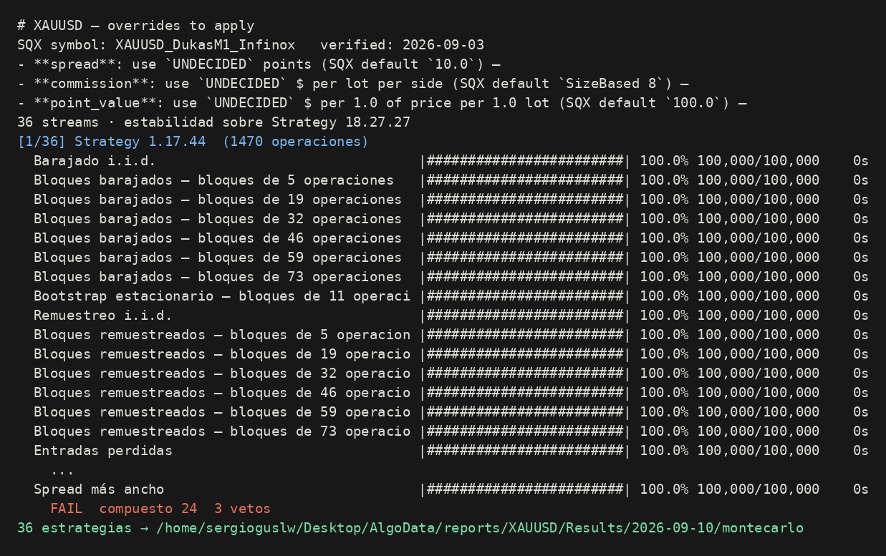
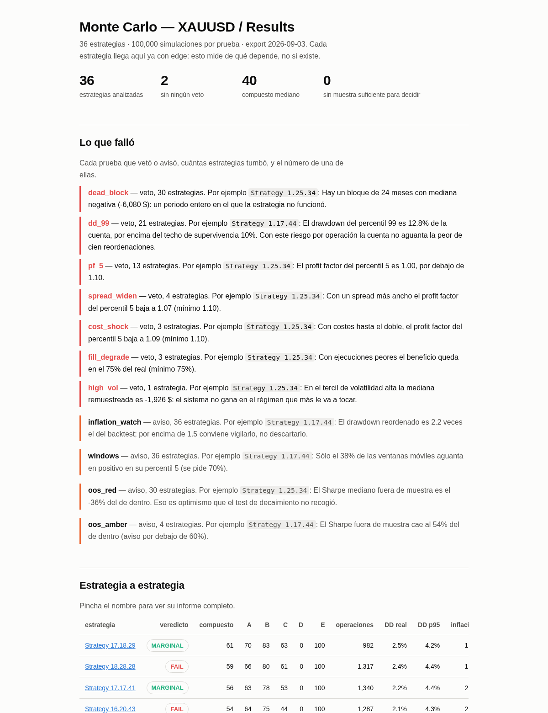
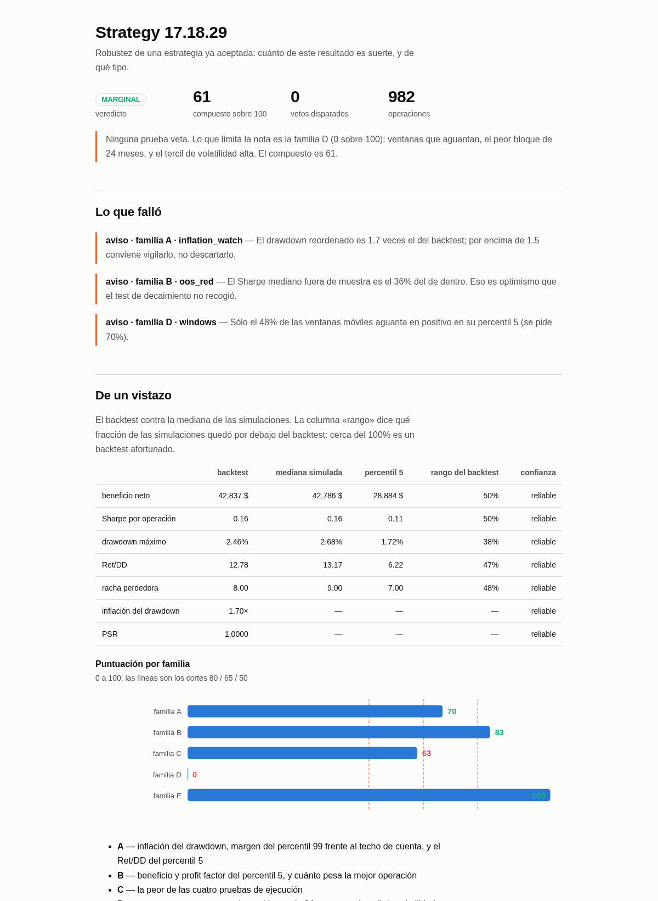
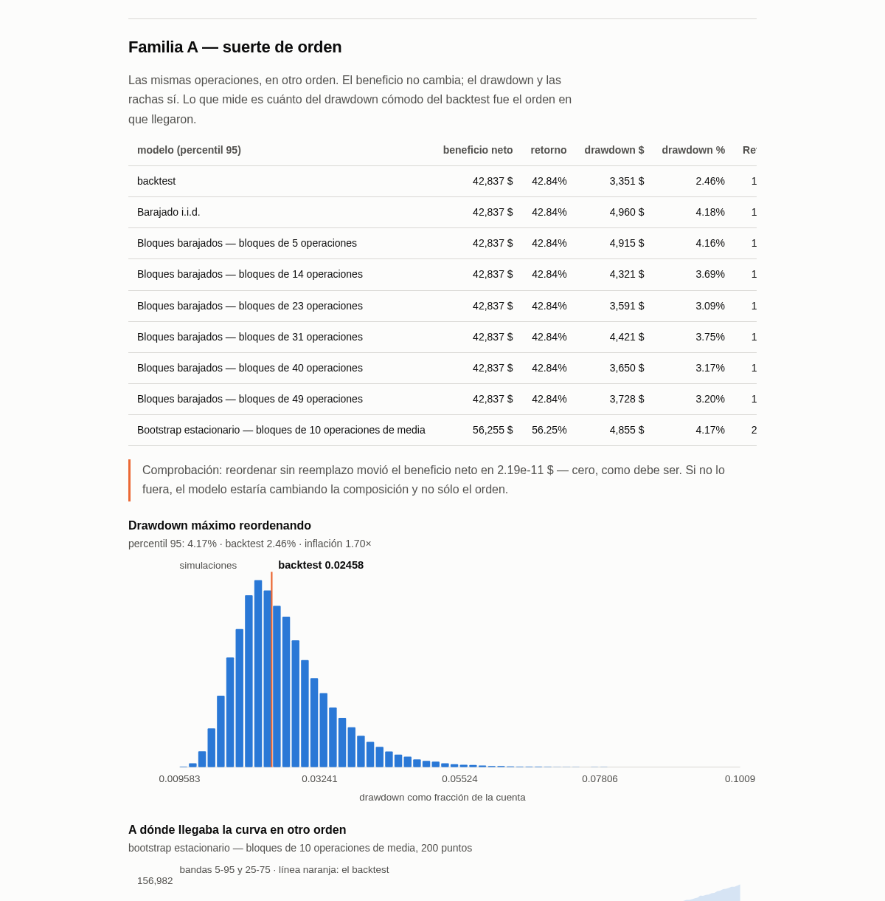
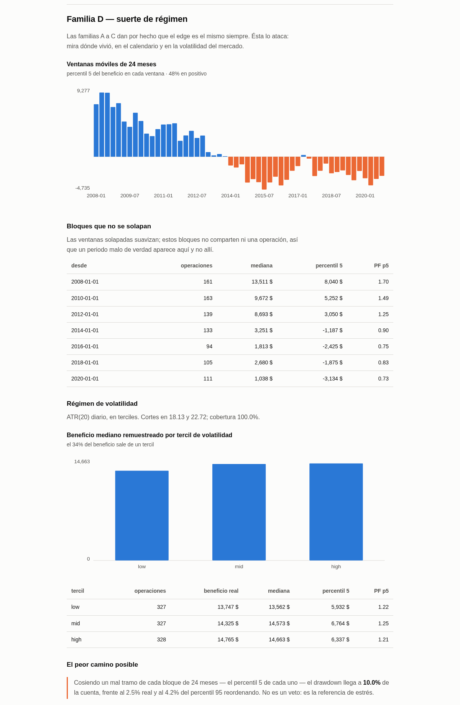
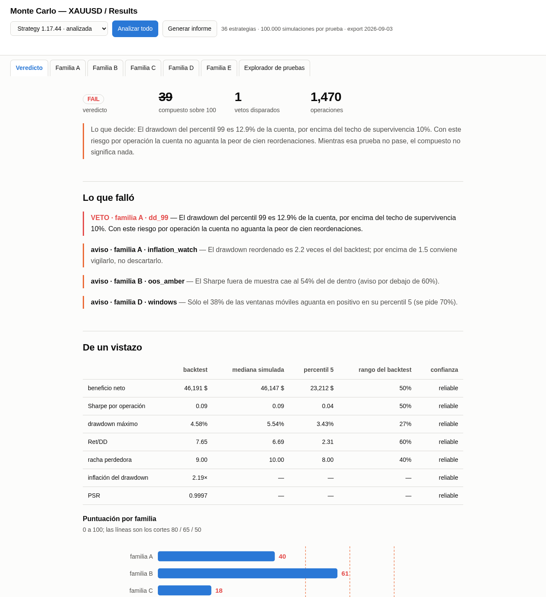
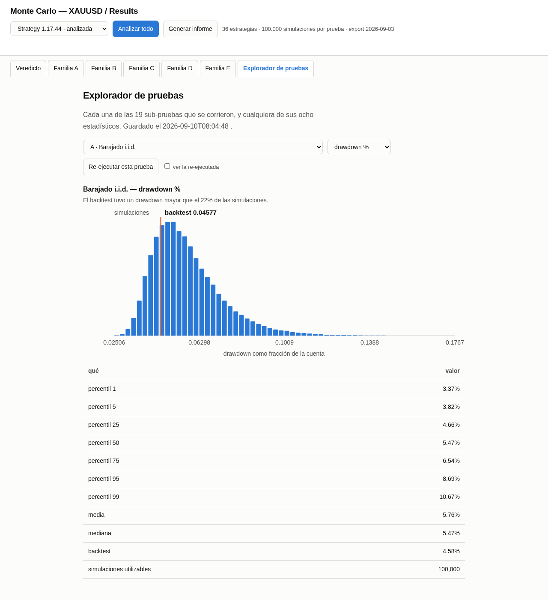

# 7. Monte Carlo — cuánto de este resultado es suerte, y de qué tipo

### Qué pregunta responde

Una estrategia que llega hasta aquí ya te ha convencido: sobrevivió al decaimiento fuera de muestra
y al retest en otros mercados. Este análisis **no vuelve a preguntar si tiene edge**. Pregunta de
qué depende ese edge, que es otra cosa:

- **¿Del orden en que llegaron las operaciones?** Las mismas operaciones barajadas dan el mismo
  beneficio pero un drawdown distinto. Si el drawdown real fue mucho menor que el de las
  barajadas, tuviste suerte con el orden y tu cuenta no está dimensionada para lo que viene.
- **¿De unas pocas operaciones concretas?** Se vuelven a sortear con reemplazo. Si en 1 de cada 20
  sorteos el resultado es negativo, el beneficio dependía de que salieran justo ésas.
- **¿De que la ejecución fuera buena?** Se repite todo con costes hasta el doble, spread más ancho,
  entradas perdidas y ejecuciones peores.
- **¿De un régimen de mercado que ya no está?** Se parte la historia en ventanas de dos años y en
  terciles de volatilidad diaria, y se mira si ganaba en todos o solo en uno.

Las cuatro familias, además, responden por separado a una quinta pregunta: **¿se sostiene igual
dentro y fuera de muestra?** Cada una repite su propia prueba de cabecera sólo con las operaciones
IS y sólo con las OOS, y las enseña una encima de la otra en el mismo histograma — no dos tablas
que hay que comparar de memoria, sino la misma figura con dos distribuciones traslúcidas y las
líneas de cada una (backtest, mediana, percentil de referencia) en su propio color. Es la forma de
ver una degradación real sin necesidad de leer números sueltos.

Termina con un veredicto por estrategia — `STRONG`, `ACCEPTABLE`, `MARGINAL`, `FAIL` o
`INCONCLUSIVE` — y, lo más importante, **con la lista de pruebas que falló y el número que la
tumbó**.

### Cuándo lo usas, y cuándo no

Úsalo cuando ya tienes un puñado de estrategias que han pasado los filtros anteriores y quieres
saber cuáles son frágiles y por dónde. También sirve para una **cartera**: con `--portfolio` junta
las operaciones de todas las estrategias en un solo flujo ordenado por tiempo y corre exactamente
las mismas pruebas sobre él.

**Cuándo NO sirve:**

- **No detecta sobreajuste.** No hay Deflated Sharpe ni CSCV aquí, y no los va a haber: harían falta
  todas las estrategias que se probaron durante la generación, y en esta fase no existen. Fabricar
  ese número daría una cifra creíble y falsa. El sobreajuste se mira en el análisis de generación.
- **No valida el edge.** Da por hecho que lo tiene. Si lo corres sobre estrategias que no han pasado
  el decaimiento, un `MARGINAL` no significa casi nada.
- **No te dice qué riesgo usar**, aunque el techo de drawdown lo parezca: ese techo compara contra
  una cuenta de 100.000 $ arriesgando 1.000 $ por operación. Cambia el riesgo y cambia el veredicto.

### Antes de empezar

- **Las operaciones tienen que estar exportadas** en
  `~/Desktop/AlgoData/raw/<proyecto>/<databank>/<fecha>/trades/`, un CSV por estrategia. Si no
  están: `python3 -m sqx.export.export_trades --project XAUUSD --databank Results --symbol
  XAUUSD_DukasM1_Infinox`.
- **Las barras del mercado** en `~/Desktop/AlgoData/bars/<feed>/M30.csv`, de donde sale la
  volatilidad diaria que define los regímenes. Si no están:
  `python3 -m sqx.export.export_bars --asset XAUUSD`.
- **El activo tiene que tener ficha** en `assets/`. Corre antes `python3 -m core.assets XAUUSD` y
  léela. Aquí un `use: null` **no bloquea**, porque el coste de cada operación no se elige: se
  recupera del propio backtest (bruto menos neto), que es lo que SQX cobró de verdad.
- **No hace falta arrancar nada.** No toca SQX ni el worker: lee CSV. Puedes lanzarlo con la GUI
  abierta.

### Cómo se ejecuta

```bash
python3 -m strategies.monteCarlo.report --project XAUUSD --databank Results \
        --asset XAUUSD --export 2026-09-03
```

| flag | obligatorio | qué hace |
|---|---|---|
| `--project` | sí | nombre del proyecto tal y como aparece en SQX |
| `--databank` | sí | nombre del databank, con sus espacios si los tiene |
| `--asset` | sí | nombre del activo en `assets/`, por ejemplo `XAUUSD` |
| `--export` | sí | la fecha de la carpeta de exportación, **no** la de hoy |
| `--portfolio` | no | analiza todas las estrategias como una sola cartera |
| `--bars-timeframe` | no | de qué barras sale la volatilidad diaria; `M30` por defecto |
| `--set` | no | cambia cualquier valor del config: `--set global.n_sims=100000` |

**Todo lo ajustable está en `strategies/monteCarlo/config.yaml`**, agrupado por familia y con un
comentario por línea. No hay ni un número escondido en el código. Los tres que importan:

| ajuste | por defecto | qué cambia |
|---|---|---|
| `global.n_sims` | 100.000 | precisión de las colas y casi todo el tiempo de cálculo |
| `blocks.n_block_sizes` | 6 | cuántos tamaños de bloque se prueban en las familias A y B |
| `scoring.survival_dd_pct` | 10% | el techo de drawdown que la cuenta aguanta. **Provisional** |
| `stability.n_stability_runs` | 8 | cuántas veces se recalculan los números que deciden |

Con 96 núcleos tarda unos **25 segundos por estrategia** con las 100.000 simulaciones por defecto:
las 36 del ejemplo, con la comprobación de estabilidad incluida, **15 minutos**. Bajar a 20.000 lo
deja en unos 4 minutos y, medido, no cambia ningún veredicto — sólo ensancha un poco las colas.

La comprobación de degradación IS/OOS de las familias A, B, C y D añade catorce remuestreos más por
estrategia, a las mismas 100.000 simulaciones — en coste, como analizar una muestra dentro/fuera de
la Familia B siete veces. Van al mismo grupo de procesos que todo lo demás, así que no se suman en
serie: medido en una máquina de 16 núcleos, una estrategia completa (las cinco familias, con esto
incluido) tardó 30 segundos — el tiempo lo decide cuántos núcleos tengas, no una cifra fija de esta
página.



### Qué produce

En `~/Desktop/AlgoData/reports/<proyecto>/<databank>/<fecha>/montecarlo/` — y en
`montecarlo_portfolio/`, al lado y sin pisarlo, cuando corres con `--portfolio`:

| archivo | qué es |
|---|---|
| `montecarlo.html` | **la página que hay que abrir.** Resumen del databank, qué falló y la tabla de todas |
| `estrategias/<nombre>.html` | el informe completo de una estrategia: las cinco familias con sus figuras |
| `verdict.csv` | una fila por estrategia: veredicto, compuesto, las cinco notas y cada número que decidió |
| `flags.csv` | una fila por prueba disparada: qué estrategia, qué prueba, con qué valor y si veta |
| `montecarlo.md` | el resumen escrito |
| `manifest.json` | qué se analizó y con qué configuración entera |

Los informes se acumulan por fecha: uno nuevo no borra el anterior.

### Cómo se lee el resultado

Se lee **en este orden**, y el orden importa.

**1. La página del databank: qué falló, antes que ninguna nota.**



**2. El informe de una estrategia: el veredicto, lo que falló, y sólo después los números.**



La columna «rango del backtest» dice qué fracción de las simulaciones quedó por debajo del
backtest real. Cerca del 100% significa que el backtest fue de los buenos entre todos los mundos
posibles: eso es suerte, no edge.

**3. Familia A — el drawdown que no viste.**



La **inflación del drawdown** es el número clave: el percentil 95 del drawdown reordenado dividido
por el que salió en el backtest. Por debajo de 1,5 es benigno; entre 1,5 y 3 hay que vigilarlo; por
encima de 3 el drawdown del backtest fue una casualidad afortunada. **Dimensiona la cuenta con el
percentil 95, no con el drawdown del backtest.**

La comprobación de la caja gris tiene que decir que barajar movió el beneficio en ~0 $. Si dice otra
cosa, el modelo está cambiando la composición y no sólo el orden: no sigas leyendo.

Al final de cada familia (A, B, C y D) hay un apartado **«Degradación dentro / fuera de muestra»**
con el histograma solapado descrito arriba. Léelo así: si la mediana y el percentil de referencia de
la muestra OOS quedan muy por debajo de los de la IS, esa familia se está sosteniendo peor fuera de
muestra que dentro — información que el veredicto agregado no distingue. *(Captura pendiente: el
histograma solapado es nuevo y todavía no tiene imagen en `assets/`.)*

**4. Familia D — dónde vivía el edge.**



Las barras naranjas son ventanas de dos años en las que la estrategia, remuestreada, pierde. Un
bloque de 24 meses que no se solapa con ningún otro y sale en negativo es un veto: es un periodo
entero en el que el sistema no funcionó, y las ventanas solapadas lo camuflan.

Debajo de esa tabla está la **curva de equity real con cada bloque marcado** — la misma curva del
backtest, con una línea discontinua donde empieza cada bloque de la tabla de arriba, para ver a ojo
en qué tramo del calendario vive el bloque muerto. Y en el régimen de volatilidad, el precio y la
serie de volatilidad (ATR o GARCH, la que esté activa) superpuestos sobre el mismo eje de tiempo,
con el fondo coloreado por tercil — pasa el ratón por la línea de precio o la de volatilidad para
resaltar cada una por separado. *(Captura pendiente para ambas figuras.)*

**Qué valor es bueno**, resumido:

| número | bien | vigilar | mal |
|---|---|---|---|
| inflación del drawdown | ≤ 1,5 | 1,5 – 3 | > 3 |
| beneficio del percentil 5 | > 0 y con margen | cerca de 0 | ≤ 0 |
| profit factor del percentil 5 | > 1,20 | 1,10 – 1,20 | ≤ 1,10 |
| Sharpe OOS / Sharpe IS | > 0,60 | 0,40 – 0,60 | < 0,40 |
| ventanas móviles en positivo | > 70% | 50 – 70% | < 50% |
| PSR | ≥ 0,95 | 0,90 – 0,95 | < 0,90 |

### Un ejemplo completo

Las 36 estrategias del databank `Results` del proyecto `XAUUSD`, con la configuración por defecto:

```
python3 -m strategies.monteCarlo.report --project XAUUSD --databank Results \
        --asset XAUUSD --export 2026-09-03
```

El resumen escrito que deja en `montecarlo.md`:

```
# Monte Carlo — XAUUSD / Results

36 estrategias · 100,000 simulaciones por prueba · export 2026-09-03

## Veredicto

| veredicto | estrategias |
|---|---|
| FAIL | 34 |
| MARGINAL | 2 |

Pasan sin ningún veto: **2** de 36.

## Por qué caen las que caen

- `dead_block` — 30 estrategias
- `dd_99` — 21 estrategias
- `pf_5` — 13 estrategias
- `spread_widen` — 4 estrategias
- `cost_shock` — 3 estrategias
- `fill_degrade` — 3 estrategias
- `high_vol` — 1 estrategia

## Estabilidad del propio Monte Carlo

Con 100,000 simulaciones y 8 repeticiones independientes, el número que más se mueve es
`iid_bootstrap.dd_pct.99`, con una dispersión del 1.3% de su media. Por debajo de la
tolerancia, así que las cifras que deciden son estables.
```

Lo que hay que leer de ahí, en cristiano:

- **Ninguna es sólida.** Dos se quedan en `MARGINAL` y el resto tienen algún veto.
- **`dead_block` tumba a casi todas.** 30 de 36 tienen un bloque de dos años en el que pierden.
  Mirando las ventanas móviles se ve por qué: **el edge se muere a partir de 2013**, y el resultado
  total lo sostienen los primeros años. Eso no lo enseña ninguna métrica del databank.
- **`dd_99` tumba a 21 de 36** con el techo del 10%. Ese techo es provisional y es tanto una
  afirmación sobre el **riesgo por operación** como sobre las estrategias: con 500 $ por operación
  en vez de 1.000 $, la mitad lo pasan. Mientras no estén las reglas de la prop firm, ese veto se
  lee como «con este riesgo, no».
- **El optimismo dentro de muestra es enorme.** El Sharpe mediano fuera de muestra es el **14%**
  del de dentro (mediana de las 36). Eso no es sobreajuste medido — es una comparación de nivel —
  pero es optimismo que el test de decaimiento no había recogido.
- **Cuenta con el doble de drawdown del que viste.** La inflación mediana es **1,95**, y la más baja
  de las 36 es 1,52. Ninguna tiene un drawdown de backtest que sirva para dimensionar la cuenta.

### El panel interactivo

El comando de arriba analiza el databank entero y escribe. El **panel** es lo contrario: una
estrategia cada vez, tú decidiendo qué se corre y mirando lo que salga, sin generar nada hasta que
lo pidas.

```bash
python3 -m strategies.monteCarlo.explorer.serve --project XAUUSD --databank Results \
        --asset XAUUSD --export 2026-09-03
```

Se abre solo en el navegador, en `http://127.0.0.1:8765` (cambia el puerto con `--port`). Acepta los
mismos `--set` que el comando, así que puedes explorar con 20.000 simulaciones y dejar las 100.000
para el informe final. Se para con `Ctrl+C`.

**Abre siempre en blanco.** A diferencia de versiones anteriores, cada arranque borra cualquier
resultado guardado de esa databank antes de abrir el navegador: nunca te vas a encontrar estrategias
«ya analizadas» de una sesión anterior confundiéndose con las de hoy. Dentro de la misma sesión el
caché sigue funcionando igual — cambiar de estrategia y volver es instantáneo.



| control | qué hace |
|---|---|
| desplegable de estrategias | cambia de estrategia. Las que ya tienen resultado guardado *en esta sesión* salen marcadas |
| **Configuración de este runeo** (desplegable bajo la cabecera) | todos los valores de `config.yaml` y el coste del activo (spread, comisión, point value, tick size), con los de fábrica precargados. Lo que cambies aquí se aplica sólo al siguiente clic — nunca se escribe en disco — y pasa el ratón por el nombre de cualquier campo para ver qué es |
| **Analizar todo** | corre las cinco familias sobre esa estrategia y guarda el resultado |
| **Generar informe** | escribe su página HTML, con la comprobación de estabilidad incluida |
| pestañas | el veredicto y cada familia, con las mismas tablas y figuras que el informe |
| **Explorador de pruebas** | cualquiera de las 19 sub-pruebas × cualquiera de sus 8 estadísticos |

*(Captura pendiente: la fila de Configuración es nueva y no sale todavía en la imagen de arriba.)*



El explorador es la respuesta a «quiero ver absolutamente todos los resultados sin que sea un lío»:
en vez de cuarenta figuras en una página, dos desplegables y la que quieras mirar. Debajo del
histograma sale también la curva de equity de esa sub-prueba con sus bandas de confianza, para ver
no sólo la distribución de un estadístico sino qué pinta tiene la curva entera bajo ese modelo.
*(Captura pendiente para la curva de equity del explorador.)* Y el botón **Re-ejecutar esta prueba**
vuelve a correr esa sub-prueba sola, con azar nuevo, y la enseña al lado de la guardada — que es la
forma honesta de comprobar si un número te está bailando.

**Lo que se guarda y dónde.** Cada análisis va a
`~/Desktop/AlgoData/derived/montecarlo/<proyecto>/<databank>/<estrategia>.json`, con una huella de
**toda** la configuración dentro — incluidos los overrides de coste del activo que hayas puesto en
el desplegable de Configuración, así que analizar la misma estrategia con un spread distinto no se
confunde con el resultado de fábrica. Por eso cambiar de estrategia es instantáneo dentro de la
misma sesión. Y por eso, si tocas un umbral del `config.yaml` o un coste del activo, el panel te
avisa en rojo de que lo que estás viendo se calculó con otra configuración, en vez de contestarte
tan tranquilo a una pregunta que no le hiciste. Se guardan resúmenes e histogramas, nunca las
simulaciones crudas: son kilobytes, no gigabytes. Esos ficheros no sobreviven al siguiente arranque
del panel — ver más arriba.

Los informes que escribe el panel van a `montecarlo_panel/`, **al lado** de los del comando y nunca
encima: el panel suele correrse con menos simulaciones, y una página hecha con una configuración no
debe sustituir a otra hecha con otra.

**Lo que el panel no hace, a propósito:**

- **No decide con una prueba suelta.** Re-ejecutar una sub-prueba no toca el resultado guardado ni
  puede mover un veredicto: un veredicto sale de un análisis entero o no sale.
- **No corre el databank entero.** Para eso está el comando, que lo dejas trabajando y te vas.
- **No se abre desde otro ordenador.** Escucha sólo en local. Si clonas el repo en otro PC funciona
  allí igual: no hay nada suyo atado a esta máquina.
- **Un trabajo a la vez.** Dos análisis simultáneos se pelearían por los mismos núcleos y ninguna de
  las dos barras de progreso significaría nada, así que el segundo se rechaza.

### Qué NO te dice

- **Que una estrategia con `MARGINAL` funcione.** Dice que ninguna de estas pruebas la tumbó. La
  prueba de que funciona es el mercado.
- **Nada sobre sobreajuste.** Ver arriba. Es el error más fácil de cometer con un Monte Carlo.
- **Nada que se repita exacto dos veces.** No hay semilla, a propósito: cada tirada usa entropía
  nueva. Lo que sí te da es la **dispersión** entre tiradas independientes (sección de estabilidad);
  si es grande, la respuesta es subir `n_sims`, no fijar una semilla y creerte la primera.
- **Nada sobre la cartera**, salvo que la pidas con `--portfolio`. Doce estrategias que pasan por
  separado pueden hundirse a la vez.

### Si algo falla

- `FileNotFoundError` en `bars/<feed>/M30.csv` — no has exportado las barras de ese mercado.
  `python3 -m sqx.export.export_bars --asset XAUUSD`.
- `ValueError: N trades open on days the bar file does not have` — las barras no son del mismo feed
  que las operaciones, o les falta histórico. No se imputa nada a propósito: compararías la
  estrategia con los regímenes de otro instrumento.
- `IndexError` al empezar — la carpeta `trades/` de esa fecha de exportación está vacía o no existe.
  Comprueba la fecha: es la de la exportación, no la de hoy.
- `Address already in use` al abrir el panel — ya tienes uno corriendo, o el puerto está ocupado.
  Ciérralo con `Ctrl+C` en su terminal, o abre el nuevo con `--port 8766`.
- Un aviso de que el coste modelado no cuadra con el recuperado — la ficha de `assets/` describe
  otro instrumento. Sólo invalida la familia C; el resto del informe sigue en pie.
