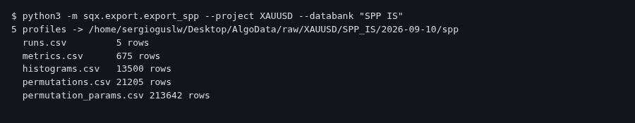
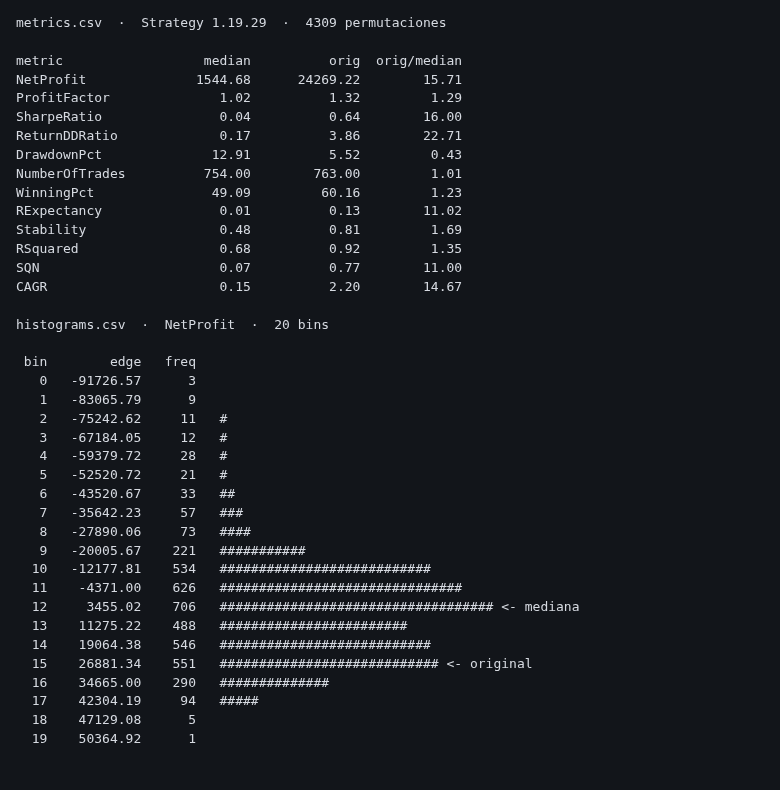
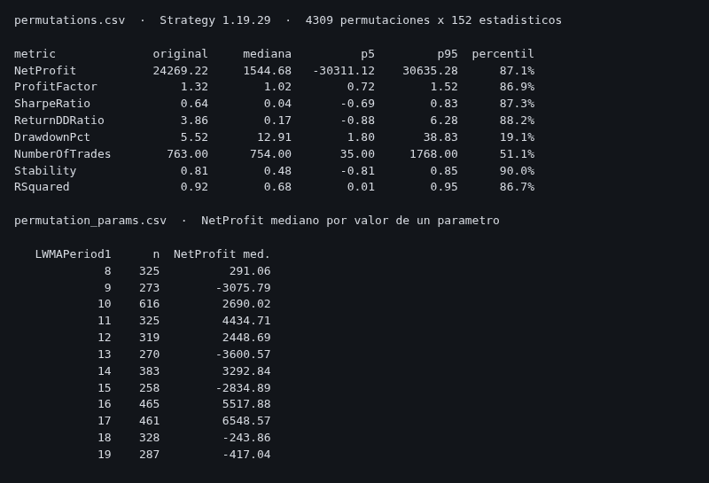

# 8. SPP — sacar a Python todo lo que deja el Sys. Param Permutation

### Qué pregunta responde

Cuando pasas una estrategia por el cross-check **Sys. Param Permutation** de StrategyQuant X, SQX
mueve un poco cada parámetro de la estrategia, la vuelve a backtestear miles de veces y te enseña un
panel con histogramas. Ese panel es lo único que ves dentro del programa, y no se puede exportar
desde el menú.

Este comando saca **todo ese panel a CSV**: cuántas permutaciones se probaron, cuántas fueron
rentables, la mediana de cada una de las 135 métricas de SQX, el valor original de la estrategia y
el histograma completo de cada métrica, bin a bin. Y si SQX guardó el detalle, además
**una fila por permutación** con sus parámetros y sus 152 estadísticos.

La pregunta de fondo es la del sobreajuste. Si tu estrategia gana 24.269 € y la permutación mediana
gana 1.858 €, tu resultado **no es lo normal de esa familia de parámetros: es el pico**. Ese cociente
—la columna `orig_over_median`— es el número que buscas.

### Cuándo lo usas, y cuándo no

Úsalo cuando ya has corrido la tarea SPP dentro de SQX y las estrategias están volcadas en un
databank (`SPP IS`, `SPP OOS`...).

**Cuándo NO sirve:**

- Si el databank no ha pasado por SPP, los `.sqx` no llevan perfil dentro y el comando no encuentra
  nada. No es un error: sencillamente esas estrategias no tienen ese dato.
- **No te da los trades de las permutaciones, y nunca podrá dártelos.** No es una limitación del
  exportador: es que SQX no los escribe. Cada permutación se guarda como su cadena de parámetros más
  un bloque `SQStats`, y ese bloque solo admite seis tipos de registro, todos numéricos —enteros,
  flotantes y longs—; no hay ninguna vía por la que se escriba una lista de órdenes. Las operaciones
  que sí tienes son las del backtest principal, y ésas se sacan con
  `python3 -m sqx.export.export_trades --project XAUUSD --databank "SPP IS" --symbol XAUUSD_DukasM1_Infinox`.
- **El detalle permutación a permutación solo existe si la casilla estaba quitada al correr el SPP.**
  Es *Settings → Performance → "Don't store data for 3D charts in Optimization profile"*. Con la
  casilla puesta SQX tira esos resultados al guardar y deja únicamente medianas e histogramas — y las
  estrategias guardadas así no lo recuperan aunque la quites después: hay que **volver a correr el
  SPP**. Con la casilla quitada el `.sqx` engorda mucho: los cinco de `SPP IS` pasaron de 125 KB a
  2,2 MB cada uno.

### Antes de empezar

- El databank tiene que estar **volcado a disco**. Si la carpeta está vacía, abre SQX, entra en el
  databank y deja que sincronice.
- **No hace falta arrancar nada.** El comando lee los `.sqx` directamente, no usa SQX ni el worker,
  y puedes lanzarlo con la GUI abierta sin ningún riesgo.

### Cómo se ejecuta

```bash
python3 -m sqx.export.export_spp --project XAUUSD --databank "SPP IS"
```

| flag | obligatorio | qué hace |
|---|---|---|
| `--project` | sí | nombre del proyecto tal y como aparece en SQX |
| `--databank` | sí | nombre del databank, con sus espacios y entre comillas si los tiene |

Tarda un par de segundos por estrategia. No toca SQX.



### Qué produce

En `~/Desktop/AlgoData/raw/<proyecto>/<databank>/<fecha>/spp/`:

| archivo | qué es |
|---|---|
| `runs.csv` | una fila por estrategia: permutaciones, cuántas ganaron y perdieron, beneficio medio y máximo, desviación típica y los parámetros que se movieron |
| `metrics.csv` | una fila por estrategia y métrica: la mediana de las permutaciones, el valor original y su cociente |
| `histograms.csv` | una fila por estrategia, métrica y bin: la frecuencia, y qué bin contiene la mediana y cuál el valor original |
| `permutations.csv` | **solo si SQX guardó el detalle** — una fila por permutación con sus 152 estadísticos. La fila `permutation = -1` es la estrategia original, contra la que se comparan las demás |
| `permutation_params.csv` | **solo si SQX guardó el detalle** — una fila por permutación y parámetro con el valor que le tocó. Se cruza con la anterior por `strategy` + `permutation` |
| `manifest.json` | qué se leyó, cuántos perfiles había y con qué versión del código |

Las carpetas van por fecha: una exportación nueva no borra la anterior.

### Cómo se lee el resultado



Arriba, `metrics.csv` para una estrategia. **La columna que decide es `orig_over_median`:**

- **Cerca de 1** — tu estrategia rinde como la permutación típica. El resultado no depende de haber
  acertado los parámetros exactos. Es lo que quieres ver.
- **Muy por encima de 1** — el resultado vive en un pico. En el ejemplo, `NetProfit` sale 13 veces la
  mediana y `ReturnDDRatio` 15 veces: mover los parámetros un punto destruye la estrategia.
- **Por debajo de 1 en una métrica de riesgo** (`DrawdownPct` sale 0,45) — el original sufre menos
  drawdown que la permutación mediana, que es la misma señal vista del revés.

Abajo, `histograms.csv` para `NetProfit`. Las 4.301 permutaciones repartidas en 20 bins, con la
mediana en el bin 13 y el valor original en el 15. Lo que importa es **cuánta masa queda a la
izquierda del cero**: aquí unas 1.300 de 4.301 permutaciones pierden dinero.

`runs.csv` resume lo mismo en una línea. `profitable_pct` es el porcentaje de permutaciones con
beneficio; en las cinco estrategias de `SPP IS` va del 54 % al 92 %, y la de 92 % es la que menos
depende de sus parámetros.

#### Y con el detalle guardado, lo que de verdad quieres



Arriba, lo que las medianas no te podían dar: **el percentil**. `NetProfit` original está en el
percentil 87 de sus propias permutaciones, y `Stability` en el 90. Y los cuantiles: el 5 % peor de
las permutaciones pierde 30.311 €. Con `metrics.csv` solo sabías la mediana; aquí tienes toda la
distribución y puedes pedir el percentil que quieras.

Abajo, lo que **ninguna** parte del panel de SQX enseña: **qué parámetro es el que hace daño**.
Agrupando las 4.309 permutaciones por el valor de `LWMAPeriod1`, el `NetProfit` mediano salta de
−3.601 € a +6.549 € según el valor. Eso es una superficie de parámetros, y es lo que decide si la
estrategia tiene una meseta donde vivir o un pico. Se hace en tres líneas:

```python
w = q[q.strategy == "Strategy 1.19.29"].pivot(index="permutation", columns="parameter", values="value")
j = w.join(p[p.permutation >= 0].set_index("permutation")["NetProfit"])
print(j.groupby("LWMAPeriod1").NetProfit.median())
```

### Un ejemplo completo

```bash
$ python3 -m sqx.export.export_spp --project XAUUSD --databank "SPP IS"
5 profiles -> /home/sergioguslw/Desktop/AlgoData/raw/XAUUSD/SPP_IS/2026-09-10/spp
  runs.csv         5 rows
  metrics.csv      675 rows
  histograms.csv   13500 rows
  permutations.csv 21205 rows
  permutation_params.csv 213642 rows
```

Y en Python:

```python
import pandas as pd
from pathlib import Path

d = Path.home() / "Desktop/AlgoData/raw/XAUUSD/SPP_IS/2026-09-10/spp"
m = pd.read_csv(d / "metrics.csv")

frag = m[m.metric == "NetProfit"].set_index("strategy")["orig_over_median"]
print(frag.sort_values(ascending=False))
```

Para leer un perfil suelto, sin exportar nada:

```python
from pathlib import Path
from core import optprofile

p = optprofile.read(Path.home() / "Desktop/SQX/user/projects/XAUUSD/databanks/SPP IS/Strategy 1.19.29.sqx")
print(p["permutations"], p["profitable_pct"], p["params"])
print(p["medians"]["NetProfit"], p["orig"]["NetProfit"])

if p["permutation_results"]:                       # la casilla estaba quitada
    print(p["results"][0]["params"])
    print(p["results"][0]["stats"]["NetProfit"])
```

### Qué NO te dice

- **No es una prueba fuera de muestra.** Todas las permutaciones se corren sobre el mismo tramo de
  datos que la estrategia original. Un SPP impecable sigue siendo compatible con una estrategia que
  no funcione en el futuro; lo que descarta es una cosa distinta —que el resultado dependa de haber
  clavado los parámetros—, no que el edge sea real.
- **Los histogramas vienen ya agregados por SQX**, en 20 bins que él eligió. Si el databank no
  guardó el detalle, ésa es toda la distribución que hay: no se puede pedir otro percentil ni cruzar
  dos métricas permutación a permutación. Con el detalle guardado, `permutations.csv` deja hacer las
  dos cosas y los histogramas sobran.
- **En `permutations.csv`, 34 de los 152 estadísticos salen como `stat:<tipo>:<índice>`.** SQX los
  guarda por su posición en un array, sin nombre. Los 118 nombrados se calibraron cruzando el
  resultado original de 34 perfiles contra la tabla de medianas del mismo fichero, que sí lleva
  nombre; los 34 restantes valen 0 en todas las estrategias, que es justo por lo que no hubo con qué
  distinguirlos. El inventario completo, campo a campo, está en el capítulo 9.
- **28 de las 135 métricas de `metrics.csv` salen como `id:<número>`.** SQX guarda las métricas bajo un hash de su
  nombre que ya no se puede deshacer, así que los nombres se reconstruyeron comparando valores
  contra una exportación de databank de 50 estrategias. Esas 28 valen exactamente 0 en todas las
  estrategias de esta instalación, así que no había con qué distinguirlas — y por eso mismo tampoco
  aportan nada. Otras seis llevan interrogación (`Exposure?` / `ExposurePosition?`, `Outlier?` /
  `Outlier2?`, `CalmarRatio?` / `AnnualPctReturnDDRatio?`): son tres parejas cuyos dos miembros valen
  lo mismo en las 225 estrategias con perfil de esta máquina, así que se sabe **de qué pareja es cada
  columna, pero no cuál de las dos**. Las 101 restantes están verificadas una a una.

### Si algo falla

- **`0 profiles`** — el databank no ha pasado por SPP, o los `.sqx` no están en disco. Comprueba la
  carpeta `user/projects/<proyecto>/databanks/<databank>/`.
- **`KeyError: 'optimizationProfile.bin'`** no puede salir: el comando salta los `.sqx` que no lo
  llevan. Si sale otra cosa al leer un `.sqx`, es que ese archivo está corrupto; el traceback dice
  cuál.
