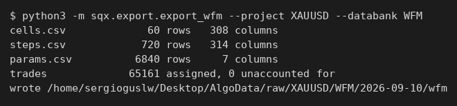
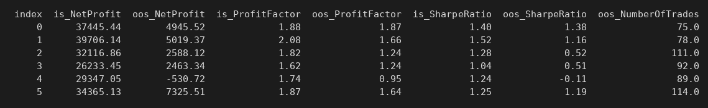

# 9. Walk-Forward Matrix — sacar a Python todo lo que guarda el cross-check WFM

### Qué pregunta responde

Cuando pasas una estrategia por el cross-check **Walk-Forward Matrix**, SQX prueba la misma
estrategia con muchas combinaciones de "cuántos tramos" y "qué porcentaje de cada tramo es fuera de
muestra", y te enseña una cuadrícula de colores. Este comando saca **toda** esa cuadrícula a CSV:
cada celda, cada tramo dentro de cada celda, con qué parámetros se quedó el optimizador en ese
tramo, cómo fue en la ventana de optimización y cómo fue después, y los trades de cada tramo.

Es lo que necesitas para responder en Python a "¿lo que va bien optimizando predice lo que va bien
después?", que es la **correlación walk-forward**.

### Cuándo lo usas, y cuándo no

Úsalo con un databank en el que hayas corrido el retest **Walk-Forward Matrix**. Las estrategias que
estén en ese databank sin haber pasado el cross-check se saltan solas, sin error.

**No sirve** para sacar las miles de optimizaciones que SQX probó dentro de cada tramo. Eso no está
guardado en ningún sitio: de cada tramo SQX se queda con el ganador y tira el resto. Lee la sección
*Qué NO te dice*.

### Antes de empezar

- Nada que preparar en la GUI. El comando **no toca el master**: copia las estrategias al worker y
  las exporta allí, así que lo puedes lanzar con SQX abierto.
- El worker tiene que estar parado. El comando lo arranca y lo para él solo.
- Ojo con el espacio: una estrategia con matriz de 30 celdas exporta unos **60.000 trades**. Sesenta
  estrategias son del orden de un giga en `~/Desktop/AlgoData`.

### Cómo se ejecuta

```bash
python3 -m sqx.export.export_wfm --project XAUUSD --databank WFM
```

| flag | obligatorio | qué hace |
|---|---|---|
| `--project` | sí | nombre del proyecto tal y como aparece en SQX |
| `--databank` | sí | el databank en el que escribió el retest WFM; entre comillas si tiene espacios |

Las tablas se leen de los ficheros y tardan segundos. Los trades pasan por el worker: una arrancada
de SQX y unos minutos, según cuántas estrategias haya.



### Qué produce

En `~/Desktop/AlgoData/raw/<proyecto>/<databank>/<fecha>/wfm/`:

| archivo | qué es |
|---|---|
| `cells.csv` | una fila por celda de la matriz (30 por estrategia): el `% OOS`, el número de tramos, y **152 estadísticos con prefijo `is_` y otros 152 con `oos_`** |
| `steps.csv` | una fila por **tramo** de cada celda (360 por estrategia): las fechas de la ventana de optimización y de la ventana de after, y los mismos 152 + 152 estadísticos |
| `params.csv` | forma larga: una fila por tramo y parámetro, con el valor que eligió el optimizador en ese tramo |
| `check.csv` | la comprobación del reparto de trades: trades asignados contra trades que SQX dice que hubo, tramo a tramo |
| `trades/<estrategia>/<celda>.csv` | los trades de esa celda, con dos columnas añadidas: `period` (el tramo) y `sample` (`IS` o `OOS`) |
| `raw/`, `strategies/` | lo que escupió SQX antes de trocearlo, y las copias que se le pasaron. Se pueden borrar |

La carpeta lleva fecha, así que **no sobrescribe** una exportación anterior.

### Cómo se lee el resultado

Cada fila de `steps.csv` es un experimento honesto: *"optimicé aquí, obtuve esto; luego lo solté ahí
sin tocarlo, y obtuve esto otro"*.



Se lee así: en el tramo 0 la optimización dejó 37.445 $ con un profit factor de 1,88; en la ventana
siguiente, sin tocar nada, hizo 4.945 $ con 1,87 en 75 operaciones. En el tramo 4 la optimización
seguía dando 29.347 $ y 1,74 y el resultado fuera de muestra fue **−530 $** con 0,95: la
optimización se veía igual de bien y el resultado ya no acompañó.

La correlación walk-forward es exactamente esto medido sobre todas las filas:

```python
import pandas as pd
s = pd.read_csv("steps.csv")
s = s[~s.future]                      # el último tramo de cada celda no se llegó a correr
s.groupby("strategy").apply(lambda d: d.is_NetProfit.corr(d.oos_NetProfit))
```

Un valor cerca de 0 quiere decir que optimizar no informa de nada sobre lo que viene después. Cerca
de 1, que sí. **En las dos estrategias medidas salió −0,04 y 0,06**, es decir, nada — con 330 tramos
cada una, que es muestra suficiente para creérselo.

Antes de fiarte de los trades, mira `check.csv`: la columna `assigned` tiene que ser igual a
`stored` en todas las filas. En la comprobación que se hizo al construir esto, 39.873 trades
repartidos en 30 celdas cuadraron **uno a uno**.

### Un ejemplo completo

```bash
$ python3 -m sqx.export.export_wfm --project XAUUSD --databank WFM
cells.csv             60 rows   308 columns
steps.csv            720 rows   314 columns
params.csv          6840 rows     7 columns
trades             65161 assigned, 0 unaccounted for
wrote /home/sergioguslw/Desktop/AlgoData/raw/XAUUSD/WFM/2026-09-10/wfm
```

Dos estrategias, 30 celdas cada una, 360 tramos cada una, y los 65.161 trades repartidos sin que
sobre ni falte ninguno.

### Qué NO te dice

- **No tiene las optimizaciones que se probaron.** Dentro de cada tramo SQX prueba hasta 10.000
  combinaciones de parámetros; guarda la que ganó y tira las demás. No es que falte el comando: no
  existe el dato. Activar *"Don't store data for 3D charts"* **no cambia esto** — esa opción es del
  *Optimization profile* del cross-check SPP, y una estrategia pasada por WFM no tiene ninguno.
  Si lo que quieres son miles de juegos de parámetros con su rendimiento, lo que sí existe es
  `export_spp.py` (página 8), que ahora sí guarda las 4.000 permutaciones por estrategia — pero de
  una sola muestra, sin partir en IS y OOS.
- **El último tramo de cada celda no cuenta.** SQX lo optimiza pero no hay datos para correrlo:
  viene con `future = True` y sin ninguna columna `oos_`. Hay que quitarlo antes de correlacionar,
  o te comes 30 filas vacías por estrategia.
- **Las 30 celdas no son 30 experimentos independientes.** Todas se calculan sobre el mismo
  histórico y se solapan mucho entre sí. Sirven para ver si el resultado depende de cómo partas el
  periodo; no para multiplicar tu tamaño de muestra por 30.
- **34 de los 152 estadísticos siguen sin nombre**, y salen como `stat:f:63`. Valían cero en las 66
  estrategias contra las que se calibró la tabla, así que no se pudieron identificar. Cuatro más
  llevan `?` porque su pareja vale exactamente lo mismo en todo el install y no se pueden separar.

### Si algo falla

| lo que ves | qué pasa |
|---|---|
| `cells.csv 0 rows` | ninguna estrategia del databank pasó por WFM. Mira que sea el databank en el que escribió el retest, no el de origen |
| `trades ... N unaccounted for` con N > 0 | el reparto por fechas no cuadra con lo que dice SQX. **No uses esos trades**; mira `check.csv` para ver en qué tramo se descuadra |
| el worker no arranca | quedó uno colgado de antes: `bin/sqx-worker.sh stop` y vuelve a lanzarlo |
