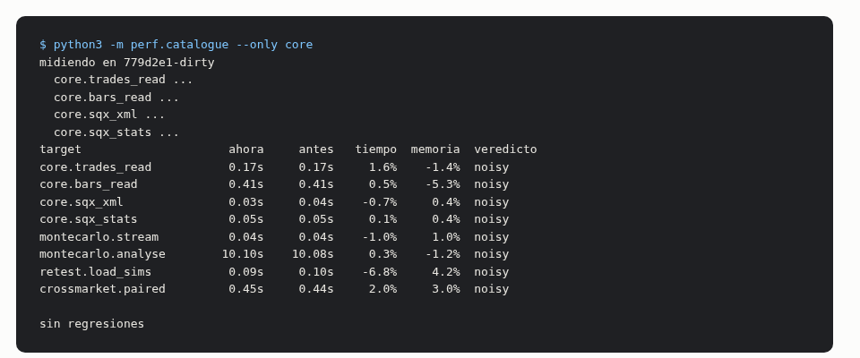
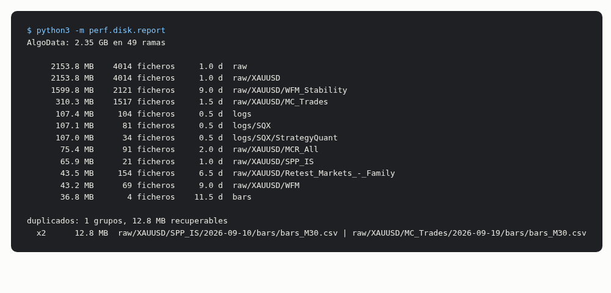
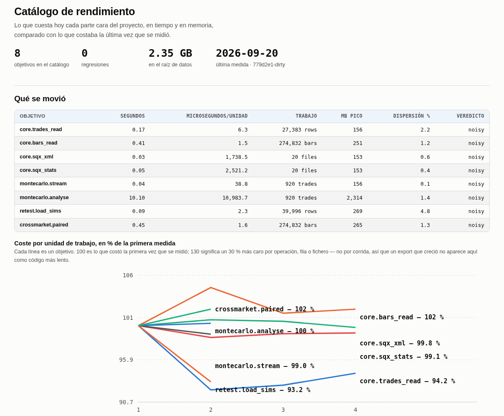
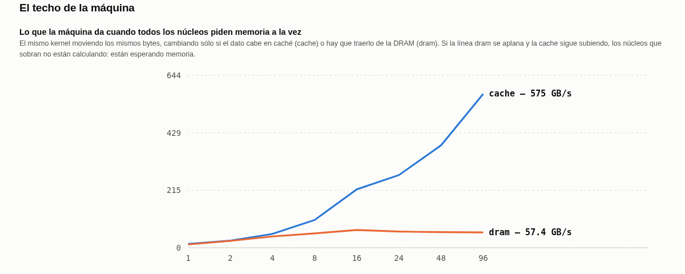
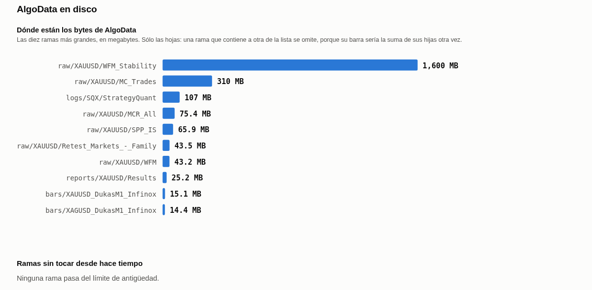
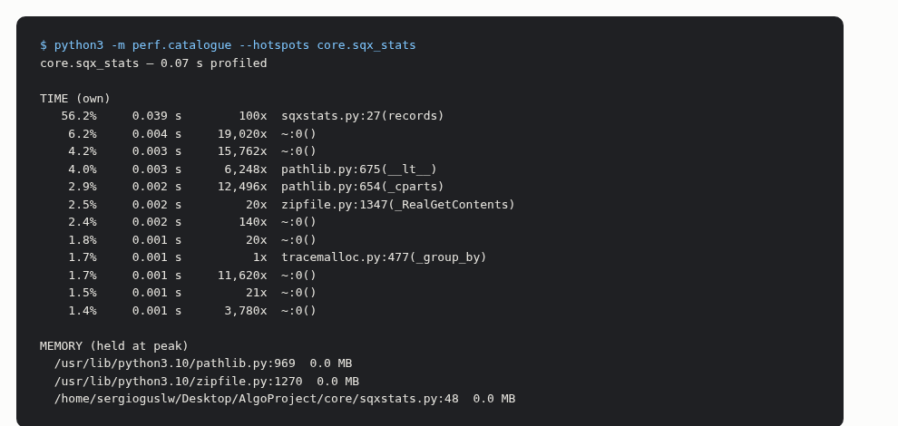

# 12. Catálogo de rendimiento — qué cuesta cada parte del proyecto, y si hoy cuesta más que ayer

### Qué pregunta responde

Este proyecto es caro: miles de estrategias, cientos de miles de simulaciones, y una máquina que
comparte con la GUI de StrategyQuant X. El catálogo mide **cuánto tarda y cuánta memoria pide** cada
parte cara del código, guarda la medida con la fecha y el commit, y la próxima vez te dice si algo
se ha vuelto más lento.

También mide el disco: cuánto ocupa cada rama de `AlgoData`, qué ficheros están duplicados, y cuánto
costaría leer los mismos datos guardados en otro formato.

No es un test. No dice si el código está bien: dice lo que cuesta.

### Cuándo lo usas, y cuándo no

**Úsalo** después de tocar cualquier módulo de análisis, antes de lanzar una corrida larga que tiene
que caber en memoria, y cuando quieras saber dónde merece la pena invertir tiempo de programación.

**No lo uses** para comparar con la medida de otra máquina: los números son de este servidor. Y no
lo uses como prueba de que un cambio es correcto — puede ser tres veces más rápido y estar mal.

**No hace falta cerrar SQX.** Ningún objetivo toca la instalación: todos leen ficheros ya exportados
bajo `~/Desktop/AlgoData`. Pero si la GUI está construyendo estrategias, la máquina está ocupada y
las medidas saldrán peores; el panel guarda la carga del sistema con cada fila para que eso se vea.

### Antes de empezar

Tiene que existir un export de trabajo bajo el raíz de datos. Por defecto el catálogo mide sobre:

| qué | dónde | se cambia en |
|---|---|---|
| operaciones exportadas y sus `.sqx` | `raw/XAUUSD/MC_Trades/<fecha>/` | `sample.trades_databank` |
| batería de retest ya ingerida | `raw/XAUUSD/MCR_All/<fecha>/` | `sample.retest_databank` |
| velas | `bars/XAUUSD_DukasM1_Infinox/M30.csv` | `sample.bars_feed` |

Siempre usa **el export más reciente** de cada uno. Si no tienes alguno, exporta primero
(`docs/manual/00-empezar.md`) o cambia esas claves en `perf/config.yaml`.

### Cómo se ejecuta

```bash
python3 -m perf.catalogue
```



Una línea por objetivo. `ahora` es el tiempo de esta medida, `antes` el de la anterior, `tiempo` el
cambio **por unidad de trabajo** y `memoria` el cambio en el pico de memoria.

| flag | obligatorio | qué hace |
|---|---|---|
| `--only` | no | mide sólo esos objetivos o esa área (`core`, `strategies`, `montecarlo.analyse`) |
| `--scaling` | no | vuelve a medir el techo de memoria de la máquina; tarda unos minutos |
| `--hotspots OBJETIVO` | no | en vez de medir todo, perfila uno y dice dónde se le va el tiempo |
| `--set CLAVE=VALOR` | no | cambia cualquier valor de `perf/config.yaml` sólo para esta corrida |

El comando **sale con código 1 si algo ha empeorado**, así que puede ir en cron sin nadie delante.

Los otros dos comandos:

```bash
python3 -m perf.disk.report      # inventario de AlgoData, presupuestos y qué se puede borrar
python3 -m perf.render.panel     # dibuja la página con lo que ya está guardado
```



#### El presupuesto de disco

Desde el 2026-09-21, `perf.disk.report` **también sale con código 1 si alguna rama de `AlgoData` se
pasa de su presupuesto**, o si el total se pasa del suyo. Igual que `perf.catalogue` con las
regresiones: así puede ir en cron y creerte lo que dice.

```
AlgoData: 2.47 GB de 60 GB (4%) en 55 ramas

           ok      1.96 GB /   40 GB      5%  raw
           ok      0.30 GB /    3 GB     10%  bars
           ok      0.11 GB /    1 GB     11%  logs
           ok      0.06 GB /    5 GB      1%  reports
```

Los techos están en `perf/config.yaml`, en `disk.budget_gb`. Se dimensionaron con 2,3 GB en uso y
dejando sitio para el estudio de variantes (~200 MB de operaciones por estrategia madre y mercado,
así que el crecimiento va a caer en `raw/`).

Una rama **sin** presupuesto sale marcada `sin presupuesto`, no aprobada. Que aparezca una rama
nueva y empiece a engordar es justo lo que esta tabla existe para que veas.

#### Qué se puede borrar

Y una última sección dice **qué se podría borrar y cuánto liberaría**:

```
candidatos a borrar: 6, 0.47 GB  (nada se borra aquí)
      331.9 MB  strategy_copies    raw/XAUUSD/WFM_Stability/2026-09-10/wfm/strategies
      118.9 MB  strategy_copies    raw/XAUUSD/MC_Trades/2026-09-19/strategies
        0.9 MB  superseded_export  raw/XAUUSD/Retest_Markets_-_Family/2026-09-09
```

Cinco reglas, y **sólo una de ellas es un veredicto**:

| regla | qué encuentra | cuánto te puedes fiar |
|---|---|---|
| `collected_variants` | databanks que el ledger del pipeline dice que ya se exportaron **y se comprobó el hash** | **veredicto** — está probado que el dato sobrevivió |
| `superseded_export` | un export fechado cuyo hermano más nuevo contiene todo lo que él tiene | candidato |
| `strategy_copies` | ficheros `.sqx` dentro de exports, que duplican lo que ya guarda el databank | candidato |
| `intermediates` | carpetas `raw/` y `trades/` de CSV al lado de un `trades.parquet` que ya las contiene (los exports posteriores al 23-09-2026 las borran solos) | candidato |
| `stale_branch` | nada escrito en 90 días | la más floja — viejo no es lo mismo que sobrante |

⚠️ **Nada del proyecto borra ninguna de estas cosas.** La lista sólo le pone un número a una
decisión que sigue siendo tuya.

Un detalle que importa: `superseded_export` compara **contenidos**, no fechas. La primera versión
comparaba fechas y propuso borrar `raw/XAUUSD/SPP_IS/2026-09-10` porque existe un `2026-09-19` —
pero el del 19 sólo tiene `wfc_pairs/`, mientras que el del 10 tiene las tablas de permutaciones que
lee todo el estudio SPP. Habría propuesto borrar la única copia de los datos de entrada. Ahora un
export sólo cuenta como sustituido si el nuevo lo contiene **entero**.

(`perf/measure/runner.py` también se puede ejecutar, pero es interno: es el subproceso que el arnés
arranca para medir un objetivo aislado. No lo llames a mano.)

### Qué salidas produce, y qué significan

Todo vive en `~/Desktop/AlgoData/profiling/`:

| fichero | qué guarda |
|---|---|
| `history.csv` | una fila por medida, para siempre. **Sólo crece**: nunca se edita ni se borra |
| `scaling.csv` | las curvas de escalado de la máquina |
| `disk.csv`, `duplicates.csv`, `formats.csv` | el inventario del disco |
| `budgets.csv` | cada rama contra su presupuesto, una fila por corrida |
| `reclaimable.csv` | los candidatos a borrar, con sus bytes y su motivo |
| `rendimiento.html` | la página |

#### La tabla de costes



Columna por columna:

- **segundos** — lo que tardó la medida mediana de las tres repeticiones.
- **microsegundos/unidad** — lo mismo dividido entre el trabajo hecho. **Ésta es la que decide.** Si
  el export crece de 500 a 3.000 operaciones, los segundos suben y esta columna no: el código no se
  ha vuelto más lento, hay más datos.
- **trabajo** — cuántas operaciones, filas, velas o ficheros procesó, con su unidad.
- **MB pico** — el pico de memoria residente **del árbol de procesos entero**, incluidos los
  trabajadores que el objetivo arranque. Es la cifra que decide si una corrida cabe en la máquina.
- **dispersión %** — cuánto se separaron entre sí las repeticiones de esta misma medida. Es el
  ruido del instrumento.
- **veredicto** — uno de cinco:

| veredicto | qué significa |
|---|---|
| `first` | primera vez que se mide; no hay con qué comparar |
| `regression` | más del 15 % más caro por unidad, o más del 15 % más de memoria |
| `improvement` | más del 15 % más barato |
| `steady` | cambió poco, y ese poco es mayor que el ruido de la medida |
| `noisy` | cambió menos de lo que el instrumento puede distinguir. **No es "igual": es "no lo sé"** |

#### El techo de la máquina



Las dos líneas son el mismo cálculo moviendo los mismos bytes. La única diferencia es si el dato
cabe en la caché del procesador o hay que ir a buscarlo a la memoria principal.

Que la línea `cache` siga subiendo hasta 96 procesos y la `dram` se quede plana desde 16 significa
que **los núcleos que sobran no están calculando: están esperando memoria**. La consecuencia
práctica: en un módulo cuyos datos no caben en caché, pedir más procesos no lo hace más rápido —
sólo gasta más RAM.

#### El disco



Las ramas más grandes son sólo las hojas: una carpeta que contiene a otra de la lista no aparece,
porque su barra sería la suma de sus hijas otra vez. Los **duplicados son candidatos, no una
sentencia**: dos ficheros que coinciden en tamaño y en 64 KB de cada extremo son casi seguro el
mismo fichero, pero nada aquí lo confirma y **nada aquí borra nada**.

### Dónde se le va el tiempo a un módulo

```bash
python3 -m perf.catalogue --hotspots core.sqx_stats
```



Arriba, las funciones ordenadas por **tiempo propio** — el gastado dentro de su propio cuerpo, sin
contar a quién llaman. Abajo, las líneas que tenían más bytes vivos en el momento de mayor consumo.

Dos avisos:

- Los segundos de un perfilado son más largos que los reales, porque perfilar cuesta. **Lee el orden,
  no los segundos.**
- La lista de memoria sólo ve lo que reservó Python en ese proceso. Los buffers de numpy dentro de un
  trabajador no salen ahí: para eso está la columna `MB pico`, que muestrea el árbol entero.

### Qué se puede tocar

Todo está en `perf/config.yaml`. Lo que de verdad cambia el resultado:

| clave | qué hace |
|---|---|
| `harness.repeats` | repeticiones por medida. Menos repeticiones, más ruido y más veredictos `noisy` |
| `regression.wall_pct` | a partir de qué porcentaje una medida se llama regresión |
| `sample.n_sims` | el presupuesto de simulación del objetivo de Monte Carlo |
| `sample.files` | cuántos ficheros muerden los objetivos de parseo |
| `disk.stale_days` | a partir de cuántos días sin tocar una rama se marca como obsoleta |

**Cambiar `sample.*` rompe la comparación con las medidas anteriores**, porque ya no es el mismo
trabajo. Si lo cambias, la historia previa de ese objetivo deja de valer.

### Las trampas que este módulo existe para evitar

- **`ru_maxrss` miente cuando hay trabajadores.** De los procesos hijos informa del más grande, no de
  la suma. Medido el 2026-09-20: `montecarlo.analyse` da 535 MB por `ru_maxrss` y **2.340 MB**
  muestreando el árbol. La segunda es la buena.
- **El muestreo cada 50 ms puede perderse un pico más corto que eso.** La cifra es un suelo.
- **Una medida con la máquina ocupada no vale.** Por eso cada fila guarda la carga del sistema y la
  memoria libre que había.
- **Un commit `-dirty` no se puede reproducir.** El panel lo enseña tal cual para que se vea.

---

## Lo que cuesta el workflow de punta a punta — medido 2026-09-24

Esto **no** sale de `perf.catalogue` y no está en `history.csv`, a propósito: el catálogo compara por
unidad de trabajo y no toca SQX nunca, y esto es reloj de pared de una cadena que sí lo toca. Es una
referencia de planificación, no una serie temporal.

**La corrida medida**: USDJPY H1, plantilla `emaCloseAbove`, proyecto `TestUSDJPY_Workflow_v1` en el
custodio (48 núcleos, 80 g de heap), embudo 50 → 17 → 12 → 8 → 4. Los tiempos escalan con la
población, así que están anotados con el tamaño al que se midieron.

### En SQX — sacado del propio log (`Task finished in`)

| paso | tarea | población | tiempo |
|---|---|---|---|
| 6 | CONSTRUCCION (build, 2008–2017) | → 50 estrategias | **16 s** |
| 7 | OOS (retest `oos1` 2018–2022) | 50 | **5,4 s** |
| 9 | Retest Markets - Family (9 pares) | 17 × 9 | **84 s** |
| 11 | crossTF H1+H4 | 24 celdas | **21 s** |
| 13 | MCR 1 Bar | 8 × 1.000 sims | **24 s** |
| 13 | MCR 5 Params | 8 × 1.000 | **16 s** |
| 13 | MCR 6 Exits | 8 × 1.000 | **198 s** |
| 13 | MCR 7 OHLC | 8 × 1.000 | **695 s** |
| 13 | MCR 8 Stress (3 perturbaciones, 15 años) | 8 × 1.000 | **1.022 s** |
| 15 | SPP IS | 4 madres | **79 s** |
| 15 | SPP OOS | 4 madres | **42 s** |

**El MC Retest es el 89 % del tiempo de SQX de toda la cadena**: 1.955 s de 2.202. Y eso con CINCO
tareas; con las siete que ahora se pueden configurar será más. Dentro del MC Retest, `OHLC` y
`Stress` son el 88 %: perturbar el histórico y correr las tres perturbaciones juntas sobre 15 años.

### En Python — `/usr/bin/time`, un núcleo salvo donde se diga

| paso | comando | población | tiempo | RSS pico |
|---|---|---|---|---|
| 8 | `gate.harvest` | 50 + 17 | **58 s** | 1,6 GB |
| 8 | `gate.report` (8 cribas + 17 monos a 2.000 sorteos) | 17 | **2,4 s** | 380 MB |
| 10 | `crossmarket.report` a 2.000 sorteos | 8 × 9 | **~13 min** | — |
| 10 | `crossmarket.report` a 10.000 sorteos (el de `config.yaml`) | 8 × 9 | **>50 min, no terminó** | — |
| 10.5 | `variants.scale` | 12 madres → 12 hermanas | **0,7 s** | 125 MB |
| 12 | `crossTF.report` | 24 celdas | **29 s** | 580 MB |
| 14 | `retest.ingest` | 36 corridas, 35.972 sims | **10 s** | **3,2 GB** |
| 14 | `retest.report` | 4 estrategias | **3,4 s** | 1,1 GB |
| 16 | `sppUltra.report` | 4 perfiles, 49.226 filas | **17 s** | 910 MB |
| 16.5 | `variants.make` | 1 madre, 60 variantes | **1,3 s** | 300 MB |

Exportaciones, que arrancan y paran el conductor por su cuenta:

| comando | población | tiempo | RSS pico |
|---|---|---|---|
| `export_metrics` | 8 estrategias | **15 s** | 20 MB |
| `export_spp` | 4 perfiles | **15 s** | 1,4 GB |
| `export_retest` | 8 × 9 mercados, 66 k operaciones | **17 s** | 1,9 GB |

### El impuesto que no aparece en ninguna tabla

Cada etapa exige parar el custodio para reescribir el `project.cfx` (regla dura 4) y arrancarlo otra
vez. Medido:

| | tiempo |
|---|---|
| `sqx-worker.sh start` (el script vuelve) | 2,6 s |
| **hasta que la CLI responde** | **21,5 s** |
| `sqx-worker.sh stop` (con su sincronización de cierre) | 14,7 s |
| **ciclo completo** | **~39 s** |

En esta corrida se pagó **ocho veces: unos 5 minutos** sólo en abrir y cerrar. No es evitable hoy:
`startOnlyTask` no corre nada en este install, así que una etapa por arranque es la única forma de
parar entre pasos para cribar.

### Los dos números que hay que tener en la cabeza

1. **`crossmarket.report` es el cuello de botella de Python**, y por dos órdenes de magnitud: 13
   minutos frente a segundos de todo lo demás. Un núcleo, 9 mercados × 10.000 sorteos por
   estrategia. Con una población de 100 en vez de 8 son horas. Es el primer candidato a
   paralelizar.
2. **`retest.ingest` pica 3,2 GB con 36 corridas.** Escala con corridas × simulaciones, así que
   una población de 100 por las ocho tareas (800 corridas) pediría del orden de 70 GB si la
   proporción se mantiene. Antes de correr eso, medirlo.

### Lo que NO está medido

**Los pasos 17 (WFC), 18 (CSCV) y 19 (WFM) no se han corrido**, porque gastan `oos2`. Tampoco el
retest del lote de variantes del 16.5, que es el que los alimenta y el que se prevé más caro de
todos: 240 variantes × 3 tramos × 9 mercados adicionales. Cualquier presupuesto de la cadena
completa que salga de esta página está incompleto por ese lado, y no de poco.

---

## Lo que cuesta NUESTRO Python, con 500 estrategias — medido 2026-09-24

La sección anterior mide la cadena entera con una población de juguete. Esta mide **sólo la capa que
hemos escrito nosotros**, con 500 estrategias construidas y retesteadas a propósito para esto
(proyecto `PerfUSDJPY_Python_v1`, USDJPY H1), y mide **escalado**, no un punto suelto.

**Máquina**: 96 núcleos, 125 GB. **Todo lo que sigue usa UN núcleo.**

### La unidad correcta no es la estrategia, es la operación

Medido: las 8 estrategias de una misma corrida llevan entre **5.338 y 43.109 operaciones** en los
nueve mercados ajenos — un factor de 8. Un «segundos por estrategia» sobre esa población no dice
nada. Por eso todo lo de abajo está normalizado por operación.

### `gate.*` — el paso 8, cribar la población

| N estrategias | `gate.report` | RSS |
|---|---|---|
| 25 | 3,5 s | 505 MB |
| 50 | 5,2 s | 545 MB |
| 100 | 8,2 s | 636 MB |
| 250 | 15,9 s | 819 MB |
| **500** | **32,3 s** | **1,32 GB** |

**Lineal y barato**: unos **60 ms por estrategia** de coste marginal, sobre un fijo de ~2 s. Incluye
las 8 cribas y el mono de cada superviviente a 2.000 sorteos. 500 estrategias se criban en medio
minuto.

`gate.harvest`, que es la mitad que conduce SQX: **112 s y 4,56 GB** con 1.000 ficheros (500+500),
contra 58 s y 1,6 GB con 67. El tiempo lo domina el arranque de la JVM; **la memoria sí crece con la
población** y es el número a vigilar.

#### Dónde se le va el tiempo al gate (cProfile, N=500)

| | s | % |
|---|---|---|
| total | 33,4 | 100 |
| `monkey.mono` | **29,5** | **88** |
| ↳ `simulate.nulls` | 15,1 | 45 |
| ↳ `simulate.fixed` | 9,9 | 30 |
| ↳ ↳ **`calibrate.atr`** | **9,2** | **28** |
| comparación de columnas `object` | 4,2 | 13 |

Dos cosas concretas, y las dos son trabajo repetido, no trabajo necesario:

1. 🔬 **El ATR se recalcula una vez por estrategia sobre las MISMAS barras.**
   `nulls/simulate.py:fixed()` llama a `calibrate.atr(frame, …)` y `frame` es idéntico en las 500
   llamadas: 234 llamadas × 39 ms = **9,2 s de los 33**, y crece lineal con la población haciendo
   siempre la misma cuenta. Calcularlo una vez por (barras, periodo) lo deja en 39 ms totales.
2. 🔬 **Se filtra la tabla entera de operaciones por identidad, una vez por estrategia**
   (`gate/monkey.py:31`, `oos[oos["identity"] == name]`), y la columna es de tipo `object`: 4,2 s en
   236 comparaciones de cadenas. Un `groupby` una sola vez lo elimina.

Juntas son **~40 % del paso 8** y ninguna cambia un número: es la misma cuenta hecha una vez.

### `crossmarket.report` — el paso 10, y el cuello de botella real

Tres medidas limpias, con SQX parado y a 500 sorteos:

| N | operaciones | tiempo | ms/operación | RSS |
|---|---|---|---|---|
| 2 | 44.660 | 170,6 s | **3,82** | 6,0 GB |
| 4 | 133.240 | 507,4 s | **3,81** | 6,8 GB |
| 8 | 158.415 | 630,1 s | **3,98** | 6,8 GB |

**La constante aguanta: 3,8–4,0 ms por operación.** Y el coste crece con los sorteos, medido sobre
una población fija de 122.045 operaciones: 4,19 ms/op a 500 sorteos y 5,03 a 1.000. Ajustando:

> **coste ≈ (3,36 + 0,00168 × sorteos) ms por operación, en un núcleo**

Lo que significa para el export completo de las 500 estrategias, que lleva **12.010.976 operaciones**
en diez mercados:

| sorteos | un núcleo | con 90 núcleos |
|---|---|---|
| 500 | **14 h** | 9 min |
| 2.000 | **22 h** | 15 min |
| 10.000 (el de su `config.yaml`) | **67 h** | **45 min** |

⚠️ El ajuste de los sorteos sale de dos puntos medidos **con SQX corriendo a la vez**, así que las
tres cifras de la derecha son el orden de magnitud, no una promesa.

#### Dónde se le va el tiempo (cProfile, 8 × 9 mercados, 500 sorteos)

| | tottime | cumtime |
|---|---|---|
| `simulate/metrics.py:paths` | 64,8 s | **184,1 s** |
| ↳ `_losing_run` | 65,8 s | — |
| `verdict/stress.py:degraded` | 65,4 s | 65,5 s |
| `np.add.at` (`mechanics/equity.py:42`) | 52,6 s | — |
| `model/holdfit.py:fit` | 38,7 s | — |
| `cumsum` · `ufunc.reduce` (1,78 M llamadas) | 28,5 · 28,1 s | — |

🔬 **`np.add.at` → `np.bincount` medido, y NO es el premio que parece**: 1,6x a 2,5x según el
tamaño, no el 10x de la sabiduría popular. Verificado dando el mismo resultado.

🔬 **`_losing_run` ya está vectorizado por caminos** — el bucle recorre operaciones, no caminos, y
cada paso es una operación vectorial. No es código ingenuo: es el coste inherente del barrido.

**Conclusión: aquí no hay una micro-optimización que salve el día.** El coste es
`operaciones × sorteos × mercados × modelos` y está donde tiene que estar. Lo que sobra es que
**corre en 1 de 96 núcleos**, y el bucle exterior sobre estrategias es independiente por
construcción. Paralelizarlo es un cambio que no toca ni una fórmula y convierte 67 horas en 45
minutos. **Es la única optimización que importa de todo el proyecto.**

### Los demás pasos de Python, a la escala a la que se pudieron medir

| paso | comando | población | tiempo | RSS |
|---|---|---|---|---|
| 10.5 | `variants.scale` | 12 → 12 | 0,7 s | 125 MB |
| 12 | `crossTF.report` | 24 celdas | 29 s | 580 MB |
| 14 | `retest.ingest` | 36 corridas, 36 k sims | 10 s | **3,2 GB** |
| 14 | `retest.report` | 4 | 3,4 s | 1,1 GB |
| 16 | `sppUltra.report` | 4 perfiles, 49 k filas | 17 s | 910 MB |
| 16.5 | `variants.make` | 1 madre, 60 | 1,3 s | 300 MB |

⚠️ **Estos seis NO están medidos a 500**, y no por pereza: cada uno necesita trabajo de SQX
proporcional a la población que no cabe en una sesión. El MC Retest son ~1.955 s por cada 8
estrategias, o sea **unas 34 horas para 500**; el SPP son ~20 s por madre, **2,8 h para 500**. Lo que
sí se puede afirmar de ellos es la forma: `retest.ingest` escala con corridas × simulaciones y ya
pica 3,2 GB con 36 corridas, así que 500 estrategias por 8 tareas (4.000 corridas) es el número que
hay que medir antes de lanzarlo, no después.

### Exportaciones, que son parte del coste de Python

| comando | población | tiempo | RSS | escrito |
|---|---|---|---|---|
| `export_metrics` | 8 | 15 s | 20 MB | — |
| `export_retest` | 8 × 9 | 17 s | 1,9 GB | — |
| `export_retest` | **500 × 9** | **154 s** | **6,3 GB** | **365 MB** |

### Y un regalo de la medición: SQX es MÁS eficiente con lotes grandes

| tarea | población | tiempo | por estrategia |
|---|---|---|---|
| build | 50 | 16 s | 0,32 s |
| build | **500** | **30 s** | **0,06 s** |
| retest OOS | 50 | 5,4 s | 0,11 s |
| retest OOS | **500** | **13,9 s** | **0,03 s** |
| crossmarket 9 mercados | 17 | 84 s | 4,9 s |
| crossmarket 9 mercados | **500** | **293 s** | **0,59 s** |

Extrapolar linealmente desde una población pequeña **sobreestima SQX entre 4x y 8x**: paraleliza
sobre los 96 núcleos y el coste fijo por tarea se diluye. Lo contrario que nuestro Python.

---

## Lo mismo, ya paralelizado — medido 2026-09-25

Todo lo de la sección anterior corría en **un núcleo de 96**. Esta sección es la misma medida después
de repartir el trabajo, sobre la misma población y los mismos ficheros. **Ninguna cifra del análisis
cambia**: cada optimización se verificó comparando el resultado contra el de antes.

### Qué se cambió, y por qué no cambia ningún número

| cambio | dónde | por qué es exacto |
|---|---|---|
| el ATR se calcula una vez por fichero de barras, no una por estrategia | `nulls/calibrate.py` | depende sólo de `(barras, ventana)`; se cachea el mismo array |
| la tabla OOS se agrupa una vez por identidad, no se filtra una vez por estrategia | `gate/monkey.py` | `groupby` y la máscara booleana devuelven las mismas filas en el mismo orden |
| `stats.measure()` construye sólo la estadística pedida, y la puerta pide la única que lee | `nulls/stats.py`, `gate/monkey.py` | el filtro estaba **después** del cálculo. `nulls.report`, que lee las cinco, cuesta lo mismo que antes |
| el bucle sobre estrategias se reparte entre los núcleos | `gate/monkey.py`, `strategies/crossmarket/report.py` | las estrategias no comparten estado ni escriben nada |
| el estrés de ejecución se trocea en lotes de 500 corridas | `strategies/crossmarket/simulate/stress.py` | los tres sorteos se siguen tomando enteros y en el mismo orden; sólo el precio va por lotes |

Los cuatro usan `fork`: el padre lee el export entero y las barras **una vez** y los procesos hijos
los heredan sin copiarlos. Mandárselos por `pickle` costaría más que el cálculo.

### Paso 8 — `gate.report`, 500 estrategias

| | antes | después |
|---|---|---|
| tiempo | **31,1 s** | **5,2 s** |
| RSS | 1,30 GB | 1,17 GB |
| CPU | 143 % | 2.437 % |

**5,9x.** Verificado: el `scorecard.parquet` de 500 filas × 29 columnas sale **idéntico**, columna a
columna, y sobreviven las mismas 229 estrategias.

El techo no es el reparto: de los 5,2 s, unos 2,5 s son leer la cosecha y correr las otras siete
cribas, que ya eran baratas, y 0,48 s la maquinaria de reparto. El mono en serie baja de **29,5 s a
8,54 s** en tres pasos: el ATR cacheado y el `groupby` lo dejan en 15,7 s, y pedir una estadística en
vez de cinco lo baja a 8,54 s.

### Dentro del mono, y la dispersión que la media esconde

Reparto del mono ya optimizado, agregado sobre las 234 estrategias que llegan a él:

| fase | % |
|---|---|
| precio de cada operación (`barrier.pnl`) | 29,1 |
| numpy suelto: `repeat`/`tile`, `reduce`, `std`, `mean` | 28,9 |
| sortear las entradas aleatorias (`model._place`) | 27,7 |
| barrido de barreras | 13,2 |
| reconciliar · fontanería · estadísticas · rejilla · p | 1,1 |

🔬 **Las estadísticas eran el 46 % de este paso y cuatro de las cinco se tiraban.** `stats.measure()`
calculaba `net, sharpe, pf, retdd, dd` para las 2.000 corridas de cada estrategia y la puerta lee
`sharpe`. Medido sobre 2.000×570: **22,45 ms las cinco, 1,75 ms sólo `sharpe`** — y quien pide las
cinco no paga nada por el cambio.

Y una por una, con 2.000 sorteos cada una:

| | mín | p25 | mediana | p75 | máx | media |
|---|---|---|---|---|---|---|
| ms por estrategia | 3,2 | 14,0 | 29,2 | 48,0 | **268,3** | 36,5 |
| operaciones OOS | 39 | 497 | 879 | 1.289 | 6.192 | 1.001 |
| µs por operación | 25,3 | 29,4 | 34,2 | 40,5 | 84,1 | **36,0** |

⚠️ **La más cara cuesta 83,4x la más barata.** Presupuesta por operación, no por estrategia: la
correlación entre tiempo y operaciones es **r = 0,982**.

### Paso 10 — `crossmarket.report`

Con 8 estrategias × 9 mercados a 500 sorteos (158.415 operaciones), que es la medida que la sección
anterior dejó hecha en un núcleo:

| | antes | después |
|---|---|---|
| tiempo | **623,5 s** | **156,1 s** |
| CPU | 102 % | 375 % |

**4,0x con sólo 7 procesos**, porque siete estrategias en siete procesos duran lo que la más larga de
las siete — y ese lote va de 50 a 44.771 operaciones. `verdict.csv` sale **idéntico byte a byte**.

**Y la población entera, que es el número que importa: 499 estrategias × 9 mercados a 500 sorteos,
72 procesos, `2.285 s` — 38,1 minutos.** Contra 12,8 h en un núcleo.

🔬 **El coste por operación es una constante de verdad, comprobado con un control.** Ocho estrategias
del medio de la población, con casi las mismas operaciones que las ocho primeras, en un solo proceso:

| lote | operaciones | segundos, 1 proceso | ms/operación |
|---|---|---|---|
| las 8 primeras | 158.415 | 623,50 | 3,94 |
| 8 del medio | 157.571 | 593,94 | 3,77 |

De ahí el «antes» de las 499: 12.010.976 × 3,85 ms = 46.278 s ≈ **12,8 h**.

### El reparto del paso 10 se mueve con el tamaño de la estrategia

Perfiladas tres del mismo lote, con un factor de 8 en operaciones. Dar una sola habría engañado:

| fase | 5.563 ops | 8.988 ops | 44.771 ops |
|---|---|---|---|
| numpy suelto (percentiles, `reduce`, `cumsum`, `add.at`) | 54,0 % | 46,8 % | 31,6 % |
| estadísticas acumuladas de cada camino | 17,9 % | 20,9 % | **33,3 %** |
| sortear: los 4 modelos de colocación | 9,4 % | 10,2 % | 13,9 % |
| estrés de ejecución | 6,6 % | 7,5 % | 9,7 % |
| test pareado contra estar largo | 4,9 % | 6,4 % | 1,4 % |
| preparar el mercado y reconciliar el fill | 3,0 % | 3,4 % | 4,4 % |
| todo lo demás | 4,1 % | 3,9 % | 2,7 % |
| ms por operación | 5,09 | 4,46 | 3,64 |

Abierto por función, **nada pasa del 11 %** (`_losing_run` 11,1 %, `np.partition` 8,6 %,
`metrics.paths` 6,7 %, `np.add.at` 6,4 %, `stress.degraded` 6,2 %, `holdfit.fit` 6,1 %). Aquí no hay
bala de plata: el premio fue el reparto.

### Lo que cuesta la maquinaria de paralelizar

Padre de 1,02 GB, 234 tareas, tarea vacía para medir sólo la fontanería:

| procesos | crear el pool (`fork`) | repartir y recoger 234 tareas |
|---|---|---|
| 16 | 0,00 s | 0,11 s |
| 48 | 0,00 s | 0,26 s |
| 96 | 0,00 s | 0,48 s |

`fork` es instantáneo porque no copia, y cada resultado del paso 8 son **45 bytes**. La comunicación
no es el cuello de botella, precisamente porque no se manda nada grande.

### La memoria era el límite de verdad, y estaba en un sitio concreto

🔬 `stress.simulate` construía la matriz entera de **25.000 corridas × operaciones del mercado** de
una vez, y tres de los arrays eran `float64` donde los valores son booleanos:

| operaciones del mercado | pico antes | pico después |
|---|---|---|
| 684 | **816 MB** | **140 MB** |
| 607 | 724 MB | 137 MB |
| 563 | 672 MB | 136 MB |

⚠️ **Esto no era un lujo.** El primer intento de correr las 500 estrategias con 96 procesos llegó a
**94,5 GB de los 125** y hubo que abortarlo; un segundo intento con 48 procesos llegó a **89 GB** y el
núcleo mató la ventana de VSCode. Con el troceado, **72 procesos ocupan 22 GB**.

> **La regla:** `--workers` es el mando que cambia RAM por reloj. Cuenta **~0,35 GB por proceso**
> más lo que ocupe el export en el padre, y deja margen: la máquina también está siendo usada.

### Cuántos procesos conviene usar — y no son 96

96 estrategias (2,43 M operaciones), 500 sorteos, el mismo trabajo a cinco tamaños de reparto. La
referencia de un núcleo son 9.370 s por la constante de 3,85 ms/operación:

| procesos | segundos | CPU | aceleración | eficiencia | horas-CPU |
|---|---|---|---|---|---|
| 12 | 1.041,4 | 851 % | 9,0x | **75 %** | 2,5 |
| 24 | 759,2 | 1.324 % | 12,3x | 51 % | 2,8 |
| 48 | 695,1 | 2.317 % | 13,5x | 28 % | 4,5 |
| 72 | 673,7 | 3.293 % | 13,9x | 19 % | 6,2 |
| 96 | 660,4 | 3.801 % | 14,2x | 15 % | 7,0 |

**De 24 a 96 procesos se gana un 13 % de reloj y se gastan 2,5x más horas-CPU.**

🔬 **Y la causa no es Amdahl.** El tramo en serie —leer el export y las barras antes de lanzar a
nadie— está medido y es **0,83 s de 695** con 96 estrategias, **2,38 s** con las 499. Eso
autorizaría 800x, no 14x.

🔬 **La causa es el tamaño de la tarea.** Una tarea es una estrategia, y dentro del mismo lote la
mayor lleva **117.612 operaciones (453 s ella sola)** y la menor **12**: un factor de 10.000. A
partir de 24 procesos el reloj no lo manda el reparto, lo manda la estrategia más larga:

| procesos | suelo teórico | medido | quién manda |
|---|---|---|---|
| 12 | 781 s | 1.041 s | el reparto |
| 24 | **453 s** | 759 s | la más larga |
| 96 | **453 s** | 660 s | la más larga |

El hueco entre 453 y 660 sí es contención, pero aunque se borrara no se bajaría de 453 s. **El
siguiente paso real es repartir por `(estrategia, mercado)`**: los nueve mercados son independientes
dentro de `analyse_market` y eso divide la tarea más larga por ~9.

> **Recomendación:** para el paso 10, **24-32 procesos**. Dan el 87 % del reloj de 96 con una
> fracción de la memoria, y la memoria es lo que mató la ventana de VSCode.

### Lo que se midió y se decidió NO hacer

- 🔬 **`_losing_run` recorriendo filas contiguas en vez de columnas con salto**: 4,5x sobre la matriz
  de 25.000×600, pero **sólo 1,5x** sobre los lotes de 500 en los que ahora se trabaja, y es ~13 % del
  tiempo. Resultado idéntico verificado. Queda medido por si el troceado cambia de tamaño.
- 🔬 `np.add.at` → `np.bincount`: 1,6x–2,5x, ya medido el 2026-09-24. No cambia el orden de magnitud.

---

## Segunda ronda: numba y balanceo de carga — medido 2026-09-25

Misma máquina, mismos ficheros y mismas órdenes que arriba, con la base **re-medida el mismo día**
desde el commit anterior (`f1bf407`) en una copia aparte del código. `PYTHONHASHSEED=0`, un hilo de
BLAS. Datos crudos y scripts: `AlgoData/reports/perf-optim-2026-09-25/`.

### Qué se cambió

| # | cambio | dónde |
|---|---|---|
| 1 | **kernel numba** que valora cada run y calcula sus estadísticas en una pasada, sin matrices intermedias | `nulls/kernel.py`, `strategies/crossmarket/simulate/kernel.py` |
| 2 | barrido de barreras que **se para en el primer toque** | `nulls/kernel.py:touched` |
| 3 | **balanceo de carga**: lo más caro primero (LPT), un hilo de BLAS por proceso | `core/fanout.py` |
| 4 | el paso 10 reparte por **(estrategia, mercado)** y calcula solo lo que publica el `verdict.csv` | `strategies/crossmarket/report.py`, `market_run.verdict_row` |
| 5 | `nulls.report` en paralelo y leyendo el export **una vez**, no una por estrategia | `nulls/report.py` |
| 6 | semilla estable por (estrategia, peldaño, bloque) y bloque medido en trades | `nulls/simulate.py` |
| 7 | la cosecha exporta IS y OOS en **un** ciclo del conductor y **un** `orderstocsv` | `gate/collect.py` |

### El resultado

| tarea | antes | después | factor | RAM del sistema, antes → después |
|---|---|---|---|---|
| `nulls.report`, 757 estrategias × 4 peldaños × 2.500 | **569,0 s** | **11,1 s** | **51x** | 1,0 → 5,3 GB |
| `crossmarket` 8 × 9, 7 procesos | 155,7 s | **12,9 s** | **12x** | 8,6 → 1,5 GB |
| `crossmarket` 96 × 9, 24 procesos | 755,4 s | **52,2 s** | **14x** | 20,8 → 7,3 GB |
| `crossmarket` 96 × 9, 96 procesos | 674,9 s | 59,4 s | 11x | 37,4 → 21,1 GB |
| `crossmarket` **499 × 9**, 72 procesos | 2.285 s (38 min) | **255 s (4 min)** | **9x** | 53,8 → 32,7 GB |
| `gate.report`, 500 estrategias | 5,6 s | 4,9 s | 1,15x | 5,3 → 1,1 GB |
| `gate.harvest`, 500 + 500 (export) | 114,1 s | **81,5 s** | 1,4x | 4,4 → 4,4 GB |
| `export_retest`, 499 × 9 (export) | 160,4 s | 160,0 s | 1,0x | 6,0 → 5,8 GB |

### Cuántos procesos, ahora

| procesos | 96 × 9, después |
|---|---|
| 12 | 90,8 s |
| 24 | 52,2 s |
| **48** | **44,6 s** |
| 72 | 51,7 s |
| 96 | 59,4 s |

> **Recomendación nueva: 48 procesos, uno por núcleo físico.** Por encima el hyperthreading y la
> caché compartida lo hacen **más lento**, no igual, y además gasta más memoria.

### Por qué los números son los mismos

- `crossmarket`: el `verdict.csv` sale **idéntico byte a byte** al de antes en 8 × 9 y en 96 × 9, con
  12, 24, 48, 72 y 96 procesos. El 499 × 9 no se pudo comparar: su salida anterior se sobrescribió.
- Los kernels se compararon contra el código numpy con los mismos sorteos: drawdown, curvas, racha y
  trades **idénticos bit a bit**; net, Sharpe y PF a ≤ 5,5·10⁻¹¹ (numpy suma por pares, el kernel en
  orden).
- `nulls` y el mono de la puerta **cambian de monos**, a propósito (semilla nueva). 15.140 p de
  `nulls.report`: correlación 0,991 con los de antes, y solo el 0,23 % se aleja más de 3 errores
  Monte Carlo (se espera ~0,3 %). La puerta: las cinco cribas deterministas idénticas; supervivientes
  229 → 228, una estrategia en el umbral.
- La cosecha: métricas y equity idénticas; operaciones idénticas en valores, con `Sample type` ahora
  categórica en vez de texto.

### Lo que se midió y NO funcionó

- 🔬 **Parsear los CSV del export con 16 hilos es más lento**: `export_retest` 179,5 s contra 160,4 s
  en serie, misma salida. Lo que se hace con cada fichero después de `read_csv` retiene el GIL. Se
  deshizo.
- En el export manda SQX: el `orderstocsv` y la carga del databank. La cosecha solo ganó lo que
  cuesta un arranque de JVM; `export_retest` ya tenía uno solo y no ganó nada.

### Dónde está el cuello de botella ahora, y qué se estropea al doblar procesos

🔬 Medido el 2026-09-25 cronometrando cada fase de cada tarea (estrategia, mercado) de 96 × 9, a
24, 48 y 96 procesos (`AlgoData/reports/perf-optim-2026-09-25/phases_*.parquet`):

- **No es el reparto**: los procesos están ocupados el 99 % del reloj en los tres casos, y la última
  tarea dura menos de 3 s. La parte en serie (leer el export y compilar) es 1,5 s.
- **Cada tarea se vuelve más lenta cuantas más corren a la vez**, y sin esperar a nada (CPU/reloj =
  1,00). El mismo trabajo cuesta 1.155 s de proceso con 24, 1.940 con 48 y **5.219 con 96**. De 48
  a 96 dos procesos comparten núcleo físico. De 24 a 48 ya se pierde un 68 %: se comparten L3 y
  memoria, y 🤔 probablemente baja el turbo.
- **Lo que más se estropea de 48 a 96**: el kernel numba de los nulos, **6,2 veces** más lento, y el
  estrés de slippage, 5,6 veces. Son las fases que leen los arrays de precios a saltos. El resto
  empeora entre 2,2 y 3,4 veces.
- **Lo que más pesa, con 48 procesos**: el **test pareado** (`paired.run`), el **42 %** del tiempo de
  cada tarea; la exposición (bootstrap), el 15 %; la reconciliación (`backtest.setting`), el 12 %; el
  bootstrap de PF y esperanza, el 10 %. Los nulos enteros (sortear, kernel, diagnósticos) ya son sólo
  el 12 %. **El siguiente objetivo es `paired.run`**, no los nulos.

---

## Tercera ronda: todo lo demás — medido 2026-09-25

Todos los procesos de Python del proyecto que no se habían optimizado, con la base re-medida el
mismo día desde el commit anterior en una copia aparte del código. **Memoria = PSS del árbol de
procesos** (`/proc/<pid>/smaps_rollup`), no RSS: con `fork`, el RSS cuenta una vez por hijo las
páginas que comparten (`knowhow/07-practices.md`). Datos crudos, scripts y validaciones:
`AlgoData/profiling/bench-2026-09-25/`.

| proceso | antes | después | factor | memoria, antes → después | qué se cambió |
|---|---|---|---|---|---|
| Monte Carlo, 36 estrategias × 20.000 caminos | **477 s** | **27 s** | **18x** | 1,7 → 2,7 GB | cada estrategia en su proceso, LPT; kernel numba de los estadísticos sin la matriz reunida |
| `tasks.reports.filters`, 10.000 estrategias | 38,7 s | **3,2 s** | 12x | 0,4 → 1,5 GB | los 420 filtros candidatos, repartidos |
| CSCV (`pbo`), 962 variantes | 30,8 s | **9,5 s** | 3,3x | igual | vecinos de la rejilla calculados una vez; las tres reglas a la vez |
| crossTF, 48 celdas | 29,2 s | **5,7 s** | 5,1x | igual | caché de los YAML de `assets/` (54 de 60 s eran parsearlos) |
| `sqx.variants.make`, 5.000 variantes | 11,2 s | **2,1 s** | 5,3x | igual | fabricar y releer los `.sqx` en paralelo |
| `nulls.report` (tras la ronda 2) | 11,1 s | **3,6 s** | 3,1x | — | la misma caché de YAML |
| `retest.ingest`, 5 × 8 tareas | 7,9 s | **1,9 s** | 4,0x | **2,9 → 1,9 GB** | cada proceso escribe su P&L; 16 procesos |
| `sppUltra` | 7,0 s | **1,9 s** | 3,7x | igual | la prueba de inertes, vectorizada |
| `retest.report` | 5,3 s | **2,0 s** | 2,6x | 0,4 → 0,85 GB | una estrategia por proceso |
| `entryQuality` | 2,5 s | 2,1 s | 1,2x | **1,3 → 0,47 GB** | lee sólo la columna M1 que usa |
| `index_sqx`, 19.328 `.sqx` | 2,2 s | 1,65 s | 1,3x | igual | abre cada zip una vez, no dos (−28 % CPU) |
| los diez restantes (WFM, WFC, parameterCloud, profitShape, exposure, decay, is_oos, tasks.nulls, ledger, variants.scale) | 0,4–1,9 s | igual | 1x | igual | su tiempo es importar pandas y scipy (~0,7 s) |

**Suma de los 20: 623 s → 67 s.**

### Por qué los números son los mismos

- **Idénticos byte a byte o celda a celda:** los ficheros de `sppUltra` y `retest.report`, el
  `cscv.json`, las 48 celdas de crossTF, el `improvement.md` de `filters`, el `nulls.csv`, el índice
  de `.sqx`, el manifiesto de `variants.make` y el contenido de sus 5.000 `.sqx`, la salida de
  `entryQuality`, y las cinco tablas de la ingesta, incluidas las **35.125.203 filas de P&L**.
- **Kernel de Monte Carlo** contra `metrics.paths` con los mismos índices, en los 5 modelos de
  sorteo y los 4 de estrés: ≤ 2,5·10⁻¹⁵ relativo, drawdown y racha idénticos.
- **Monte Carlo es aleatorio sin semilla**, así que se validó contra su propio ruido: dos corridas
  nuevas y una base dan el **mismo tier en las 36 estrategias**, y la base se separa de la nueva lo
  mismo que la nueva de sí misma.

### Lo que se encontró por el camino

- 🔬 **`@njit` por defecto lanza `ZeroDivisionError`** donde numpy da `nan`. Los tres kernels llevan
  ya `error_model="numpy"`, también los de la ronda 2.
- `retest.ingest` no gastaba memoria en el padre, sino en los trabajadores (~85 MB cada uno). Con
  40 va en 1,4 s y 3,4 GB; con 16, en 1,9 s y 1,9 GB; con 8, en 2,7 s y 1,1 GB. Se dejó en 16.
- `sqx.variants.equity` y `collect` no se pudieron medir: no hay en disco ninguna carpeta de
  variantes con el formato de tres tramos actual.

## El paso 16.5 de punta a punta — medido 2026-09-25

Tres madres de USDJPY H1, 5.000 variantes cada una, retesteadas en 3 tramos × 10 mercados en el
custodio. Tabla completa en `docs/manual/19-wfc.md`. Lo que cambió en la cosecha, medido sobre la
misma escala y validado contra la lógica original en 200 ficheros de cada tramo:

| fase | antes (madre 1) | después (madres 2 y 3) |
|---|---|---|
| `equity` | 385 s, **31,8 GB** | **83–88 s, 3,7–4,4 GB** |
| `collect` | 196 s | **17 s** |
| vaciar el custodio | 206 s arrancando SQX, que carga las 20.000 estrategias (JVM 47 GB) solo para borrarlas | **3–4 s** borrando con SQX parado |
| **Python por madre** | **~13 min** | **~1,8 min** |

Lo que manda es SQX: 63–71 min de retest por madre, con el JVM pegado a su techo de 80 GB.
