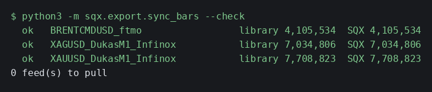
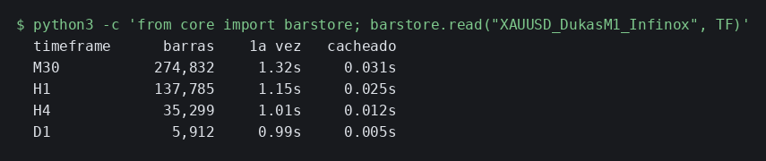
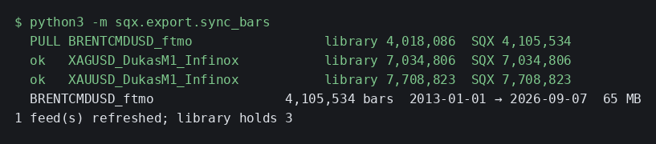

## 13. La librería de barras — un solo dato guardado, todos los timeframes gratis

### Qué pregunta responde

¿De dónde saca Python los precios? De aquí. La librería guarda **las barras de un minuto** de cada
mercado que usas, y nada más. Cuando un análisis pide M30, H1, H4 o diario, se calculan en el
momento a partir del minuto y se quedan guardados para la siguiente vez.

Guardar solo el minuto no es un atajo: está comprobado que **el M30 calculado en Python es idéntico,
decimal a decimal, al M30 que exporta SQX**. Medido el 21-09-2026 sobre los 7.708.823 minutos de oro:
mismas 274.832 barras, mismo índice, diferencia máxima 0,000000 en apertura, máximo, mínimo y cierre.
Así que tener los dos guardados sería tener el mismo dato dos veces.

### Cuándo lo usas, y cuándo no

**Lo usas** cuando empiezas a trabajar con un mercado nuevo, y cuando actualizas la data de un
mercado dentro de SQX. En los dos casos es el mismo comando y él solo decide qué hay que bajar.

**No lo usas** para nada más. Los análisis no lo llaman: ellos piden barras y la librería responde.
Tampoco sirve para datos de tick — SQX tiene feeds de tick y el comando los ignora a propósito,
porque un tick no es una barra y aquí no se remuestrea nada desde ahí.

### Antes de empezar

- **El worker tiene que poder arrancar.** El comando lo levanta él solo y lo deja parado al acabar.
  No toca el master, así que **puedes lanzarlo con la GUI de SQX abierta**.
- **El mercado tiene que estar declarado** en `strategies/crossmarket/markets.yaml`, o ya estar en la
  librería. Si añades un activo nuevo ahí, el siguiente `sync_bars` lo baja sin que hagas nada más.
- No hace falta que exportes nada antes. Las barras son un hecho del mercado, no de un backtest.

### Cómo se ejecuta

Primero mira qué falta, que no cuesta nada:

```bash
python3 -m sqx.export.sync_bars --check
```



Y cuando quieras que lo baje de verdad, el mismo comando sin `--check`:

```bash
python3 -m sqx.export.sync_bars
```

| flag | obligatorio | qué hace |
|---|---|---|
| `--check` | no | dice qué bajaría y no baja nada. Sin él, baja |

No hay flags de fechas a propósito: **cada mercado se baja sobre su propio rango completo**, el que
SQX declara para él. Si le pusieras una ventana fija, el mercado que tuviera datos más allá de esa
fecha se marcaría como desactualizado para siempre.

**Cuánto tarda:** unos 35 segundos por mercado. Los tres de oro juntos, menos de dos minutos.

### Qué produce

| ruta | qué es |
|---|---|
| `~/Desktop/AlgoData/bars/<feed>/M1.parquet` | las barras de un minuto. 128 MB el oro, 107 el plata, 65 el Brent |
| `~/Desktop/AlgoData/bars/manifest.json` | qué tiene la librería: barras, rango y la huella de cada mercado |
| `~/Desktop/AlgoData/derived/bars/<feed>/<TF>-<huella>.parquet` | los timeframes ya calculados |

La huella en el nombre del archivo es lo que hace que no tengas que acordarte de nada: si actualizas
la data de un mercado en SQX y vuelves a sincronizar, la huella cambia y **los timeframes viejos
dejan de usarse solos**. No se sirven barras antiguas por error nunca.

### Cómo se lee el resultado

En `--check`, una línea por mercado:

- **`ok`** — la librería tiene exactamente las barras que tiene SQX. No hay nada que hacer.
- **`PULL`** — falta el mercado, o SQX tiene más barras que tú. Se va a bajar entero.
- **`??`** — el mercado está declarado en `markets.yaml` pero SQX no lo tiene como feed de minuto.
  Es un nombre mal escrito, casi siempre.

La comparación es **el número de barras**, no la fecha. Eso es lo que hace que detecte también un
relleno de huecos o una corrección en medio del histórico, y no solo que haya crecido por el final.

Y lo que cuesta pedir un timeframe, medido de verdad sobre el oro:



La primera vez de cada timeframe cuesta **un segundo largo**: ahí está leyendo los 7,7 millones de
minutos. A partir de ahí, centésimas. Un informe que analiza 757 estrategias no nota ese segundo;
el panel interactivo tampoco, porque solo lo paga la primera vez que lo abres tras actualizar data.

### Un ejemplo completo

Actualizaste el Brent en SQX y quieres que Python lo vea:

```bash
python3 -m sqx.export.sync_bars
```



Lee lo que pasó: el oro y la plata estaban al día y **no se tocaron**. El Brent tenía 4.018.086
barras en la librería contra 4.105.534 en SQX, así que se bajó entero — hasta el 7 de septiembre,
que es hasta donde llega su data. Los timeframes del Brent que hubiera calculados quedaron
huérfanos en ese momento y se recalculan la próxima vez que alguien los pida.

### Qué NO te dice

- **No te dice si la data de SQX es buena.** Copia lo que SQX tenga. Si un feed tiene huecos, la
  librería tendrá los mismos huecos.
- **No te avisa de que tu data está vieja.** Solo compara tu librería contra SQX. Si en SQX llevas
  ocho meses sin actualizar un mercado, los dos dirán `ok` tan contentos. Eso se mira en SQX.
  *(A 21-09-2026 el oro y la plata llegan hasta el 16-01-2026 y el Brent hasta el 07-09-2026: los
  metales llevan ocho meses sin actualizar **en SQX**, y esto no te lo iba a decir el comando.)*
- **No sustituye a `export_bars.py`.** Ese sigue existiendo para bajar un timeframe concreto a CSV
  si alguna vez hace falta uno suelto.
- **El volumen no es exacto al de SQX.** Calculado desde el minuto, difiere en 13 barras de 274.832
  y como mucho en 2 unidades — redondeo de SQX al agregar. Los precios sí son exactos. Si algún día
  haces algo que dependa del volumen al detalle, tenlo presente.

### Si algo falla

- **`KeyError: '<feed>'` al pedir barras** — ese mercado no está en la librería. Corre
  `sync_bars --check` y mira si sale como `??`: entonces el nombre en `markets.yaml` no coincide con
  el de SQX.
- **El comando se queda colgado al arrancar** — el worker no levantó. `bin/sqx-worker.sh stop` y
  vuelve a lanzarlo.
- **Un mercado sale `PULL` una y otra vez aunque acabe de bajarlo** — eso sería un fallo de verdad y
  hay que mirarlo, no repetirlo. Pasó una vez, con una ventana de fechas fija que recortaba el feed;
  por eso ya no hay flags de fechas.
