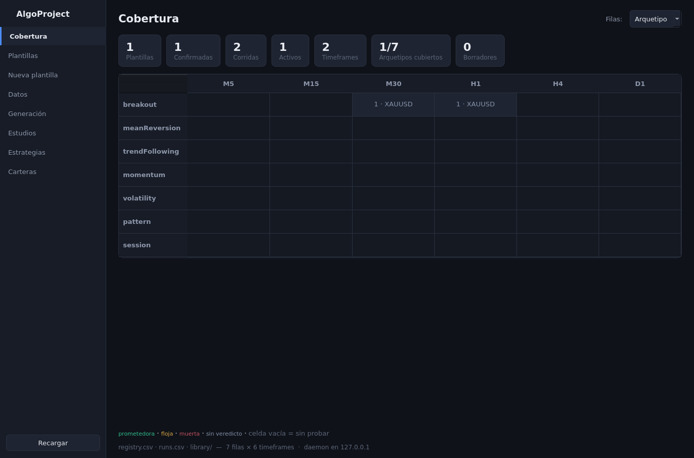
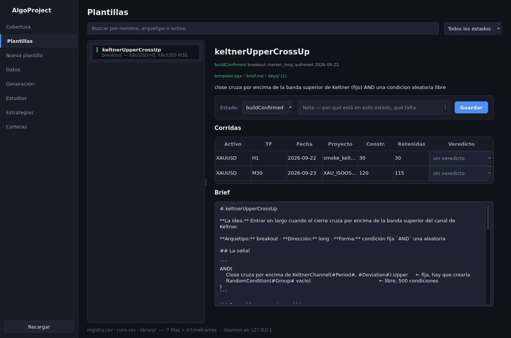
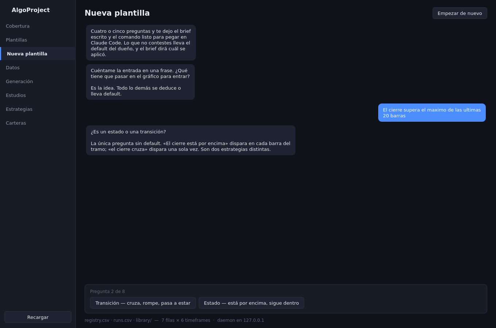
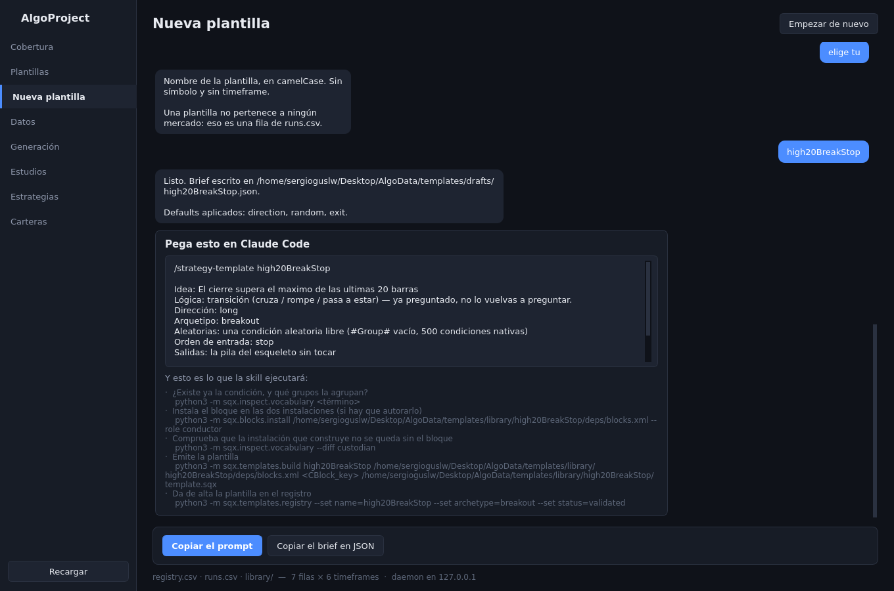
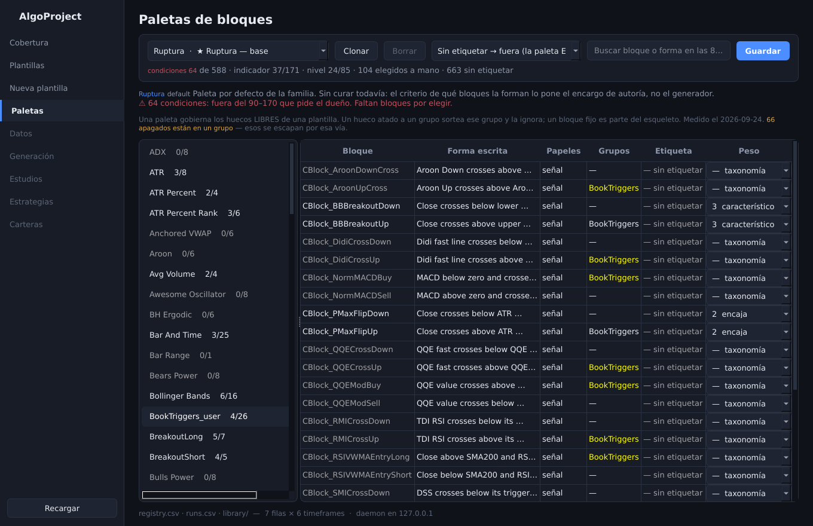
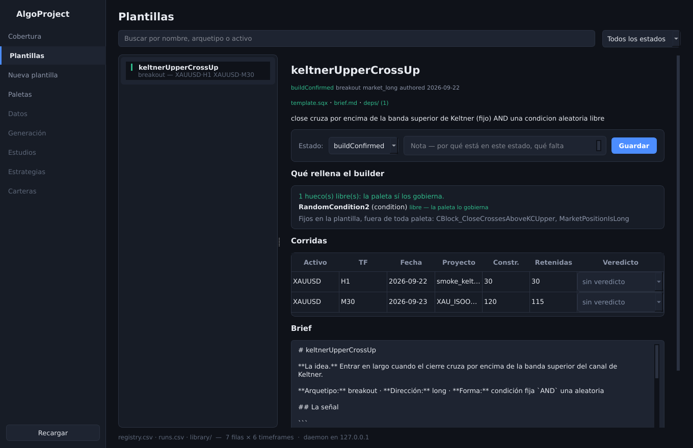
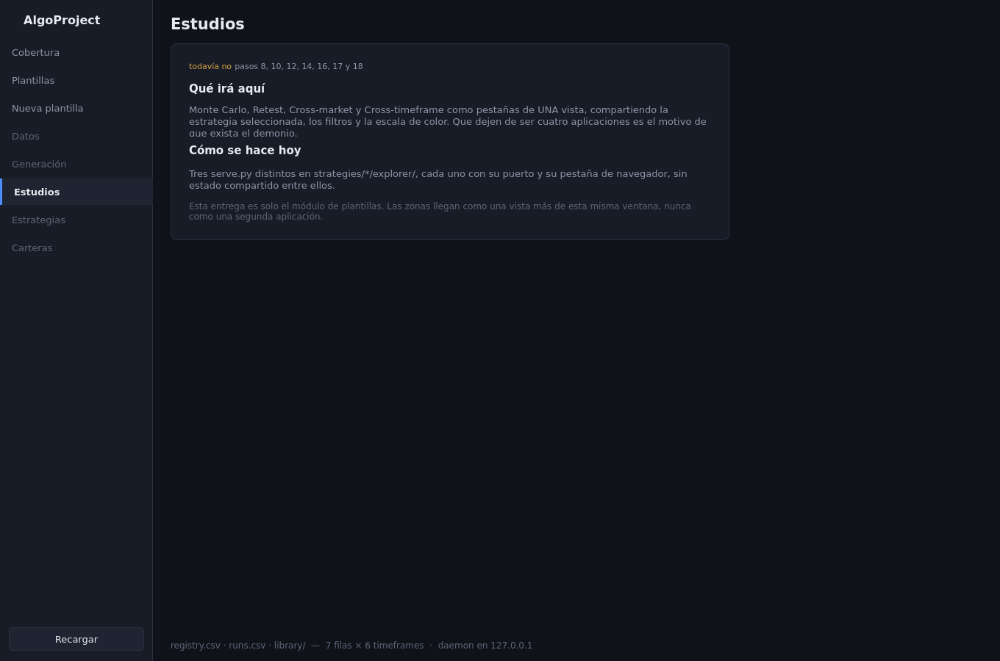

# 35. La aplicación de escritorio — plantillas

La ventana. No es una pestaña del navegador ni un panel más: es la primera rebanada de la
aplicación que va a envolver SQX y Python, y por ahora contiene un solo módulo, el de las
**plantillas**.

### Qué pregunta responde

Tres, y las tres se contestaban hasta hoy abriendo dos CSV en Excel y una carpeta en el explorador:

- **¿Qué plantillas tengo, de qué tipo, y en qué mercados y timeframes las he probado?**
- **¿De qué tengo poco?** Qué arquetipo no he tocado, qué timeframe está vacío, qué idea probé una
  sola vez y no volví a mirar.
- **¿Cómo empiezo una plantilla nueva sin olvidarme de ninguna de las preguntas?** La ventana te
  entrevista, escribe el borrador del brief y te deja el comando listo para pegar en Claude Code.

### Cuándo lo usas, y cuándo no

**Lo usas** para mirar la librería, para decidir qué construir a continuación, para anotar el
veredicto de una corrida en cuanto lo tengas, y para redactar la idea de una plantilla nueva.

**No lo usas** para construir nada. La ventana **no arranca SQX, no instala bloques y no emite
ningún `.sqx`**. Todo eso lo hace `/sqx-strategy-template` y `/template-run`, que escriben en
instalaciones de verdad y son el carril del conductor y el del custodio. Una ventana que escribiera
en `SQX_w1` por su cuenta rompería la tabla de carriles de `sqx/CLAUDE.md` en cuanto hubiera dos
sesiones abiertas.

Tampoco es donde se editan los CSV. Escribe tres cosas y solo tres: el **estado** de una plantilla,
su **nota**, y el **veredicto** de una corrida.

### Antes de empezar

- `pip install -r requirements.txt` — la app añade PySide6, FastAPI, uvicorn y httpx.
- Nada más. No hace falta SQX abierto ni cerrado, no hace falta ningún worker arrancado, y no toca
  ninguna instalación. Si `~/Desktop/AlgoData/templates/` no existe todavía, la ventana abre vacía
  en vez de fallar.

### Cómo se ejecuta

Tres formas, las tres hacen exactamente lo mismo:

| dónde | qué haces |
|---|---|
| **el escritorio** | doble clic en el icono **AlgoProject** |
| **el menú de aplicaciones** | buscas *AlgoProject* |
| **cualquier terminal, desde cualquier carpeta** | `algoui` |

```bash
algoui
```

Las tres acaban en `bin/algoui`, que no hace más que llamar a `python3 -m ui.desktop.launch` desde
la raíz del proyecto. El icono es la propia matriz de cobertura en miniatura, y es el mismo que sale
en la barra de tareas y en el alt-tab.

`algoui` funciona desde cualquier sitio porque `~/.local/bin/algoui` es un enlace al del repositorio
y el script resuelve el enlace antes de buscar la raíz. Si alguna vez mueves la carpeta del
proyecto, rehaz el enlace y la línea `Exec=` de `~/.local/share/applications/algoproject.desktop`:
las dos llevan la ruta escrita.

| flag | obligatorio | qué hace |
|---|---|---|
| — | — | no tiene flags: el puerto sale de `ui_port` en `config/machine.yaml`, 8765 por defecto |

Si algo va mal y la ventana no abre, el demonio se arranca por separado para ver su error:

```bash
python3 -m ui.daemon.serve
```

**Dos procesos, no uno.** `bin/algoui` levanta el demonio si no está ya escuchando y abre la
ventana. Al cerrar la ventana, el demonio se apaga **solo si lo arrancó ella**: dos ventanas
comparten uno, y matarlo le quitaría la librería a la otra. El demonio escucha en 127.0.0.1 y en
ningún sitio más.

### Qué produce

| ruta | qué es | cuándo se escribe |
|---|---|---|
| `AlgoData/templates/registry.csv` | la fila de la plantilla, con su `status` y su `notes` | al pulsar **Guardar** en la ficha |
| `AlgoData/templates/runs.csv` | la fila de la corrida, con su `verdict` | al cambiar el desplegable de veredicto |
| `AlgoData/templates/drafts/<nombre>.json` | el borrador del brief que redacta el chat | al terminar la entrevista |
| `sqx/blocks/palettes/<familia>.yaml` | la paleta de bloques de un arquetipo | al pulsar **Guardar paleta** |

Los dos CSV los escribe `sqx/templates/registry.py`, **la misma función que usa la línea de
comandos**. La ventana no tiene una segunda forma de escribir un CSV: dos escritores para un fichero
es como se descuadra una columna.

⚠️ **La ventana escribe paletas, nunca la taxonomía.** `sqx/blocks/taxonomy.yaml` lleva las
etiquetas y lo rellena otra persona (`docs/encargos/6-taxonomia-bloques.md`); desde aquí solo se
escriben los `overrides` de una paleta. Son dos ficheros distintos a propósito.

### Cómo se lee el resultado

#### Cobertura — la primera pantalla



Arriba, siete contadores. **Todos explican qué cuentan al pasar el ratón por encima**, porque un
número que nadie sabe definir es un número con el que nadie debería decidir. El que más dice es
*Arquetipos cubiertos*: `1/7` significa que de los siete arquetipos que el catálogo conoce, has
tocado uno. Esa distancia **es** la respuesta a «de qué tengo poco».

Debajo, la rejilla. Las columnas son siempre los timeframes —es el eje con vocabulario corto, fijo
y ordenado—. Las filas las eliges arriba a la derecha: **Arquetipo**, **Activo** o **Plantilla**.

Cada celda dice cuántas corridas hay y en qué mercados, y **su color es el mejor veredicto que hay
dentro**, no un promedio. Es deliberado: una celda es una invitación a abrirla, y promediar haría
que una celda con una corrida prometedora y dos muertas argumentase en contra de mirarla.

| color | significa |
|---|---|
| verde | alguna corrida quedó como `promising` |
| ámbar | la mejor quedó como `weak` |
| rojo | todas `dead` |
| gris | probada, sin veredicto escrito todavía |
| celda vacía | **sin probar.** Es el hueco que la matriz existe para enseñar |

Las filas de arquetipo que nadie ha tocado **siguen apareciendo**, vacías. Si se generaran a partir
de los datos desaparecerían, y con ellas justo la información que buscas.

Un clic en una celda con datos abre esa plantilla.

#### Plantillas — la ficha



A la izquierda la lista, con buscador (nombre, arquetipo o activo) y filtro por estado. Los
borradores del chat aparecen marcados como tales: **no son plantillas**, no tienen `.sqx`, y por eso
no cuentan en la matriz.

A la derecha la ficha. En orden:

- **Las etiquetas**: estado, arquetipo, forma, origen y fecha. El estado explica su significado al
  pasar el ratón: `draft` es XML sin comprobar, `validated` es XML que resuelve, `buildConfirmed` es
  el único que prueba algo — una construcción real sacó estrategias y llevan de verdad su bloque.
- **La línea de disco**: `template.sqx`, `brief.md`, `deps/`. En verde lo que está, en rojo lo que
  falta. El registro es una **afirmación**; esta línea es la **prueba**. Importa porque SQX no da
  error con una plantilla cuyos bloques no están instalados: la quita del builder en silencio.
- **Estado y nota**, con su botón Guardar.
- **Corridas**: una fila por mercado y timeframe, con las estrategias construidas y retenidas, y el
  veredicto como desplegable. El veredicto se escribe **al cambiarlo**, sin botón: es un juicio tuyo,
  no un formulario.
- **Brief**: el texto en castellano tal cual lo escribió quien la autoró. La ventana no lo resume y
  no lo deja editar por detrás del fichero.

#### Nueva plantilla — el chat



Ocho preguntas como mucho. Las que llevan default del dueño traen un botón **Elige tú** que lo
aplica y lo deja escrito en el brief; las que no lo llevan, no se pueden saltar.

**Una pregunta no tiene default y nunca lo tendrá: estado contra transición.** «El cierre *está* por
encima de la banda» dispara en cada barra del tramo; «el cierre *cruza* la banda» dispara una sola
vez. Son dos estrategias distintas, no dos maneras de decir lo mismo, y adivinarla gasta CPU para
construir lo que no pediste.

Al terminar:



Te quedan tres cosas: el **borrador del brief** escrito en disco, el **prompt** para pegar en Claude
Code —que ya lleva todas las respuestas, para que la skill no vuelva a preguntar lo que ya
contestaste—, y **la lista de comandos que la skill va a ejecutar**, para que sepas lo que viene.
La ventana no ejecuta ninguno.

Fíjate en la línea *Defaults aplicados: direction, random, exit*. El brief deja constancia de qué
preguntas te saltaste y qué default las rellenó. Un default aplicado en silencio y nunca escrito es
como se pierde una decisión.

#### Paletas — qué puede sortear el builder



Esta es la vista que estrecha el vocabulario del builder, y es una **librería**: no hay tres
paletas fijas, hay las que haya. Vienen tres por defecto, una por familia, marcadas con ★, y encima
de ellas se clona todo lo demás.

Arriba, de izquierda a derecha:

- **El selector de paleta**, agrupado por familia: `Ruptura · ★ Ruptura — base`. Las ★ son las de
  por defecto.
- **Clonar**: copia la paleta abierta con el nombre que le des y la abre. Es el camino normal —
  parte de una por defecto y personalízala.
- **Borrar**: solo para las tuyas. En una por defecto está deshabilitado y dice por qué.
- **Qué hacer con lo no etiquetado**: `entra a peso 1` (la paleta hereda la taxonomía y tú solo
  corriges) o `fuera` (**la paleta ES su lista**: solo entra lo que hayas elegido). La segunda es
  la que hace útil una paleta curada a mano sin esperar a que la taxonomía esté etiquetada.
- **El buscador**, que ignora la categoría: encuentra un bloque sin saber en cuál de las 83 lo
  archivó SQX.
- **Los recuentos**, en su propia línea. El primero, **condiciones**, va en verde o en rojo según
  caiga dentro del **90–170 que pide el dueño** por build: por debajo el builder no tiene de dónde
  combinar, por encima vuelve el sobreajuste. Si una paleta se sale, la ficha de debajo lo dice y
  además apunta hacia dónde — faltan bloques o sobran.

Debajo, la ficha de la paleta abierta: su familia, si es por defecto o tuya, de cuál es clon, y su
nota. Y si no ha elegido nada todavía, un aviso en ámbar diciéndolo con todas las letras — porque
una paleta vacía y una paleta que deja pasar todo se ven igual, y no son lo mismo.

A la izquierda, las categorías con cuántos bloques tienen encendidos. A la derecha, los bloques:
su clave, **su forma escrita** —que es lo único que dice de verdad qué comprueba—, sus papeles, los
grupos que lo agrupan, su etiqueta y el peso.

**La lista de bloques es siempre la misma** — son los 767 del vocabulario del builder — y eso no
cambia entre familias. Lo que cambia por familia son las dos últimas columnas y los recuentos.

- **Etiqueta**: lo que `taxonomy.yaml` dice de ese bloque **para la familia que tienes elegida**.
  Es la columna que hace visible el cambio de familia. `— sin etiquetar` significa que nadie ha
  dicho nada todavía, y entonces las tres familias lo tratan igual.
- **Peso**: lo único editable, y es un *override*. `— taxonomía` significa «haz lo que diga la
  etiqueta»; cualquier otro valor la pisa **solo para esta paleta**. `0` apaga el bloque y lo pone
  en gris, `3` lo prefiere. Se guarda con el botón; hasta entonces el recuento dice cuántos llevas
  sin guardar.

Un bloque apagado se ve en gris en toda su fila, y el contador de su categoría baja: `ADX 8/8` pasa
a `ADX 5/8`. Ésa es la forma rápida de comprobar que una paleta está estrechando de verdad.

⚠️ La línea gris de debajo repite el límite, y hay que tomárselo en serio: **una paleta gobierna los
huecos LIBRES de una plantilla.** Un hueco atado a un grupo sortea ese grupo y la ignora, y un
bloque fijo es parte del esqueleto. Está medido el 2026-09-24 y está en `knowhow/authoring/builder-block-switches.md`.
Cuando un bloque apagado está en un grupo, su celda de **Grupos** se pone en ámbar y lo dice.



Por eso la ficha de cada plantilla lleva ahora **Qué rellena el builder**: un hueco por línea,
diciendo si es libre —y entonces la paleta lo gobierna— o a qué grupo está atado, y debajo los
bloques fijos, que están fuera de toda paleta. Si esa línea dice que no hay huecos libres, la vista
de paletas no puede hacer nada por esa plantilla y hay que tocar el grupo.

#### Las otras cinco zonas



**Datos, Generación, Estudios, Estrategias y Carteras se pueden abrir, y no hacen nada todavía.**
Cada una dice qué irá ahí, cómo se hace ese trabajo hoy mientras tanto, y qué pasos del workflow
cubre. Están en la barra lateral desde el primer día a propósito: este módulo es la primera rebanada
de un producto, y las zonas que faltan llegarán como una vista más de esta misma ventana, nunca como
una segunda aplicación.

Se pulsan en vez de estar apagadas por un motivo concreto: en Qt un botón deshabilitado no recibe el
ratón, así que **su tooltip no se muestra nunca**. Cinco entradas grises con una explicación que
nadie puede leer no explican nada.

### Un ejemplo completo

Idea: *«el cierre supera el máximo de las últimas 20 barras»*.

1. `bin/algoui`. Abre en Cobertura. `1/7` arquetipos, dos corridas, un solo activo.
2. **Nueva plantilla**. Escribes la idea. Contestas **Transición** — quieres que dispare al romper,
   no en cada barra por encima. Arquetipo **breakout**. Orden de entrada **Stop**. Dirección,
   aleatorias y salidas: **Elige tú** en las tres. Nombre: `high20BreakStop`.
3. La ventana escribe
   `~/Desktop/AlgoData/templates/drafts/high20BreakStop.json` y te da el prompt.
4. **Copiar el prompt** y pegarlo en Claude Code. Ahí sí: `/sqx-strategy-template` mira el vocabulario
   de la instalación, autora el bloque si no existe, emite el `.sqx` y da de alta la fila.
5. Vuelves a la ventana, **Recargar**. La plantilla ya está en la lista, el borrador ha
   desaparecido, y la fila `breakout` de la matriz sigue sin corrida nueva — porque autorar no es
   construir. Eso es `/template-run`.
6. Cuando esa corrida termine y la hayas mirado, abres su ficha y le pones el veredicto.

### Qué NO te dice

- **No te dice si una plantilla es buena.** `buildConfirmed` significa que SQX la acepta y que las
  estrategias llevan su bloque. No dice que gane dinero. Eso lo deciden los pasos 12 a 19 del
  workflow, no esta ventana.
- **El veredicto de una corrida es tuyo, no suyo.** La ventana lo guarda y lo pinta; no lo calcula.
  Una celda verde significa «tú dijiste que era prometedora», nada más.
- **La matriz cuenta corridas, no calidad ni tamaño.** Una celda con `1` puede ser una construcción
  de humo de 30 estrategias y 29 segundos. El número de estrategias está en la ficha, no en la
  celda.
- **No sabe lo que hay dentro de un `.sqx`.** La línea de disco dice si el fichero existe, no si su
  contenido es el que el registro afirma. Para eso está `sqx/inspect/template_check.py`. La
  excepción es el panel de huecos, que sí lo abre y lee sus bloques aleatorios.
- **Una paleta guardada todavía no llega a SQX.** La ventana escribe el YAML; quien lo tiene que
  aplicar al `<BuildingBlocks>` de la tarea Build es el builder, y esa pieza no está escrita. Hasta
  entonces una paleta es una decisión anotada, no un efecto.
- **La paleta no etiqueta.** Los pesos salen de `taxonomy.yaml`, que a día de hoy está entero sin
  etiquetar: `767 sin etiquetar`. Mientras siga así, las tres paletas son idénticas y no estrechan
  nada.

### Si algo falla

- **`el demonio no respondió en el puerto 8765`** — hay otra cosa ocupando el puerto, o el demonio
  se cayó al arrancar. Arráncalo a mano con `python3 -m ui.daemon.serve` y lee el error; si el
  puerto está ocupado, cámbialo en `ui_port` de `config/machine.yaml`.
- **La ventana abre vacía y los contadores están a cero** — `AlgoData/templates/` no existe o no
  tiene CSV. No es un fallo: es una librería sin nada dentro.
- **Una plantilla aparece en rojo en la línea de disco** — su fila está en el registro pero su
  carpeta no está completa. Suele pasar al traer un registro de otra máquina sin traer `library/`.
- **`qt.qpa.plugin: could not load the Qt platform plugin "xcb"`** — **pasó en esta máquina**, el
  2026-09-24, la primera vez que se abrió la ventana de verdad. El plugin `xcb` de Qt necesita
  cuatro librerías que Ubuntu no trae puestas: `libxkbcommon-x11.so.0`, `libxcb-icccm.so.4`,
  `libxcb-keysyms.so.1` y `libxcb-xkb.so.1`. El mensaje que da Qt culpa a `libxcb-cursor0`, que
  **sí estaba** — o sea que el mensaje miente sobre cuál falta. Quién falta de verdad lo dice esto:

  ```bash
  ldd ~/.local/lib/python3.10/site-packages/PySide6/Qt/plugins/platforms/libqxcb.so | grep "not found"
  ```

  Como `sudo` pide contraseña aquí, no se instalan con `apt install`: se bajan y se extraen en el
  home, que es lo que ya está hecho en `~/.local/lib/qt-xcb/`.

  ```bash
  apt-get download libxkbcommon-x11-0 libxcb-icccm4 libxcb-keysyms1 libxcb-xkb1
  for d in *.deb; do dpkg -x "$d" x; done
  mkdir -p ~/.local/lib/qt-xcb && cp -P x/usr/lib/x86_64-linux-gnu/*.so* ~/.local/lib/qt-xcb/
  ```

  `bin/algoui` añade esa carpeta al `LD_LIBRARY_PATH` él solo, así que una vez hecho esto no hay
  que acordarse de nada. En un ordenador nuevo con `sudo` a mano,
  `sudo apt install libxkbcommon-x11-0 libxcb-icccm4 libxcb-keysyms1 libxcb-xkb1` hace lo mismo y
  la carpeta del home sobra.
