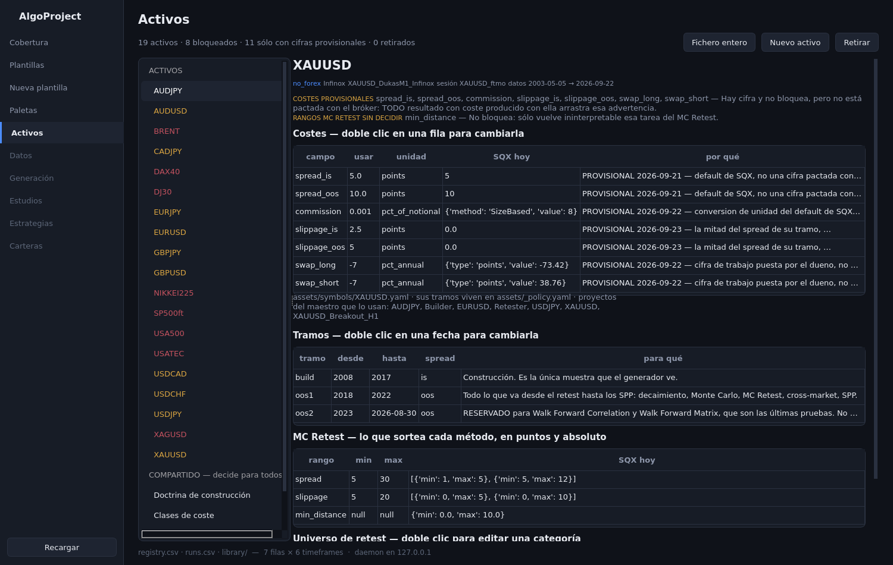
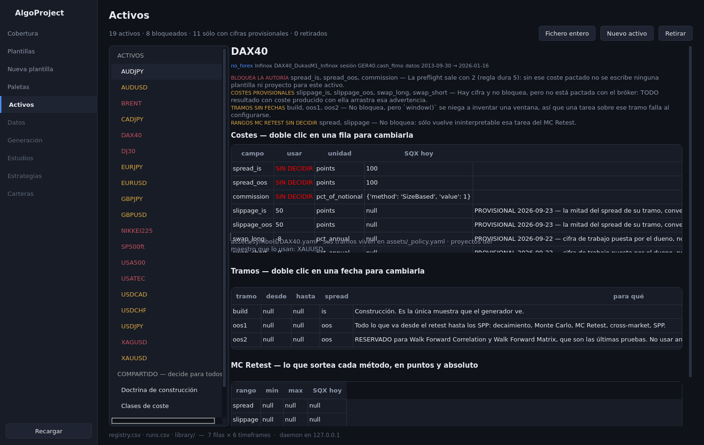
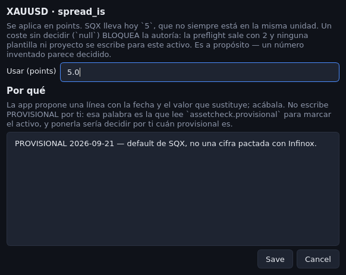
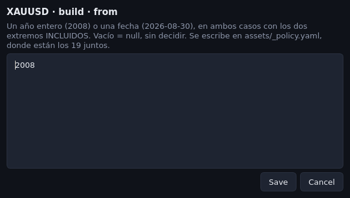
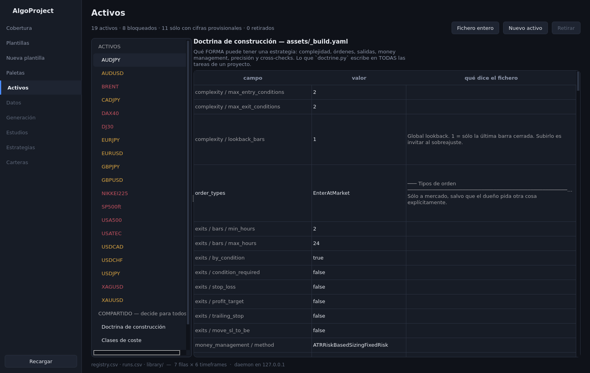
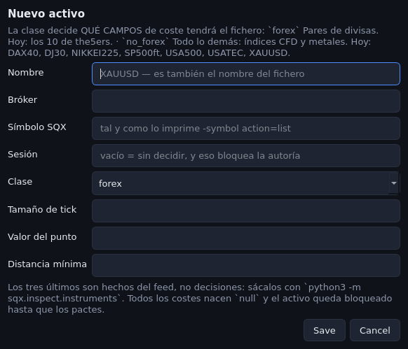

# 38. La aplicación de escritorio — activos

La segunda zona de la ventana. Contiene **todo lo que hay en `assets/`**: los diecinueve
instrumentos y los cuatro ficheros que deciden para todos a la vez, con sus costes, sus ventanas
temporales, sus rangos de MC Retest y su universo de retest — y se pueden cambiar desde ahí.

### Qué pregunta responde

Antes había que abrir veintitrés ficheros YAML para contestar a esto. Ahora son cuatro clics:

- **¿Qué activos tengo y cuáles están bloqueados?** Un activo con un coste obligatorio sin pactar
  no deja escribir ni una plantilla ni un proyecto (regla dura 5). La lista lo dice en rojo, y la
  ficha dice exactamente qué campo falta y qué pasa por eso.
- **¿Qué le estoy cobrando de verdad a este instrumento, y en qué unidad?** El spread, la comisión,
  el slippage y los dos swaps, cada uno con su unidad, al lado de lo que SQX lleva hoy — que casi
  nunca está en la misma unidad — y con la línea que dice por qué difieren.
- **¿Entre qué fechas se construye y se testea?** Los tres tramos, con el aviso cuando uno está
  RESERVADO y gastarlo es una puerta de una sola dirección.
- **¿Qué forma pueden tener las estrategias que genero?** La doctrina de construcción entera, con
  el comentario del propio fichero al lado de cada valor.

### Cuándo lo usas, y cuándo no

**Lo usas** cuando el bróker te da una cifra de verdad y hay que sustituir una provisional; cuando
das de alta un instrumento nuevo; cuando ajustas una ventana; cuando quieres ver de un vistazo qué
te falta por decidir; y cuando alguien —tú o una sesión— va a construir sobre un activo y hay que
mirar antes qué arrastra.

**No lo usas** para nada que hable con SQX. La ventana **no abre el maestro, no arranca un worker y
no lee un instrumento del install**. `instrument:` y `sqx_now:` son hechos leídos de SQX, y quien
los refresca sigue siendo `python3 -m sqx.inspect.instruments`; la ventana solo los enseña y te deja
escribirlos a mano si los tienes delante.

Tampoco sustituye a la preflight. Antes de autorizar nada sigue siendo obligatorio
`python3 -m core.assets <SÍMBOLO>`: la ventana enseña lo mismo, pero el código de salida —2
bloqueado, 3 esquema roto— es lo que para el trabajo, y eso solo lo da el comando.

### Antes de empezar

- `pip install -r requirements.txt`. La zona añade **una** dependencia: `ruamel.yaml`, el YAML que
  conserva los comentarios. Sin ella la app no arranca.
- Nada más. No hace falta SQX, ni un worker, ni datos exportados.

### Cómo se ejecuta

```bash
algoui
```

La misma ventana de siempre (capítulo 35). En la barra de la izquierda, **Activos**.

### Qué produce

Escribe, y solo escribe, dentro de `assets/`:

| lo que tocas | dónde acaba |
|---|---|
| un coste, la sesión, el feed, los hechos del instrumento, los rangos MC Retest | `assets/symbols/<SÍMBOLO>.yaml` |
| las fechas de un tramo | `assets/_policy.yaml`, bajo `segments: <SÍMBOLO>:` |
| una categoría del universo de retest | `assets/_markets.yaml` |
| la doctrina de construcción | `assets/_build.yaml` |
| el esquema de las dos clases de coste | `assets/_classes.yaml` |
| dar de alta un activo | un `.yaml` nuevo en `symbols/` **y** su bloque en `_policy.yaml` |
| retirar un activo | se mueve a `assets/symbols/_retired/<SÍMBOLO>.yaml` |

Después de cada escritura regenera `assets/INDEX.md`, así que el índice nunca contradice a los
ficheros.

**Los comentarios se conservan.** Cambiar un valor cambia esa línea y nada más: las cabeceras, los
⚠️, las unidades y los párrafos que explican por qué el porcentaje del swap es ANUAL siguen donde
estaban. Verificado el 2026-09-24: leer y reescribir los cinco ficheros sin tocar nada devuelve un
resultado idéntico byte a byte.

### Cómo se lee el resultado

#### La lista y la ficha



A la izquierda, los diecinueve. El color es el estado y el tooltip lo deletrea:

| color | qué significa |
|---|---|
| **rojo** | bloquea la autoría: falta un coste obligatorio, o el esquema está roto |
| **ámbar** | funciona, pero alguna cifra es PROVISIONAL y todo resultado con coste la arrastra |
| **normal** | nada que decidir |

Debajo del título, las fichas: clase, bróker, feed, sesión, y el rango de datos que SQX tiene. En
rojo si la sesión está sin decidir o si SQX no tiene ese feed.

La tira de debajo es **la preflight entera**, en el orden en el que se actúa sobre ella: primero lo
que rompe la corrida, después lo que bloquea la autoría, al final lo que solo mancha el resultado.



El DAX40 lo enseña completo: tres costes sin pactar, los tres tramos sin fechas, los dos rangos de
MC Retest sin decidir, y cuatro cifras provisionales que sí tiene.

La tabla de costes lleva `SIN DECIDIR` en rojo cuando el campo es obligatorio para su clase. La
columna **SQX hoy** está en la unidad de SQX, que no es la de `usar` — por eso las dos columnas
existen por separado, y por eso el `por qué` de al lado dice en qué se diferencian.

#### Cambiar un coste

Doble clic en cualquier celda de la fila:



Dos campos, y los dos se escriben juntos o no se escribe ninguno. Dejar el valor vacío es escribir
`null`, o sea devolver el campo a «sin decidir» y bloquear la autoría a propósito.

Al salir del campo del valor, la app **propone** una línea de `por qué` con la fecha y la cifra que
sustituye, y te deja acabarla. No escribe `PROVISIONAL` por ti: esa palabra exacta es la que lee
`core.assetcheck.provisional` para marcar el activo en ámbar, y ponerla sería decidir por ti cuán
provisional es tu propia cifra.

#### Cambiar una ventana o un rango

Doble clic sobre la fecha, no sobre la fila:



Un año entero o una fecha, siempre con los dos extremos incluidos. El tramo `oos2` sale marcado
RESERVADO: es el que gastan la Walk Forward Correlation y la Matrix, y mirarlo antes lo quema.

#### Los cuatro ficheros compartidos

Debajo de los activos, en **COMPARTIDO — decide para todos**:



Es el fichero entero como tabla: la ruta del valor, el valor, y **el comentario que el propio YAML
lleva encima o al lado**. La explicación no está escrita en la app — se lee del fichero, así que no
puede contradecirlo.

Los valores cortos se editan en la celda. Las listas y los textos largos abren una caja, una línea
por elemento. El mismo botón **Fichero entero** de arriba enseña así el fichero de un activo, con
todo lo que la ficha no muestra.

#### Dar de alta y retirar



La clase decide qué campos de coste tendrá el fichero, así que es lo único que no se puede cambiar
después sin reescribirlo. Los tres hechos del instrumento se teclean —sácalos de
`python3 -m sqx.inspect.instruments`— y **todos los costes nacen `null`**: el activo entra
bloqueado, que es justo lo que se quiere. Un fichero con cifras inventadas es peor que ninguno,
porque parece decidido.

**Retirar** mueve el fichero a `symbols/_retired/`. Deja de existir para `core.assets` y para el
índice, pero su bloque de tramos se queda en `_policy.yaml`: si lo restauras, vuelve con sus
ventanas intactas. Aparece abajo del todo, en RETIRADOS, con el botón para devolverlo.

### Un ejemplo completo

The5ers te pasa por fin el spread real del EURUSD: 0,3 puntos en vez del 0,1 de fábrica.

1. `algoui`, zona **Activos**, `EURUSD` en la lista. Sale en ámbar: seis cifras provisionales.
2. Doble clic en la fila `spread`. La caja dice `points`, y que SQX lleva hoy `0.1`.
3. Escribes `0.3` y sales del campo. El `por qué` se rellena solo con
   `2026-09-24 — cambiado desde la app: 0.1 → 0.3. `
4. Lo acabas: `…cifra pactada con the5ers por correo el 2026-09-24.` — sin la palabra PROVISIONAL,
   porque ya no lo es. Guardar.
5. La ficha se redibuja: `spread` ya no aparece en la lista de provisionales.
6. En la terminal, la comprobación que manda:

```bash
$ python3 -m core.assets EURUSD
AVISO: el tramo `oos2` llega a 2026-08-30 y los datos de `EURUSD_DukasM1_the5ers` acaban en 2026-01-16
# EURUSD — clase `forex`, overrides a aplicar

SQX symbol: EURUSD_DukasM1_the5ers   verificado: 2026-09-03

- **spread**: usar `0.3` points (SQX lleva hoy `0.1`) — 2026-09-24 — cambiado desde la app: 0.1 → 0.3. cifra pactada con the5ers por correo el 2026-09-24.
...
```

(El AVISO de arriba es de este activo hoy y no tiene que ver con el cambio: la ventana `oos2`
llega más lejos que los datos sincronizados, que es el estado normal del tramo más nuevo.)

El `git diff` de ese cambio son **dos líneas**: el valor y su `por qué`.

### Qué NO te dice

- **No dice si una cifra es correcta**, solo si está decidida. `use: 0.0` en la comisión es una
  decisión perfectamente válida para la preflight y a la vez un modelo de coste que infravalora el
  real diez veces. Eso lo dice el `por qué`, que es texto y no lo valida nadie.
- **No sabe qué lleva SQX ahora mismo.** `sqx_now` es una foto del maestro del día en que alguien
  corrió `sqx.inspect.instruments`. Si has tocado un proyecto en la GUI desde entonces, la columna
  miente y la ventana no puede saberlo.
- **No comprueba que la sesión exista** en el proyecto donde se va a usar. Una tarea que nombra una
  sesión que su proyecto no lleva carga sin quejarse y opera otro horario; de eso se ocupa
  `sqx/projects/doctrine.py`, no la ventana.
- **No propaga nada.** Cambiar un coste aquí no reconfigura ningún proyecto de SQX ya escrito: los
  costes viven dentro de cada tarea, y volver a escribirlos es trabajo del módulo que la configura.

### Si algo falla

- **`ModuleNotFoundError: ruamel`** — falta la dependencia nueva:
  `python3 -m pip install --user ruamel.yaml==0.18.16`.
- **La ventana se queda con la lista vieja después de un cambio** — el botón **Recargar** de abajo
  a la izquierda relee todo desde el demonio. Pasa si has editado un YAML a mano en paralelo.
- **`KeyError` al abrir un activo recién copiado a mano** en `symbols/` — le falta su bloque en
  `_policy.yaml`. Los que se dan de alta desde la ventana lo llevan; a uno copiado a mano hay que
  ponérselo, aunque sea con las fechas a `null`.
- **Un `- item` de una lista larga se ha quedado en una sola línea** después de guardar. Es
  cosmético y solo le pasa a los textos que estaban partidos a mano en varias líneas: el contenido
  es idéntico. Los comentarios no se tocan.
