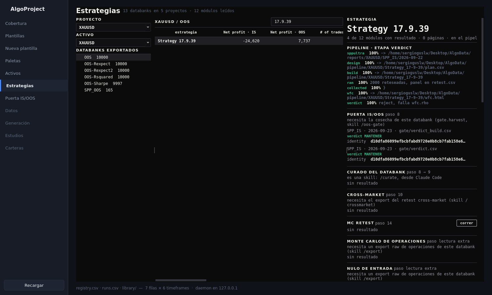
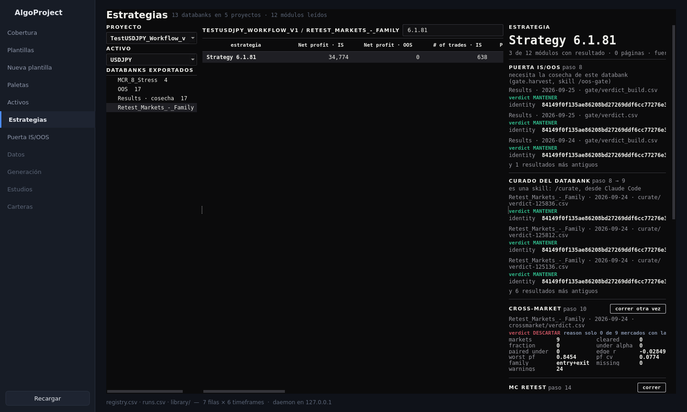

# 44. La aplicación de escritorio — estrategias

La tercera zona de la ventana, y la primera que lleva el aspecto nuevo: fondo casi negro sin
tinte, letra monoespaciada para toda cifra y todo nombre, filas finas separadas por líneas en vez
de tarjetas. Se elige **un proyecto**, y debajo salen **sus databanks ya exportados en AlgoData**, las
estrategias de cada uno, y al pulsar una, **qué dijo ya cada módulo de análisis sobre ella** —
con un botón **correr** en los módulos que todavía no han hablado y pueden hacerlo desde aquí.

### Qué pregunta responde

- **¿Qué databanks de este proyecto tengo ya en Python?** Arriba a la izquierda se elige el
  proyecto; debajo, el activo que opera, leído de su nombre (si el nombre no lo dice, se elige a
  mano: los módulos lo necesitan para el feed y los costes). La lista son los databanks que
  `export` sacó a `metrics/` y las cosechas de `harvest/`, con su recuento y la fecha. Un
  databank en amarillo no tiene `manifest.json`: nadie firmó ese export y el auditor lo marca.
- **¿Qué estrategias hay en este databank, y cuáles pintan bien?** Una fila por estrategia con
  beneficio neto, operaciones, profit factor, Sharpe, Ret/DD y drawdown máximo, en IS y en OOS
  cuando el export los trae. Se ordena por cualquier columna y se filtra por nombre. Los negativos
  en rojo.
- **¿Qué se sabe ya de esta estrategia?** Un bloque por módulo de análisis, en el orden del
  workflow: puerta IS/OOS, curado, cross-market, MC Retest, Monte Carlo, nulo de entrada, forma
  del beneficio, calidad de la entrada, exposición, WFC, WFM y decaimiento. Cada bloque dice en
  qué databank, qué día y qué fichero dejó el módulo su veredicto sobre esa estrategia, y lo
  enseña con sus cifras. Si la estrategia entró en el pipeline, las etapas del ledger con su
  porcentaje y su línea de estado van arriba.
- **¿Qué puedo correrle ahora mismo?** El botón **correr** de cada bloque lanza ese módulo
  sobre este databank. Sale solo cuando sus entradas existen: un export de operaciones de un
  solo mercado, la cosecha, el export cross-market. Si no, el bloque dice qué falta y con qué
  skill se consigue.

### Cuándo lo usas, y cuándo no

**Lo usas** cuando vuelves a un proyecto y no recuerdas qué pruebas se le hicieron a una
estrategia; cuando quieres cruzar el veredicto de dos módulos sin abrir dos paneles; cuando vas a
lanzar un análisis y quieres saber si ya se hizo; y para copiar el comando exacto de lo que falta.

**No lo usas** para nada que toque SQX. La ventana **no arranca SQX ni un worker**: lo que corre
son los módulos de Python sobre lo que ya está exportado. Tampoco lee el databank vivo de SQX: si
no has exportado, no aparece. Y no hace curado (`/curate`) ni WFC (va por el pipeline).

### Antes de empezar

- Algún databank exportado: `python3 -m sqx.export.export_metrics --project X --databank Y`
  (manual `04-export.md`) o una cosecha de `gate.harvest` (manual `31-puerta-oos.md`).
- La app abierta con `bin/algoui`. **Si ya la tenías abierta antes de este cambio, ciérrala y
  vuelve a abrirla**: la ventana comparte un demonio con las otras ventanas y el demonio viejo no
  conoce las rutas nuevas.

### Cómo se ejecuta

```bash
bin/algoui
```

Y en la barra lateral, **Estrategias**. O directamente desde el escritorio: el acceso
**AlgoProject Estrategias** (`~/Desktop/AlgoProject-Estrategias.desktop`, copia de
`~/.local/share/applications/algoproject-estrategias.desktop`) abre la misma ventana ya en esta
zona, con `bin/algoui --zone Estrategias`. Es el único flag: el nombre de la zona tal y como sale
en la barra lateral.

Pulsar **correr** lanza el módulo en segundo plano como hijo del demonio, con los mismos
argumentos que pondrías a mano (el tooltip del botón los enseña). Mientras corre, el bloque lo
dice en ámbar; al terminar, verde con código 0 o rojo con el código de error, y debajo las
últimas 25 líneas de su salida. Los módulos de una estrategia tardan segundos; Monte Carlo, MC
Retest o WFM sobre el databank entero, minutos. Se pueden lanzar varios a la vez. Todo es lectura de disco en el demonio:
abrir un databank de 10.000 filas tarda una décima de segundo, y la ficha de una estrategia lee
todos los CSV de informes del proyecto, decenas de ficheros pequeños, en menos de otra décima.
No toca SQX: se puede usar con el maestro abierto y con un worker construyendo.

### Qué produce

Un log por cada botón pulsado, en `~/Desktop/AlgoData/logs/ui/<fecha-hora>-<módulo>.log`, con
la salida entera del módulo. Lo que el módulo escriba —su `reports/...`— es cosa suya y está en
su página del manual. La ventana no escribe nada más. El botón «abrir informe html» abre en el navegador la página que
un módulo ya escribió para esa estrategia (hoy solo Monte Carlo las escribe, en
`reports/<proyecto>/<databank>/<día>/montecarlo/estrategias/`).

### Cómo se lee el resultado



Tres columnas. A la izquierda los databanks por proyecto, con el número de estrategias; «cosecha»
marca los que vienen de `harvest/`. En el centro, la tabla del databank abierto. A la derecha, la
ficha de la estrategia seleccionada:

- La línea bajo el nombre resume cuántos módulos tienen algo, cuántas páginas html hay y si la
  estrategia está en el pipeline.
- **Pipeline**: cada etapa del ledger con su porcentaje y su última línea de estado. Verde si
  terminó, ámbar si está a medias.
- **Un bloque por módulo**. La primera línea gris dice dónde está el resultado: databank, día y
  fichero. Si el fichero tiene varias filas para la estrategia (un WFC tiene una por punto de
  parámetro) se enseña la primera y se dice cuántas hay. La palabra del veredicto va en color:
  verde `MANTENER`/`worth_it`, rojo `DESCARTAR`/`FAIL`, ámbar `DUDOSA`/`MARGINAL`, gris cualquier
  palabra que ningún módulo de este proyecto use — se enseña, no se esconde.
- Debajo, cada cifra de la fila del informe con su nombre tal y como el módulo lo escribió. La
  ventana no las interpreta: la página de cada módulo en este manual dice qué es buena y qué mala.



Una estrategia de `TestUSDJPY_Workflow_v1` sobre su export cross-market. Cross-market ofrece
«correr otra vez»; MC Retest acaba de terminar desde el botón y enseña el final de su salida;
Monte Carlo, nulo y exposición explican que ese export mezcla mercados y no les vale.

### Un ejemplo completo

1. `bin/algoui`, **Estrategias**. Bajo `XAUUSD`, pulsar `OOS 10000`.
2. En «filtrar por nombre» escribir `17.9.39` y pulsar la fila.
3. La ficha dice: en el pipeline hasta `verdict`, y la puerta la mantuvo en `SPP_IS` el
   2026-09-23; el nulo de entrada tiene sus p-valores en `MC_Trades/2026-09-22`; la exposición
   en `MC_Trades/2026-09-24`; el WFC tiene sus puntos en `Seq._Opt._IS/2026-09-19`. Cross-market,
   MC Retest, Monte Carlo y WFM: sin resultado, con su comando debajo.
4. Pulsar **correr** en MC Retest. El bloque pasa a «en curso»; al minuto, «terminó» y las
   últimas líneas de la tabla; la ficha se redibuja sola con el veredicto en su sitio.

### Qué NO te dice

- **No dice si la estrategia es buena.** Enseña cifras y palabras que otros módulos decidieron.
  Las reglas de cada uno están en su página.
- **No sabe nada de un informe que no nombre a la estrategia en una columna `strategy`.** Es la
  convención que todos los módulos siguen hoy (`knowhow/locations/report-csv-conventions.md`); un informe que la
  rompa no aparece, sin aviso.
- **No enseña las estrategias que están en SQX y no exportadas.** Un databank vivo con 5.000
  estrategias y ningún export es invisible aquí.
- **Un veredicto viejo sigue apareciendo.** Si el módulo se corrió varias veces, se enseñan las
  tres más recientes y se dice cuántas más hay. La ventana no decide cuál vale.
- **El botón no sabe si el módulo tiene sentido aquí.** Comprueba que las entradas existan, no
  que el databank sea el adecuado: MC Retest sobre un proyecto sin tareas MCR termina con error,
  y el error es lo que se enseña.

### Si algo falla

- **La zona sale vacía o la pestaña no existe**: el demonio que atiende la ventana es anterior a
  este cambio. Cerrar todas las ventanas de la app y volver a abrir; si sigue, `pgrep -af
  ui.daemon.serve` y matar ese PID.
- **Un botón termina en rojo**: el final de su log está debajo; el log entero en
  `AlgoData/logs/ui/`. Casi siempre es una entrada que no era la que el módulo esperaba.
- **`KeyError: 'strategy_build'`** al abrir una cosecha: el `metrics.parquet` es de antes del
  2026-09-23, cuando la columna se llamaba de otra forma. Rehacer la cosecha con `gate.harvest`.
