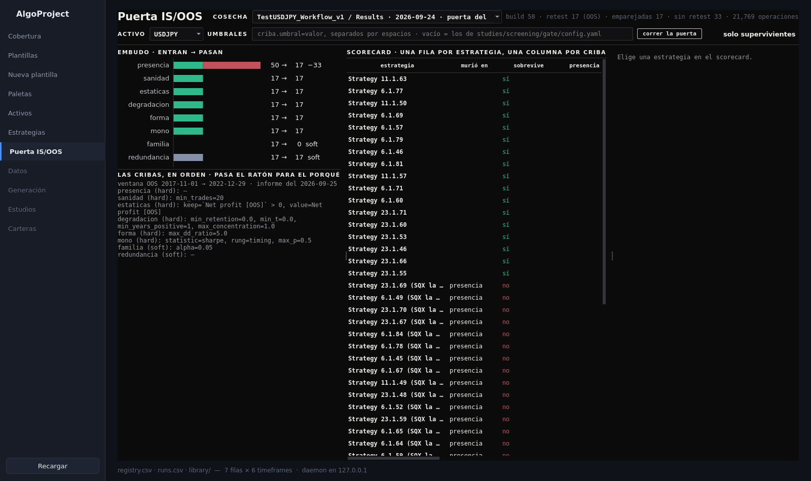
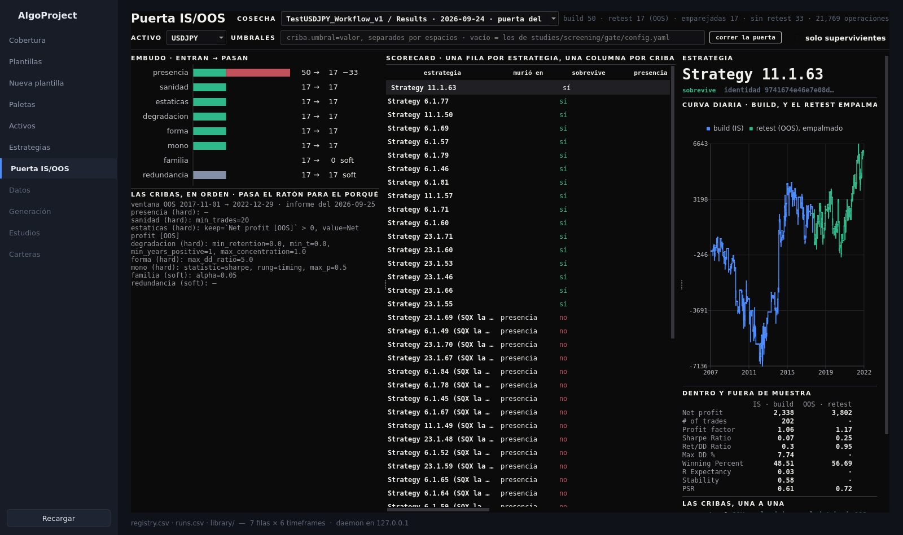

# 45. La aplicación de escritorio — la puerta IS/OOS

La zona del **paso 8** del workflow: el primer análisis dentro y fuera de muestra, el que pasa de
miles de estrategias a decenas. Enseña lo que la puerta (`studies.screening.gate.report`, manual `29-puerta.md`)
hizo con una cosecha, criba a criba y estrategia a estrategia, y la lanza con los umbrales a la
vista. Es el primer panel construido a partir del catálogo
`docs/AgentPDFs/catalogo-para-la-ui-2026-09-25.md` (sección 3.2); el resto del catálogo llegará
como paneles al lado de este.

### Qué pregunta responde

- **¿Qué cosechas hay y cuáles están juzgadas?** El desplegable de arriba lista cada cosecha de
  `AlgoData/harvest/` con la fecha de su puerta y el resultado (`120 → 45`), o «sin puerta
  todavía». Debajo, lo que la cosecha juntó: cuántas estrategias tenía el build, cuántas dejó
  SQX en el retest, cuántas emparejó por identidad y cuántas se quedaron sin retest.
- **¿Cuánta población mata cada criba?** El **embudo**: una barra por criba, a escala, verde lo
  que pasa y rojo lo que muere; gris las cribas *soft*, que miden y no eliminan. Es la cifra que
  más se olvida y aquí se lee de un vistazo. Al pasar el ratón, el porqué de la criba y sus
  umbrales.
- **¿Qué le pasó a cada estrategia?** El **scorecard**: una fila por estrategia con su identidad,
  su nombre en cada databank, en qué criba murió, si sobrevive, y el valor que cada criba midió
  en ella, en verde o en rojo. Se ordena por cualquier columna; «solo supervivientes» esconde a
  las muertas. Al pasar el ratón por un valor, la nota de la criba.
- **¿Cómo es esta estrategia dentro y fuera?** Al pulsar una fila: la curva diaria de los dos
  backtests (el retest empalmado al último nivel del build, como hace la puerta al pegar por
  retornos), diez métricas IS contra OOS lado a lado, y cada criba con su valor y su nota.

### Cuándo lo usas, y cuándo no

**Lo usas** justo después de una cosecha, para ver cuánto mata cada criba antes de decidir nada;
para buscar en qué criba cae una estrategia concreta; y para probar un umbral distinto sin tocar
`studies/screening/gate/config.yaml`: se escribe en la caja de umbrales y queda en el manifest del informe.

**No lo usas** para hacer la cosecha: eso es `studies.screening.gate.harvest` y toca el conductor (skill
`/oos-gate`), y la ventana no arranca SQX. Tampoco aplica el veredicto al databank: eso es
`/curate`. Y no decide qué umbrales son los buenos: los del fichero son laxos a propósito
(decisión del dueño, 2026-09-23) y están registrados en `ledger/thresholds.yaml`.

### Antes de empezar

- Una cosecha en `AlgoData/harvest/<proyecto>/<databank>/<día>/`: `python3 -m studies.screening.gate.harvest
  --project P --databank Results --oos-databank OOS`, manual `29-puerta.md`.
- El activo del proyecto en `assets/symbols/` con su `sqx_symbol`: la puerta necesita el feed
  para las barras del mono.
- La app abierta con `bin/algoui`, o `bin/algoui --zone "Puerta IS/OOS"`.

### Cómo se ejecuta

En la barra lateral, **Puerta IS/OOS**. Elegir la cosecha en el desplegable. Si ya tiene puerta,
se pinta todo; si no, el botón **correr la puerta** la lanza en segundo plano como hijo del
demonio. Sobre 120 estrategias tarda segundos; el mono con 2.000 corridas por estrategia es lo
que manda, y no toca SQX. Al terminar, el estado junto al botón pasa a «terminó» (o al código de
error, con el final de la salida en su tooltip) y la zona se recarga sola.

| control | qué hace |
|---|---|
| cosecha | qué cosecha se mira. Una cosecha juzgada varias veces enseña su puerta más reciente |
| activo | el símbolo cuyo feed leen las barras del mono. Se rellena desde el informe, o desde el nombre del proyecto |
| umbrales | overrides `criba.umbral=valor` separados por espacios, como `--set`. Vacío = `studies/screening/gate/config.yaml` |
| solo supervivientes | esconde las filas muertas del scorecard |

### Qué produce

Lo que produce `studies.screening.gate.report`, en `AlgoData/reports/<proyecto>/<databank>/<día de hoy>/gate/`:
`scorecard.parquet`, `funnel.csv`, `verdict.csv`, `verdict_build.csv`, `gate.md/.html/.json` y su
manifest, que apunta a la cosecha que juzgó y guarda los overrides. Un informe se fecha el día que
corre, no el de la cosecha; la ventana los une por ese manifest. Más el log del botón en
`AlgoData/logs/ui/`.

### Cómo se lee el resultado

Arriba, la cosecha y sus cuentas. A la izquierda, el embudo y debajo la lista de cribas con sus
umbrales y la ventana OOS del informe. En el centro, el scorecard. Un `murió en` vacío con
`sobrevive = no` no existe: toda muerta nombra su criba. Una estrategia con `— (SQX la tiró)`
como nombre murió en `presencia`: el retest no la tiene, y por eso no tiene nombre allí.

La ficha. La curva azul es el build, la verde el retest empalmado. Las métricas en dos columnas:
un `·` es una métrica que ese lado no exporta (la vista de SQX emite menos columnas OOS que IS).
Las cribas: verde pasa, rojo no pasa, gris *soft* con ✓/✗ informativo, y «no llegó» si murió antes.

### Un ejemplo completo

1. `bin/algoui --zone "Puerta IS/OOS"`. En cosecha, `TestUSDJPY_Workflow_v1 / Results ·
   2026-09-24`.
2. El embudo dice: 50 entran, 33 mueren en `presencia` (SQX no las dejó en el retest), y las 17
   restantes pasan todo. Con los umbrales laxos de hoy, la puerta solo tumba lo que SQX ya tumbó.
3. Escribir en umbrales `sanidad.min_trades=200 forma.max_dd_ratio=1.5` y pulsar **correr la
   puerta**. A los segundos, «terminó», y el desplegable muestra la puerta del día con el nuevo
   resultado; el embudo enseña dónde cayeron las que ahora mueren, y la línea de cribas lleva los
   overrides.
4. Pulsar una fila: la curva dice si el retest siguió subiendo o se aplanó, y las cribas de la
   derecha dicen con qué número.

### Qué NO te dice

- **No dice si un umbral es el bueno.** Enseña cuánta población mata; decidir el umbral es el
  paso que viene después, con la distribución delante, y se anota en `ledger/thresholds.yaml`.
- **No puede deshacer una selección previa.** Si el build ya filtró con el periodo OOS, todas las
  cribas leen inertes (`studies/screening/gate/README.md`). El embudo lo delata: nadie muere salvo en presencia.
- **No es el veredicto aplicado.** Hasta `/curate`, el databank de SQX sigue con todas.
- **La curva empalmada no es una cuenta real.** Cada lado fue su propio backtest desde su saldo;
  el empalme es para leer la forma, no el beneficio total.

### Si algo falla

- **El desplegable está vacío**: no hay ninguna cosecha en `AlgoData/harvest/`.
- **«falló» tras correr**: el tooltip del estado lleva las últimas líneas; el log entero en
  `AlgoData/logs/ui/`. Lo habitual es un `--set` mal escrito (la criba o el umbral no existen)
  o un feed sin barras en `AlgoData/bars/`.
- **El activo sale mal**: el nombre del proyecto no contiene ningún símbolo y no había informe
  previo. Elígelo a mano antes de correr.
