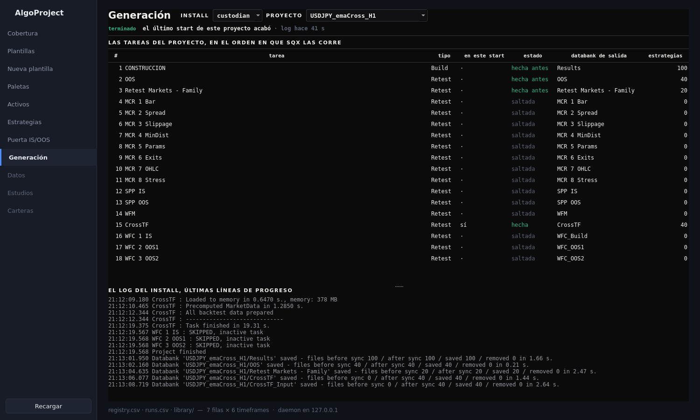

# 48. La aplicación de escritorio — generación, o por dónde va el proyecto

La zona que responde a «¿por dónde va lo que está corriendo?» sin abrir SQX ni molestarlo. Elige
un install y un proyecto y enseña, cada tres segundos, qué tarea está en marcha, qué porcentaje
lleva, qué tareas ya acabaron y cuántas estrategias tiene cada databank en disco. **Solo lee**:
dos ficheros y una carpeta del install. No arranca, no para, no reconfigura.

### Qué pregunta responde

- **¿Está corriendo, y qué?** La línea de estado: `CORRIENDO · tarea WFM · 40 %`, `terminado`,
  `otro proyecto corre` (el install está con otro) o `parado`. Al lado, hace cuántos segundos
  creció el log: si ese número sube y sube, SQX no escribe, y eso también es información.
- **¿Qué tareas tiene el proyecto y en qué estado?** La tabla, en el orden en que SQX las corre:
  tipo, si está activa en este `start` (lo que decide `stage`, manual `47-proyecto-workflow.md`),
  su estado, su databank de salida y cuántas estrategias hay ya en él.
- **¿Qué está haciendo exactamente ahora?** Las últimas líneas de progreso del log, tal cual las
  escribe SQX: «Loading backtest data…», «All backtest data prepared», «Task finished in 19 s».

### Cuándo lo usas, y cuándo no

**Lo usas** mientras corre un paso largo en el custodio, para no abrir SQX y no mandarle nada; y
al volver a una sesión, para ver qué acabó y qué no.

**No lo usas** para lanzar ni parar: no hay botón, a propósito. Arrancar y parar sigue siendo
`bin/sqx-worker.sh` y las skills, con las reglas de carriles de `sqx/CLAUDE.md`. Tampoco es un
recuento exacto del databank en curso: SQX escribe los `.sqx` al sincronizar, así que la salida de
la tarea que corre va con retraso hasta que guarda.

### Antes de empezar

Nada. Vale con el maestro abierto y con el custodio en mitad de un trabajo, porque no se le envía
ningún comando. Los installs son los de `config/machine.yaml`: conductor, custodio y maestro.

### Cómo se ejecuta

```bash
bin/algoui --zone "Generación"
```

O desde la barra lateral. Elegir el install y el proyecto; la zona se refresca sola cada tres
segundos mientras está a la vista y deja de leer cuando cambias de zona.

| control | qué hace |
|---|---|
| install | `custodian` (SQX_w2), `conductor` (SQX_w1) o `master`. El maestro solo se lee |
| proyecto | cualquier carpeta de `user/projects` de ese install con `project.cfx` |

### Qué produce

Nada. No escribe ni un fichero.

### Cómo se lee el resultado



Cada `start` de un proyecto es **un paso del workflow**: `stage` deja activa solo la tarea del paso
y SQX marca las demás como `SKIPPED, inactive task`. Por eso los estados son estos:

| estado | qué significa |
|---|---|
| **en curso** | la última tarea que escribe en el log; en negrita, y con su porcentaje arriba cuando SQX lo da |
| **hecha** | el log vio `Task finished` en este start |
| **hecha antes** | inactiva en este start, pero su databank tiene estrategias: la hizo un start anterior |
| **en cola** | activa en este start y aún no empezada |
| **saltada** | inactiva en este start y con el databank vacío |
| **inactiva** | apagada, sin start en marcha |

La columna «estrategias» son ficheros en disco. En la captura: `CONSTRUCCION` hizo 100, `OOS` dejó
40, el retest de mercados 20, y el `CrossTF` acaba de terminar en 19 s.

### Un ejemplo completo

1. Otra sesión lanza el paso 13 en el custodio con `/mcretest`.
2. `bin/algoui --zone "Generación"`, install `custodian`, proyecto `USDJPY_emaCross_H1`.
3. Arriba: `CORRIENDO · tarea MCR 3 Slippage · 62 %`. En la tabla, `MCR 1 Bar` y `MCR 2 Spread`
   en verde como hechas, `MCR 3` en negrita, `MCR 4` a `MCR 8` en cola. Debajo, el log diciendo
   «Loading backtest data for Main test».
4. Cuando la línea pase a `terminado`, los ocho databanks MCR tendrán su recuento.

### Qué NO te dice

- **Cuánto falta.** El porcentaje es el que SQX pone en el nombre del hilo, y no todas las
  tareas lo escriben; un build no tiene total conocido.
- **De quién es el start.** El log nombra el proyecto solo cuando el start llega por la API
  (`Starting project '…'`); un start desde la GUI del maestro no se atribuye hasta que guarda un
  databank (`knowhow/locations/log-names-project-only-via-cli.md`).
- **Si el resultado es bueno.** Solo cuenta ficheros.

### Si algo falla

- **«sin log de hoy»**: el install no ha escrito nada hoy; o no ha corrido nada o el log está en
  otra fecha. La zona solo lee el fichero del día.
- **«otro proyecto corre»**: no es un error. El install está ocupado con el proyecto que nombra.
- **El recuento no sube aunque corre**: normal hasta que SQX sincroniza el databank.
