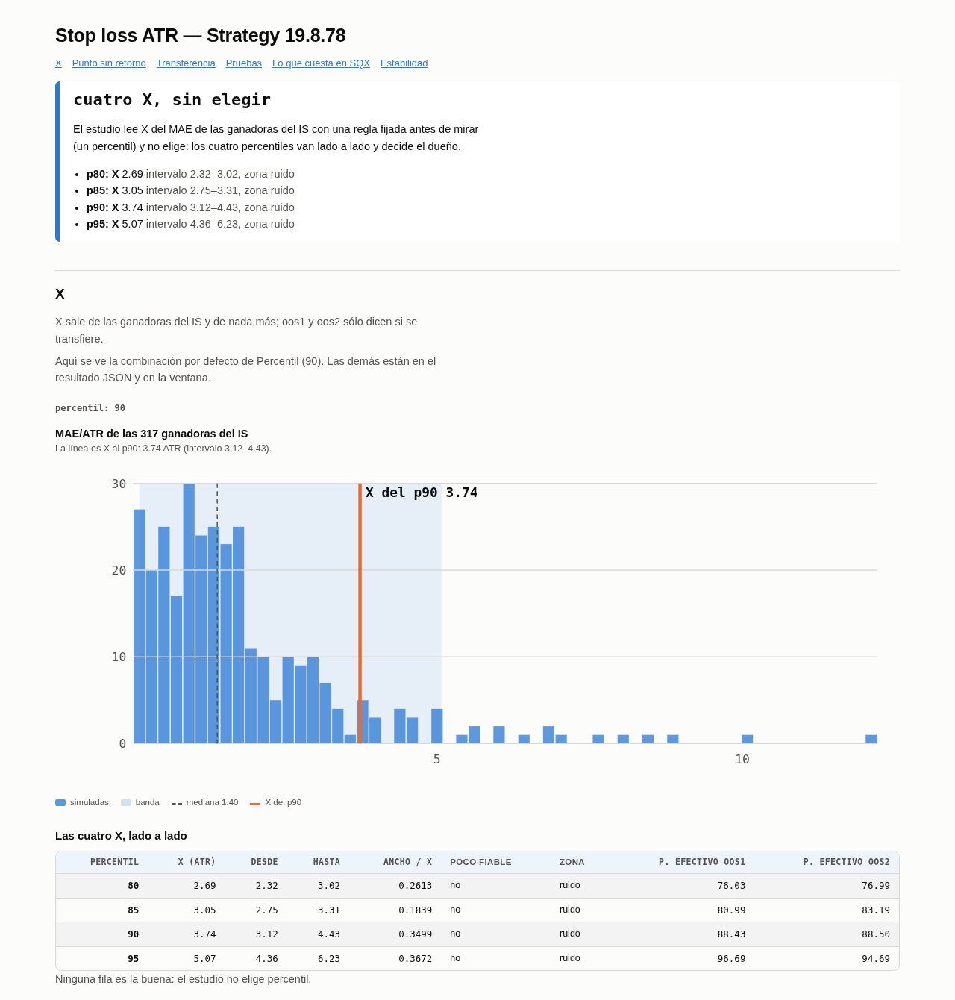
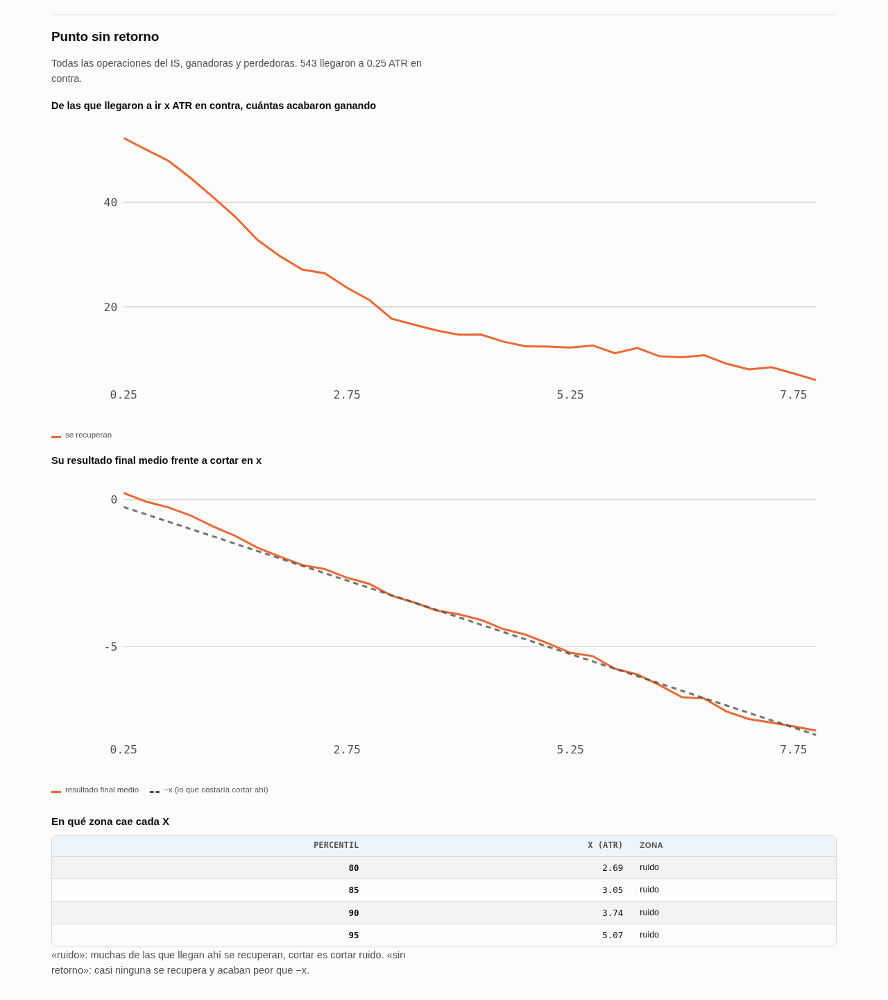
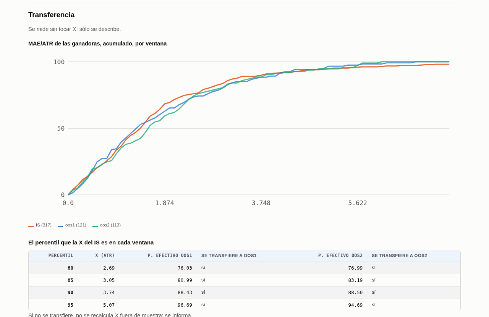
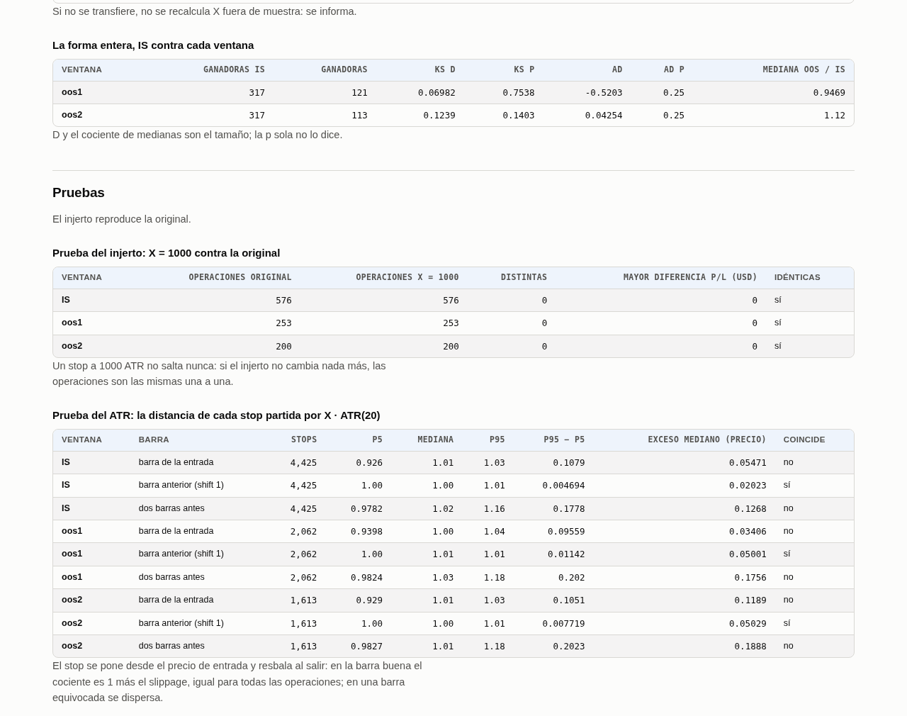
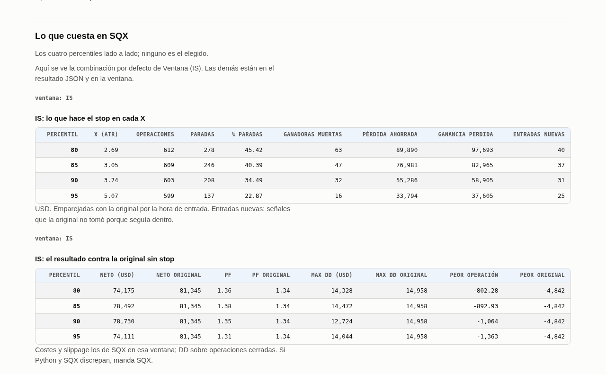
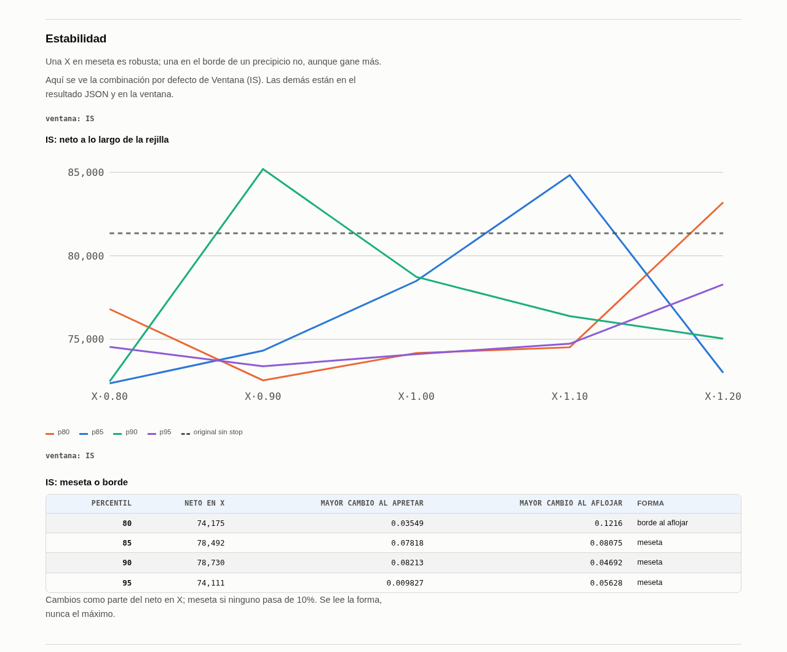

# 49. Stop loss ATR — el colchón que la estrategia no trae, leído de sus operaciones y sin optimizar

### Qué pregunta responde

La cadena construye **sin stop a propósito**: un stop es un parámetro más, y cada parámetro es sitio
para el sobreajuste. Pero para operar la estrategia hace falta uno. Este módulo pone
`SL = X · ATR(20)`, fijo al entrar, y **saca X de las operaciones con una regla fijada antes de
mirar**: el percentil 80, 85, 90 o 95 de lo que las operaciones **ganadoras del IS** llegaron a ir en
contra, medido en ATR. Luego SQX, con su spread y su slippage, dice lo que ese stop cuesta y si el
resultado es plano alrededor de X.

> *«No quiero que sea una optimización ni nada.»* — el dueño, 2026-09-26

**No elige nada.** Los cuatro percentiles salen uno al lado del otro y decides tú. Es el **paso 22**
del `WORKFLOW.md`, tras la exposición y antes de la cartera.

### Cuándo lo usas, y cuándo no

**Lo usas** sobre una estrategia que ya pasó la secuencia entera y va a operar: una, no una
población.

**No lo usas** para buscar el stop que más gana. Si te encuentras «probando un par de valores más»,
eso es otra cosa y hay que hablarlo. Tampoco lo uses para decidir si la estrategia tiene edge: el
stop se pone **sin cambiar la estrategia**, y lo esperable es que salte poco y cambie poco.

**No toca MT5**: nada de `StopsLevel` ni mínimos del bróker (dueño, 2026-09-26).

### Antes de empezar

1. `python3 -m core.assets XAUUSD` (regla dura 5): anota los costes provisionales que te enseña.
2. El `.sqx` de la estrategia **copiado fuera** de SQX, a una carpeta de `AlgoData`
   (`AlgoData/atrCalculator/<proyecto>/mothers/`). Sólo se lee.
3. Un **custom project** en el custodio con las tres patas WFC (regla dura 10). Si el estudio sólo
   lee el mercado principal, **sin los mercados adicionales**:

   ```bash
   python3 -m sqx.projects.builder ATRCalc_XAUUSD_M30_dev --template <plantilla.sqx> \
       --symbol XAUUSD --role custodian --timeframe M30 --workflow
   python3 -m sqx.projects.wfc XAUUSD --timeframe M30 --no-markets \
       --cfx ~/Desktop/SQX_w2/user/projects/ATRCalc_XAUUSD_M30_dev/project.cfx
   ```
4. **El custodio libre**: nadie más corriendo, el puerto 5070 caído, y una copia de
   `user/projects` antes de arrancar (regla dura 1). `execute` lo arranca y lo para él.

### Cómo se ejecuta

Dos pasadas de SQX en el mismo proyecto, con Python entre medias. Ningún export anterior tiene las
operaciones de IS, oos1 y oos2 a los costes de hoy, así que la primera pasada las produce.

```bash
W=~/Desktop/AlgoData/atrCalculator/ATRCalc_XAUUSD_M30_dev
P=ATRCalc_XAUUSD_M30_dev
LEGS="WFC_Build WFC_OOS1 WFC_OOS2"
COMMON="--project $P --databank $LEGS --feed XAUUSD_DukasM1_Infinox --symbol XAUUSD --timeframe M30"

# Pasada 1 — la original sin stop y la sonda X = 1000, en las tres ventanas
python3 -m sqx.variants.stopgrid --mothers $W/mothers --out $W/pass1
python3 -m sqx.variants.execute --work $W/pass1 --project $P          # ⏰ custodio, ~1 min
for d in $LEGS; do python3 -m sqx.export.export_retest --project $P --databank $d --role custodian; done
python3 -m studies.closing.atrCalculator.report $COMMON --work $W/pass1   # lee X y escribe stopgrid.csv

# Pasada 2 — la rejilla de estabilidad alrededor de cada X
python3 -m sqx.variants.stopgrid --mothers $W/mothers --out $W/pass2 \
    --grid $W/pass1/estudios/atrCalculator/stopgrid.csv
python3 -m sqx.variants.execute --work $W/pass2 --project $P          # ⏰ custodio, ~2 min
for d in $LEGS; do python3 -m sqx.export.export_retest --project $P --databank $d --role custodian; done
python3 -m studies.closing.atrCalculator.report $COMMON --work $W/pass2
```

Cada ejecución del informe **deja una fila en el ledger por tramo leído** (build, oos1, oos2), con `n_in = n_out` porque no elige nada. El oos2 está reservado para el WFC, el WFM y este paso 22 (`assets/_policy.yaml`, dueño, 2026-09-26): mirarlo lo gasta, y queda apuntado.

`studies.closing.atrCalculator.report`:

| flag | obligatorio | qué hace |
|---|---|---|
| `--project` | sí | el proyecto de donde salen los exports |
| `--databank` | sí | uno o varios: las tres patas WFC, o un export que ya cubra IS, oos1 y oos2. Lee el export más reciente de cada uno |
| `--family` | no | la familia de plantillas; junto con el activo y el timeframe nombra el estudio en el ledger. Si falta, el nombre del proyecto |
| `--feed` | sí | el feed del mercado principal; las operaciones de otros mercados se descartan |
| `--symbol` | sí | el activo de `assets/`: da el point value y las fechas de cada ventana |
| `--timeframe` | sí | el de la estrategia: el ATR se calcula sobre sus barras |
| `--strategy` | no | una sola; sin él, todas las del export |
| `--work` | no | el lote de `stopgrid`. Sin él sólo lee X (§2); con él añade las pruebas y lo que dice SQX |
| `--set` | no | `seccion.clave=valor` sobre `config.yaml`, p. ej. `--set grid.band=0.3` |

`sqx.variants.stopgrid`:

| flag | obligatorio | qué hace |
|---|---|---|
| `--mothers` | sí | carpeta con los `.sqx` sin stop; el nombre del fichero es el de la estrategia |
| `--out` | sí | carpeta del lote, en `AlgoData`. Deja `sqx/` y `manifest.parquet` |
| `--grid` | no | el `stopgrid.csv` del estudio. Sin él, sólo la original y la sonda X = 1000 |

El estudio en Python no toca SQX y tarda segundos (36 estrategias en 5,6 s, medido). Lo que tarda es
el custodio: una estrategia, 22 variantes y tres ventanas son un par de minutos.

### Qué produce

- `<lote>/sqx/S00V000.sqx` (la original, renombrada), `S00V001.sqx` (X = 1000) y `S00V002…` (la
  rejilla), más `manifest.parquet`: qué fichero es qué X. Se vacía al refabricar.
- `AlgoData/raw/<proyecto>/<pata>/<fecha>/trades.parquet`: las operaciones de cada pata.
  ⚠️ Un segundo export el mismo día **sobrescribe** el primero: corre el informe de la pasada 1 antes
  de exportar la 2.
- `<lote>/estudios/atrCalculator/estrategias/<estrategia>.json` y `.html` (lo que pinta la
  ventana), `stopgrid.csv` (las X de la rejilla) y `verdict.csv` con su `manifest.json`.
- Sin `--work`: lo mismo en `AlgoData/reports/<proyecto>/<databank>/<fecha>/atrCalculator/`.

### Cómo se lee el resultado

**X.** El histograma es lo que fueron en contra las ganadoras del IS, en ATR; la línea es la X del
percentil elegido en el selector. La tabla pone las cuatro con su **intervalo por bootstrap**: si el
ancho pasa de la mitad de X, sale «poco fiable» — con 60 ganadoras el p95 lo deciden las tres más
extremas.



**Punto sin retorno.** Arriba, de las operaciones del IS que llegaron a ir x ATR en contra, cuántas
acabaron ganando. Abajo, su resultado final medio contra −x, lo que costaría cortar ahí. Mientras la
línea naranja va por encima de la discontinua, cortar es perder dinero; cuando casi ninguna se
recupera **y** acaban peor que −x, esa zona es «sin retorno» y cortar ahí ahorra sin quitar nada.



**Transferencia.** Las tres curvas acumuladas de las ganadoras (IS, oos1, oos2). Si se tapan, X se
transfiere. La tabla dice qué percentil de las ganadoras de fuera es la X del IS («p. efectivo») y
el test de dos muestras con su tamaño: **D de KS** (0 = iguales) y el **cociente de medianas** (más
de 1 = fuera necesitaron más aire). La p de Anderson-Darling la recorta scipy entre 0,001 y 0,25.



**Pruebas.** Antes de leer nada de SQX: la sonda X = 1000 tiene que ser la original operación a
operación, y la distancia de cada stop partida por X·ATR tiene que ser 1 más el slippage **en la
barra anterior a la entrada** y dispersarse en las vecinas. Si alguna dice «no», lo demás no vale.



**Lo que cuesta en SQX.** Por ventana (selector): cuántas operaciones cierra el stop, cuántas eran
ganadoras en la original, la pérdida que ahorra y la ganancia que quita, las entradas nuevas (señales
que la original no tomó porque seguía dentro), y el neto, PF, drawdown y peor operación contra la
original.



**Estabilidad.** El neto a lo largo de `X·{0,8 0,9 1 1,1 1,2}` para cada percentil, con la original
de referencia. La forma la decide **tu puntuación**: 40 % PF + 30 % neto + 30 % DD máximo, cada uno
contra la original sin stop (el DD invertido, para que más sea mejor), de modo que 1 es «igual que sin
stop». «meseta» si la puntuación no se mueve más del 10 % de la de X a lo largo de la rejilla; si no,
en qué lado está el borde. Pesos y tolerancia en `config.yaml` (`shape.weights`, `shape.tolerance`).
Se lee la forma, **nunca el máximo**: la puntuación no ordena las X.



### Un ejemplo completo

`Strategy 19.8.78`, XAUUSD M30 (del `TestXAU_crossTF` del custodio), 2026-09-26. **No es una
superviviente**: es la estrategia de desarrollo. Pasada 1:

```
PROGRESS 100 2 variantes x 3 tramos, build: 2 en disco, oos1: 2 en disco, oos2: 2 en disco
XAUUSD_DukasM1_Infinox             1152 trades      (WFC_Build: 576 por estrategia)
```

| percentil | X (ATR) | desde | hasta | poco fiable | zona | p. efectivo oos1 | p. efectivo oos2 |
|---|---|---|---|---|---|---|---|
| 80 | 2.69 | 2.32 | 3.02 | no | ruido | 76.03 | 76.99 |
| 85 | 3.05 | 2.75 | 3.31 | no | ruido | 80.99 | 83.19 |
| 90 | 3.74 | 3.12 | 4.43 | no | ruido | 88.43 | 88.50 |
| 95 | 5.07 | 4.36 | 6.23 | no | ruido | 96.69 | 94.69 |

317 ganadoras en el IS, 121 en oos1, 113 en oos2. KS D 0,07 (oos1) y 0,12 (oos2), cociente de
medianas 0,95 y 1,12: **se transfiere en las dos**, los cuatro percentiles a menos de 5 puntos. Las
cuatro X caen en «ruido»: el resultado final medio de las que llegan a x va pegado a −x en todo el
recorrido, así que cortar ni ahorra ni cuesta en media — el stop es un colchón, no una fuente de
dinero, que es lo que se buscaba.

Prueba del injerto: IS 576/576, oos1 253/253, oos2 200/200, cero distintas. Prueba del ATR: en la
barra anterior a la entrada, p95 − p5 = 0,005 (IS), 0,011 (oos1), 0,008 (oos2), y el exceso mediano
0,020 / 0,050 / 0,050 es el slippage de cada ventana; las barras vecinas se dispersan 0,10–0,20.

Lo que dice SQX en X (neto original: IS 81.345, oos1 10.995, oos2 18.696 USD; peor operación
original −4.842, −4.924, −4.584):

| ventana | percentil | % paradas | ganadoras muertas | neto | PF (orig.) | peor operación |
|---|---|---|---|---|---|---|
| IS | 80 | 45 | 63 | 74.175 | 1,36 (1,34) | −802 |
| IS | 90 | 34 | 32 | 78.730 | 1,35 (1,34) | −1.064 |
| IS | 95 | 23 | 16 | 74.111 | 1,31 (1,34) | −1.363 |
| oos1 | 80 | 51 | 29 | 5.366 | 1,05 (1,10) | −814 |
| oos1 | 95 | 20 | 4 | 11.218 | 1,11 (1,10) | −1.380 |
| oos2 | 80 | 50 | 26 | 4.093 | 1,05 (1,26) | −729 |
| oos2 | 95 | 19 | 6 | 14.111 | 1,18 (1,26) | −1.316 |

El stop corta la peor operación de ~4.800 a ~800–1.400 USD en las tres ventanas. En el IS el neto
queda a un 3–9 % de la original y, con la puntuación 40/30/30, la forma es **meseta en los cuatro
percentiles** (puntuación en X entre 0,99 y 1,05). Fuera de muestra **ninguno es meseta**: la
puntuación en X cae a 0,73–1,08 en oos1 y 0,59–0,90 en oos2, y se mueve entre un 5 % y un 47 % a lo
largo de la rejilla. Con 200–250 operaciones por ventana, parte de ese movimiento es ruido.

### Qué NO te dice

- **Cuál elegir.** Ni el percentil ni la X. Lo decides tú mirando las cuatro.
- **Que el stop mejora la estrategia.** Se pone para cortar las colas y dejar aire, no para ganar
  más. Si en una ventana gana más con stop, no es un argumento para apretarlo.
- **Lo que haría en MT5.** Ni `StopsLevel` ni mínimos del bróker.
- **Nada sobre el edge.** Qué tests se repiten sobre la versión con stop lo decide el dueño.
- La etiqueta «meseta/borde» es tan buena como la tolerancia del 10 %, que es provisional hasta que
  fijes tus criterios. Mira las curvas, no sólo la palabra.

### Si algo falla

- **`Prueba del injerto: idénticas = no`.** El injerto cambió algo más que el stop, o la ventana de
  una pata no es la de la original. No leas nada más; revisa `sqx/variants/build/stoploss.py`.
- **`Prueba del ATR: coincide = no` en la barra anterior.** El ATR de Python no es el que SQX usó
  (otro timeframe, otras barras, otra sesión). Nada de X significa lo que dice.
- **`execute` se niega: «tiene activas …»**. Hay otras tareas encendidas: vuelve a pasar
  `python3 -m sqx.projects.wfc … --no-markets`, que deja sólo las tres patas.
- **`KeyError` con el nombre de la estrategia.** El `stopgrid.csv` nombra una estrategia que no está
  en `--mothers`: el nombre del `.sqx` tiene que ser el de la estrategia.
