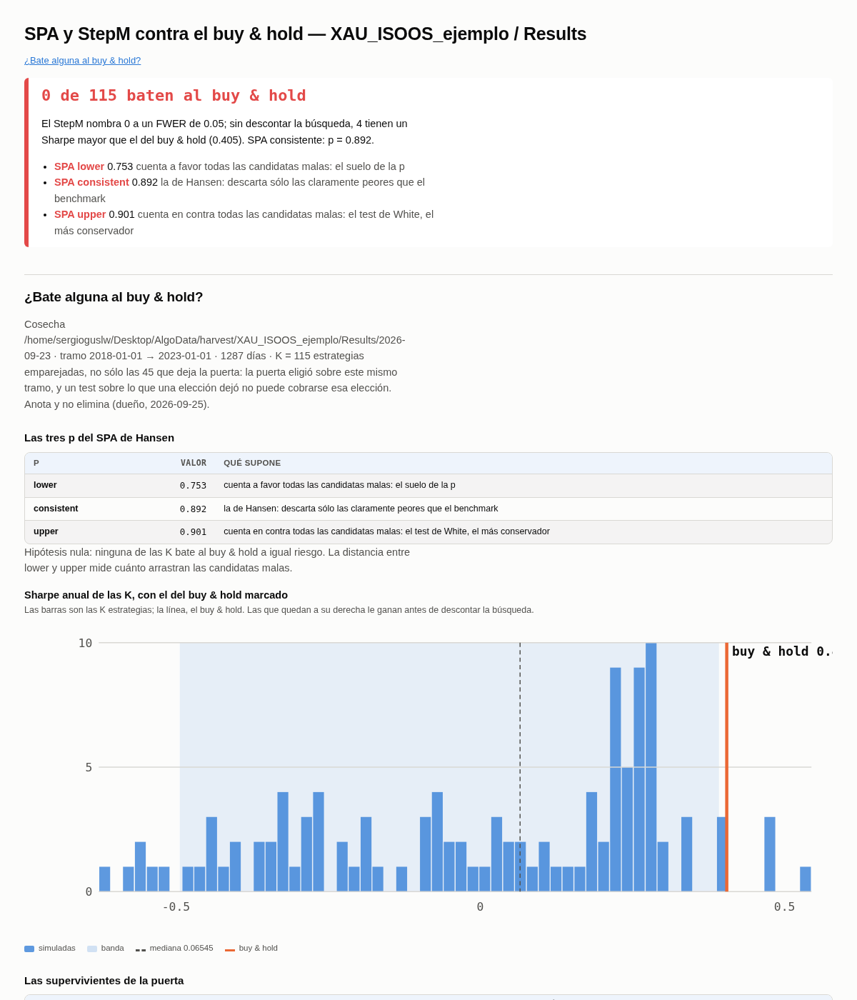
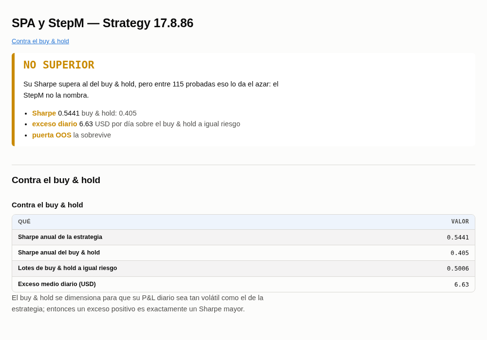

## 49. SPA y StepM — ¿bate alguna al buy & hold, pagando toda la búsqueda?

### Qué pregunta responde

La puerta OOS te dice qué estrategias pasan unas cribas. No te dice si alguna es **mejor que
comprar el activo y quedarte quieto**, una vez descontado que has probado muchas. Con 115
estrategias, alguna va a batir al oro por pura suerte; la pregunta es si alguna lo bate **más de lo
que la suerte explica**.

Lo contestan dos tests clásicos, uno detrás del otro:

- **SPA de Hansen** — *¿alguna de las K bate al buy & hold?* Da una p para la población entera.
- **StepM de Romano y Wolf** — *¿cuáles, en concreto?* Nombra estrategias, controlando la
  probabilidad de nombrar aunque sea una que no lo merece (el **FWER**, 0,05).

### Cuándo lo usas, y cuándo no

**Lo usas** justo después de la puerta OOS (paso 8), sobre la misma cosecha. Va dentro de la skill
`/oos-gate`, como paso 2b.

**No corta nada.** Decisión tuya del 2026-09-25: **anota y no elimina** hasta que veas cuánto
cortaría. Su `verdict.csv` dice MANTENER para todas, así que pasárselo a `/curate` no mueve nada.

**No sustituye al CSCV** (paso 18). El CSCV mira las variantes de *una* madre y pregunta si tu forma
de elegir parámetros sobreajusta. Esto mira *K estrategias distintas* y pregunta cuáles baten al
benchmark. Son preguntas distintas.

### Antes de empezar

Tienen que existir la cosecha y la puerta **sobre esa misma cosecha**:

1. `python3 -m studies.screening.gate.harvest ...` (paso 1 de `/oos-gate`)
2. `python3 -m studies.screening.gate.report ...` (paso 2)

Si la puerta más reciente juzgó otra cosecha, el comando se niega y te dice cuál. No toca SQX: se
puede correr con todo abierto.

### Cómo se ejecuta

```bash
python3 -m studies.screening.snoopingScreen.report --project XAU_ISOOS_ejemplo --databank Results \
    --feed XAUUSD_DukasM1_Infinox --symbol XAUUSD --timeframe M30 --family DirectionalMomentum
```

| flag | obligatorio | qué hace |
|---|---|---|
| `--project` | sí | el proyecto, como en SQX |
| `--databank` | sí | el databank de construcción sobre el que corrió la puerta (`Results`) |
| `--feed` | sí | el feed de SQX: de ahí sale el precio del buy & hold |
| `--symbol` | sí | el fichero de activo: la ventana `oos1` y el valor del punto |
| `--timeframe` | sí | sólo para el ledger: identifica el estudio |
| `--family` | sí | sólo para el ledger. **Usa la misma familia que ya tenga el estudio** (`python3 -m ledger.report` la lista), o la mirada se apunta en un estudio nuevo |
| `--set` | no | cambia un mando de `config.yaml`, p. ej. `--set stepm.fwer=0.10` |

Tarda **~5 segundos** con 115 estrategias. Salida real:

```
PROGRESS 5 115 estrategias contra el buy & hold
PROGRESS 100 0 de 115 baten al buy & hold

SPA  lower 0.753  consistent 0.892  upper 0.901   (bloque medio 8 días)
StepM a FWER 0.05: 0 de 115 · Sharpe del buy & hold 0.405
ledger: XAUUSD_M30_DirectionalMomentum paso 8 -> /home/sergioguslw/Desktop/AlgoData/reports/XAU_ISOOS_ejemplo/Results/2026-09-25/snoopingScreen
```

⚠️ **Cada ejecución escribe una fila en el ledger**, porque cada una es una mirada más al `oos1`.
Correrlo dos veces sobre lo mismo cuenta dos miradas.

### Qué produce

En `~/Desktop/AlgoData/reports/<proyecto>/<databank>/<día>/snoopingScreen/`:

| fichero | qué es |
|---|---|
| `snoopingScreen.html` / `.md` / `.json` | la población: las tres p, el histograma, las supervivientes de la puerta, lo que nombra el StepM |
| `estrategias/<nombre>.html` / `.json` | la ficha de cada estrategia |
| `table.parquet` | una fila por estrategia: Sharpe, exceso diario, lotes del buy & hold, si el StepM la nombra |
| `verdict.csv` | todas MANTENER, con la columna `superior` |
| `manifest.json` | qué cosecha juzgó y con qué mandos |

Y una línea en `~/Desktop/AlgoData/ledger/<estudio>.jsonl`, paso 8, sobre `oos1`.

### Cómo se lee el resultado



**Arriba, el veredicto**: cuántas nombra el StepM de las K. Aquí, **0 de 115**.

**Las tres p del SPA.** Las tres responden a lo mismo —«ninguna bate al buy & hold»— y difieren en
cómo tratan a las estrategias claramente peores que el oro:

| p | qué supone | aquí |
|---|---|---|
| `lower` | todas las malas cuentan a favor: el suelo | 0,753 |
| `consistent` | **la que se lee**: descarta sólo las claramente peores | 0,892 |
| `upper` | todas en contra: la más conservadora | 0,901 |

Una p pequeña (menor que 0,05) diría que *alguna* le gana al oro de verdad. 0,89 dice que lo que se
ve se explica de sobra por haber probado 115.

**El histograma** es el Sharpe anual de las 115, con el del **buy & hold marcado con la línea**
(0,405). Las barras a la derecha de la línea le ganan *antes* de descontar la búsqueda: aquí son 4, y
las 4 están entre las 45 que deja la puerta.

**La ficha de una estrategia:**



- **SUPERIOR** (verde): el StepM la nombra.
- **NO SUPERIOR** en ámbar: su Sharpe supera al del oro, pero con 115 probadas eso lo da el azar.
  Es el caso de `Strategy 17.8.86`: Sharpe 0,544 contra 0,405, y aun así no se puede nombrar.
- **NO SUPERIOR** en rojo: ni siquiera le gana al oro antes de corregir.

### Lo que decide cada elección, dicho claro

**¿Buy & hold de qué tamaño?** A **igual riesgo** (lo elegiste el 2026-09-25): a cada estrategia se
la compara con el oro comprado en la cantidad que hace que su P&L diario sea igual de volátil que el
de ella. Así, un exceso positivo es **exactamente** un Sharpe mayor que el del oro. Con «la misma
cantidad» o «todo el capital» el oro estaría dentro el 100 % del tiempo contra una estrategia que
está dentro un 7 %, y entre 2018 y 2022 el test mediría cuánto subió el oro, no la estrategia. Es el
mismo `equal_risk` del paso 21 (`38-exposicion.md`).

**¿Por qué K = 115 y no las 45 de la puerta?** Porque la puerta eligió mirando este mismo tramo. Si
el test sólo viera las 45 que ganaron la elección, no podría cobrarse esa elección, y saldría
optimista. Por eso prueba las 115 emparejadas y marca cuáles pasaron la puerta.

**Lo que no puede ver.** Lo que SQX probó y nunca guardó en el databank. Ese número lo lleva el
ledger (`43-ledger.md`), no este test.

### Cómo sé que funciona

`python3 tests/test_snooping.py` fabrica datos cuya respuesta se conoce:

```
ok: sobre ruido el StepM nombra a alguien en 0 de 20 semillas (FWER 0.05); el edge plantado sale
nombrado en 20 de 20; y a igual riesgo un exceso positivo es exactamente un Sharpe mayor que el del
buy & hold
```

Sobre ese mismo ruido, un t-test ingenuo estrategia a estrategia «encuentra» algo en **15 de 20**
semillas. Esa diferencia es lo que este test te ahorra.

### Los mandos (`studies/screening/snoopingScreen/config.yaml`)

| mando | valor | qué hace |
|---|---|---|
| `study.segment` | `oos1` | el tramo; el mismo que lee la puerta |
| `benchmark.sizing` | `equal_risk` | el buy & hold a igual riesgo |
| `stepm.fwer` | `0.05` | tu umbral; también está en `ledger/thresholds.yaml` |
| `bootstrap.reps` | `1000` | remuestreos del bootstrap |
| `bootstrap.seed` | `0` | fija: la misma cosecha nombra siempre las mismas |
