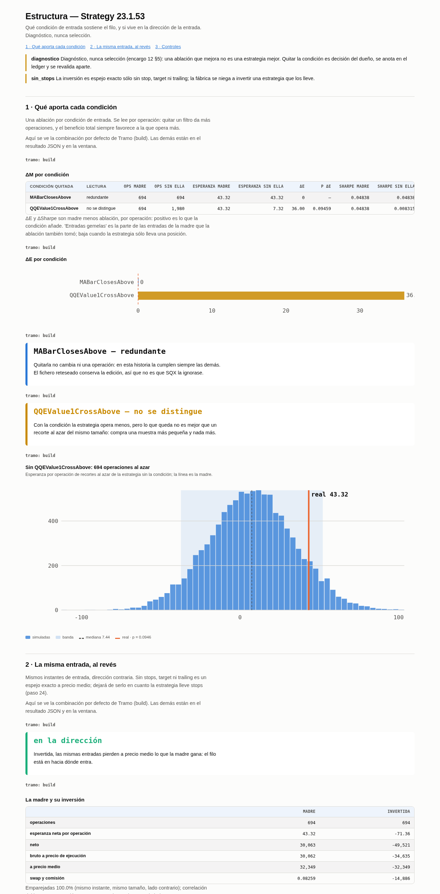

# 51. Estructura — qué condición sostiene el filo, y si vive en la dirección de la entrada

### Qué pregunta responde

Coge una estrategia superviviente y le quita **una condición de entrada cada vez** (ablación), y
aparte le da **la vuelta a la orden** dejando las entradas donde están (inversión). Te dice qué
condición aporta de verdad por operación, cuál no hace nada y si lo que gana la estrategia depende de
hacia dónde entra. Es el paso 23 del workflow, después del mapa condicional (22) y antes del stop ATR (24).

### Cuándo lo usas, y cuándo no

Con una estrategia que ya pasó los pasos 1–21, para entender de qué está hecho su resultado.

**No** sirve para elegir. Una ablación que sale mejor que la madre no es una estrategia mejor que
adoptar: es una condición que no aportaba. Quitarla es decisión tuya, se anota en el ledger y se
revalida aparte (encargo 12 §5). Tampoco sirve con estrategias que ya llevan stop, target o trailing:
la fábrica se niega a invertirlas, porque la vuelta sólo es un espejo sin ellos.

### Antes de empezar

1. `python3 -m core.assets USDJPY` en verde (regla dura 5). Hoy los costes de USDJPY son
   **provisionales**: spread 0.1, slippage 0.05, comisión 0, swap largo 0 y corto −10.4 puntos/noche.
2. El `.sqx` de la madre **copiado fuera de SQX**, a `AlgoData/structural/<proyecto>/mothers/`. El
   nombre del fichero es el de la estrategia. Mejor la copia del databank `OOS`: guarda el resultado
   OOS y así el control de identidad tiene con qué compararse.
3. Un **proyecto custom** en el custodio con las tres patas WFC (regla dura 10):

   ```bash
   python3 -m sqx.projects.builder USDJPY_structural_v1 \
       --template ~/Desktop/AlgoData/templates/library/emaCloseAbove/template.sqx \
       --symbol USDJPY --role custodian --timeframe H1 --workflow \
       --session-from ~/Desktop/SQX_w2/user/projects/USDJPY_emaCross_H1/project.cfx
   python3 -m sqx.projects.wfc USDJPY --timeframe H1 \
       --cfx ~/Desktop/SQX_w2/user/projects/USDJPY_structural_v1/project.cfx
   ```
4. **El custodio libre**: nadie corriendo, puerto 5070 caído, y una copia de `user/projects` antes de
   arrancar (regla dura 1). `execute` lo arranca y lo para él.

### Cómo se ejecuta

Cinco comandos. Sólo el segundo toca SQX.

```bash
W=~/Desktop/AlgoData/structural/TestUSDJPY_Workflow_v1/batch1
P=USDJPY_structural_v1
python3 -m sqx.structural.make --mothers ~/Desktop/AlgoData/structural/TestUSDJPY_Workflow_v1/mothers --out $W
python3 -m sqx.variants.execute --work $W --project $P            # ⏰ custodio, ~2 min
python3 -m sqx.structural.keep --work $W                          # ¿SQX corrió lo que se fabricó?
for d in WFC_Build WFC_OOS1; do python3 -m sqx.export.export_retest --project $P --databank $d --role custodian; done
python3 -m studies.readings.structure.report --work $W --project $P \
    --databank WFC_Build WFC_OOS1 --feed USDJPY_DukasM1_the5ers --symbol USDJPY
```

`sqx.structural.make`:

| flag | obligatorio | qué hace |
|---|---|---|
| `--mothers` | sí | carpeta con los `.sqx` de las madres; una tanda para todas |
| `--out` | sí | carpeta del lote en `AlgoData`. Se vacía `sqx/` al refabricar |

`studies.readings.structure.report`:

| flag | obligatorio | qué hace |
|---|---|---|
| `--work` | sí | el lote de `make`, ya corrido y con `keep` hecho |
| `--project` | sí | el proyecto custom donde se reteseó |
| `--databank` | sí | las patas que se leen. **`WFC_OOS2` se rechaza**: `oos2` está reservado al WFC y a la WFM, y esto es el paso 23 |
| `--feed` | sí | el feed del mercado principal; los mercados adicionales se ignoran |
| `--symbol` | sí | el activo: da el point value y la comprobación del ledger |
| `--set` | no | `seccion.clave=valor` sobre `config.yaml`, p. ej. `--set verdict.alpha=0.01` |

Fabricar y leer tardan un par de segundos. Lo que tarda es el custodio: cuatro ficheros por tres
patas y diez mercados, unos dos minutos.

### Qué produce

- `<lote>/sqx/S00O00.sqx` (la madre reconstruida), `S00A01…` (una ablación por condición),
  `S00I00.sqx` (la inversión) y `structure.parquet`: qué es cada fichero y qué contiene de verdad.
- `<lote>/retested/<pata>/` y `retained.parquet`: los ficheros que devolvió SQX y si conservan la edición.
- `AlgoData/raw/<proyecto>/<pata>/<fecha>/trades.parquet`: las operaciones de cada pata.
- `<lote>/estudios/structure/estrategias/<estrategia>.json` y `.html`, `verdict.csv` y `manifest.json`.

⚠️ `execute` exporta también el panel de `oos2` (`retest_oos2.csv`). No lo abras: el estudio no lo lee.

### Cómo se lee el resultado



**Pestaña 1, qué aporta cada condición.** Todo va **por operación**: quitar un filtro da más
operaciones y el beneficio total siempre favorece a la que opera más. ΔE es la esperanza de la madre
menos la de la ablación: lo que la condición añade. `p ΔE` compara la madre con recortes al azar, del
mismo tamaño, de la estrategia sin la condición. Las lecturas:

| lectura | qué quiere decir |
|---|---|
| aporta | la condición elige operaciones mejores que un recorte al azar (p < 0.05) |
| no se distingue | opera menos, pero lo que queda no es mejor que recortar al azar |
| resta | sin ella la esperanza por operación es mayor. No se adopta: se anota y se revalida aparte |
| redundante | quitarla no cambia ni una operación, y SQX sí corrió el fichero sin ella |
| no es un filtro | sin ella opera igual o menos: era una rama de un OR, no un recorte |
| no aplicada | SQX devolvió un fichero distinto del fabricado: esa fila no se lee |

**Pestaña 2, la inversión.** "A precio medio" es el movimiento sin spread, reconstruido de las dos
operaciones emparejadas: la madre y su inversión son espejo exacto ahí. Lo que separa los netos es el
spread (lo paga cada lado) y el swap. "En la dirección" quiere decir que el filo está en hacia dónde
entra la estrategia.

**Pestaña 3, controles.** Sin los tres en verde no hay lectura: SQX conservó cada edición, alguna
ablación cambia el número de operaciones, y la madre reconstruida reproduce un resultado que su fichero
guardaba.

### Un ejemplo completo

`Strategy 23.1.53` de `TestUSDJPY_Workflow_v1`, USDJPY H1, 2026-09-26. Elegida por ser la de mejor
OOS de las tres madres USDJPY (364 operaciones, PF 1.30) y la más simple: `EMA(50) close above` (la
condición fija de la plantilla) AND `QQE(14) Value1 cruza por encima de 57.72`, salida a las 24 barras.

```
$ python3 -m sqx.structural.make --mothers .../mothers --out .../batch1
variant_id         strategy      kind               block direction   ok
    S00A01 Strategy 23.1.53  ablation    MABarClosesAbove         1 True
    S00A02 Strategy 23.1.53  ablation QQEValue1CrossAbove         1 True
    S00I00 Strategy 23.1.53 inversion                            -1 True
    S00O00 Strategy 23.1.53  identity                             1 True
1 madre(s) -> 4 ficheros en .../batch1/sqx

$ python3 -m sqx.variants.execute --work .../batch1 --project USDJPY_structural_v1
PROGRESS 100 4 variantes x 3 tramos, build: 4 en disco, oos1: 4 en disco, oos2: 4 en disco
```

Lo que devolvió SQX (panel de cada pata):

| fichero | build: ops / neto | oos1: ops / neto |
|---|---|---|
| S00O00 madre reconstruida | 694 / 30,062.63 | 364 / 35,062.48 |
| S00A01 sin `MABarClosesAbove` | 694 / 30,062.63 | 364 / 35,062.48 |
| S00A02 sin `QQEValue1CrossAbove` | 1,980 / 14,491.26 | 1,050 / 23,991.39 |
| S00I00 invertida | 694 / −49,520.95 | 364 / −49,031.31 |

La lectura (tramo oos1):

```
| condición quitada   | lectura     | ops madre | ops sin ella | esp. madre | esp. sin ella | ΔE    | p ΔE  |
| MABarClosesAbove    | redundante  | 364       | 364          | 96.33      | 96.33         | 0     | —     |
| QQEValue1CrossAbove | aporta      | 364       | 1,050        | 96.33      | 22.85         | 73.48 | 0.031 |
inversión: en la dirección — emparejadas 100 %, a precio medio +36,609 / −36,609
controles: pass — la madre reconstruida = el OOS guardado (364 / 35,062.48)
```

Qué dice, en cristiano:

- **La condición fija de la plantilla no hace nada en esta estrategia.** Con el QQE cruzando 57.72,
  el precio ya está siempre por encima de la EMA(50): quitarla da las mismas 694 y 364 operaciones.
  No es que SQX ignorase la edición: el fichero reteseado ya no tiene el bloque.
- **El QQE es el que aporta**, pero sólo se distingue del azar en oos1 (p 0.031); en build, p 0.095.
- **El filo está en la dirección**: invertida, las mismas entradas pierden a precio medio exactamente
  lo que la madre gana. El neto invertido (−49,521) pierde más porque además paga spread y el swap
  de los cortos (−14,886 en build).

### Qué NO te dice

- **No te dice qué estrategia usar.** Es diagnóstico. "Redundante" no es "bórrala": en otra historia
  la EMA podría filtrar algo.
- **No mide interacciones.** Quita las condiciones de una en una; dos que se tapan entre sí salen las
  dos como poco útiles.
- **No mira `oos2`**, a propósito.
- **Los costes son provisionales** (defaults de SQX, comisión cero): el ΔE compara dos estrategias con
  los mismos costes, así que se sostiene; el neto no.
- Sólo condiciones de **entrada**. Las salidas son otra prueba, y este corpus no tiene señales de salida.

### Si algo falla

- `PermissionError: ledger: el paso 23 no puede mirar oos2` — has puesto `WFC_OOS2` en `--databank`. Quítalo.
- `el lote no es el plan` (make) o `SQX no conservó la edición` (keep) — un fichero no contiene lo que
  debía. No leas nada de ese lote: es el fallo de `OPEN.md` §9.
- `exit formulas [...]: inversion is only a mirror without stops` — la madre ya lleva stop o target.
  Este paso va antes del 24; con stops no hay inversión.
- No sale ninguna ablación — la señal de entrada tiene una sola condición: sin ella no quedaría
  regla de entrada, y la fábrica no la fabrica. Sólo salen la identidad y la inversión.
