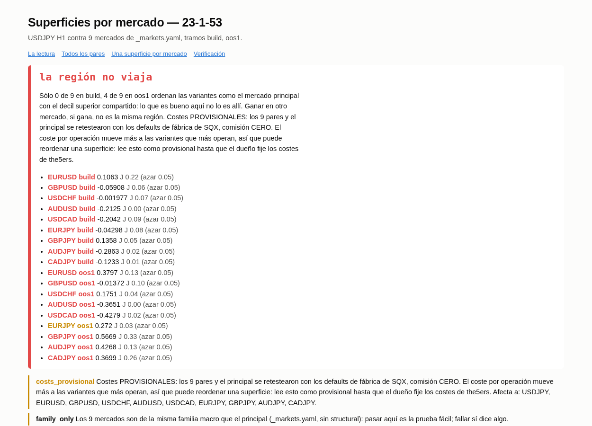
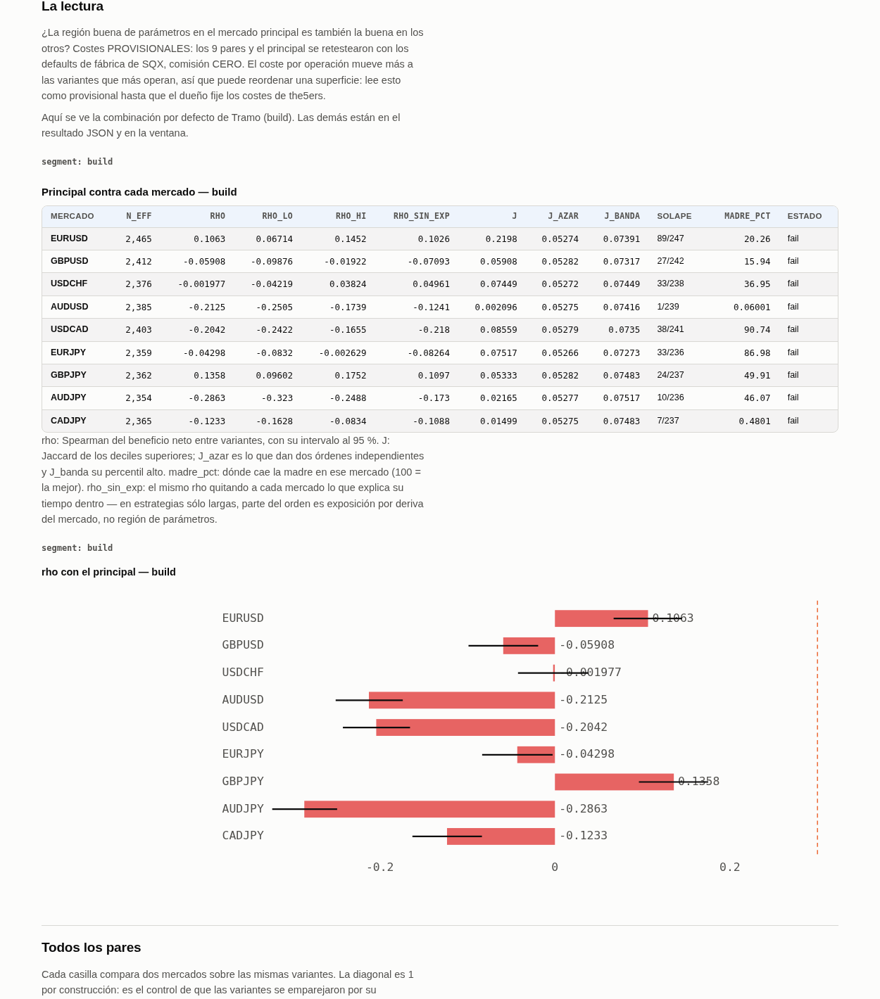
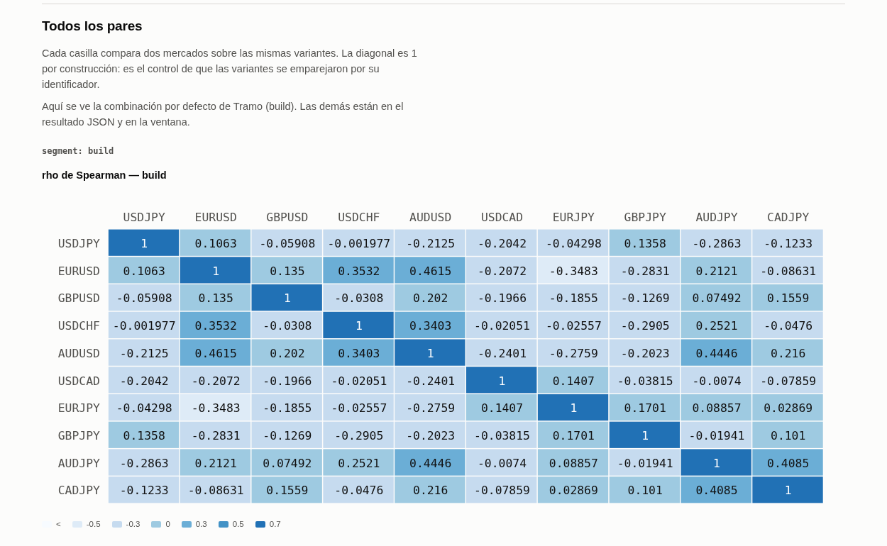

## 52. Superficies por mercado — ¿la región buena de parámetros es la misma en otros mercados?

> ⚠️ **Costes provisionales.** Todo lo que sale de este comando hoy (2026-09-26) está calculado con
> los costes de fábrica de SQX en los 9 pares y en USDJPY, **comisión cero**. Cada resultado lo lleva
> marcado (`costs_provisional`), en la primera pestaña, en el veredicto y en los avisos. Léelo como
> provisional hasta que fijes los costes de the5ers.

### Qué pregunta responde

Que una estrategia gane en otro mercado es poca prueba: puede estar simplemente comprada en algo
que se parece. Que **la misma zona de parámetros** sea la buena en dos mercados distintos es mucha
más, porque eso no lo produce la suerte de un backtest.

El lote de variantes del paso 16.5 ya se retesteó en los 9 mercados de `assets/_markets.yaml`. Este
comando hace, para cada tramo (`build` y `oos1`), **una superficie por mercado** —el beneficio neto
de cada variante en ese mercado— y compara las superficies de dos en dos con dos números:

- **rho** (Spearman): ¿los dos mercados **ordenan** las variantes igual? 1 = mismo orden, 0 = nada
  que ver, −1 = al revés.
- **J** (Jaccard del decil superior): de las **mejores** variantes (el 10 % de arriba) de cada
  mercado, ¿qué parte son las mismas? Dos órdenes al azar ya comparten algo: J ≈ 0,053. Por eso la
  tabla trae siempre `J_azar` y `J_banda` al lado.

Y termina en una decisión para el paso 20: **la región viaja**, **viaja a medias** o **no viaja**.

### Cuándo lo usas, y cuándo no

**Lo usas** en el paso **18.5**, al mismo nivel que el WFC (17) y el CSCV (18): consume el mismo lote
del 16.5, y su resultado se lee junto a ellos, a ciegas, en el paso 20. Es gratis: no toca SQX.

**No lo usas** para elegir una variante, ni para decidir que el edge funciona en otro mercado
(eso es el crossmarket, `39-crossmarket-lote.md`): aquí sólo se pregunta si **el orden** viaja.

**No lee `oos2`.** Está reservado para el WFC y el WFM, y el ledger lo rechaza antes de abrir ningún
fichero. Si quieres que este paso entre en el grupo del `oos2`, es decisión tuya: se añade a
`reserved_for` en `assets/_policy.yaml`.

### Antes de empezar

Un lote de variantes retesteado **con los cross-checks de mercado**. El retest del 16.5 los lleva
por defecto: `wfc.markets: true` en `assets/_build.yaml` hace que `sqx.projects.wfc` meta los 9
mercados en cada una de las tres tareas, y `sqx.variants.equity` / `collect` dejan en el lote:

- `segments.parquet` — métricas por variante, mercado y tramo (de aquí sale la superficie)
- `metrics.parquet` — las variantes que lee el WFC
- `equity.parquet` y `equity_markets.parquet` — las curvas diarias (sólo para verificar)

SQX puede estar abierto o cerrado: no se le habla.

### Cómo se ejecuta

```bash
python3 -m studies.optimisation.marketSurfaces.report \
    --work ~/Desktop/AlgoData/profiling/variantes-2026-09-25/real/23-1-53 \
    --family TestUSDJPY_Workflow_v1 \
    --out ~/Desktop/AlgoData/profiling/variantes-2026-09-25/marketSurfaces/23-1-53
```

| flag | obligatorio | qué hace |
|---|---|---|
| `--work` | sí | la carpeta del lote de variantes |
| `--family` | sí | la familia de plantillas del lote; con el activo y el timeframe forma el estudio del ledger |
| `--out` | no | dónde escribir; si no lo pones, `<work>/estudios/`, como el WFC |
| `--set clave=valor` | no | cambia un ajuste de `config.yaml` para esa ejecución (p. ej. `--set rho_floor=0.4`) |

**Cuánto tarda** (medido el 2026-09-26 sobre los tres lotes de USDJPY, 5.000 variantes × 10
mercados × 2 tramos): **9,4 a 12,0 s** y **2,2 a 2,4 GB** de memoria como pico. El fichero de curvas
por mercado (228 millones de filas) nunca se carga entero: se lee mercado a mercado y tramo a tramo.

### Qué produce

En la carpeta de `--out`:

| fichero | qué es |
|---|---|
| `marketSurfaces.html` / `.md` / `.json` | el informe: la lectura, las dos matrices, una superficie por mercado, la verificación |
| `pairs.csv` | cada par de mercados de cada tramo: n, n_eff, rho con su intervalo, rho_neutral, J, J_azar, J_banda |
| `checks.csv` | las comprobaciones de la verificación |
| `verdict.csv` + `manifest.json` | la llamada de la madre, y qué lote se juzgó |

Y **una fila en el ledger por tramo** (paso 18.5): cuántos mercados y cuántas variantes se miraron.
Mirar mercados también es buscar; sin esa cuenta, un resultado bonito no se puede interpretar.

### Cómo se lee el resultado



Arriba, la llamada y un punto por mercado y tramo. Debajo, la tabla que la justifica:



| columna | qué es |
|---|---|
| `n_eff` | variantes con un resultado distinto: dos combinaciones que dan el mismo backtest cuentan una vez |
| `rho`, `rho_lo`, `rho_hi` | el orden compartido y su intervalo al 95 % |
| `rho_sin_exp` | el mismo rho quitando a cada mercado lo que explica su **tiempo dentro** (ver abajo) |
| `J`, `J_azar`, `J_banda` | solape de los mejores, lo que daría el azar y su techo |
| `solape` | cuántas del decil superior comparten, de cuántas |
| `madre_pct` | dónde cae la estrategia original en ese mercado (100 = la mejor de todas) |
| `estado` | `pass`, `watch` o `fail` |

Un par **pasa** cuando el intervalo entero del rho está por encima de **0,30** (el mismo suelo del WFC)
**y** el J supera la banda del azar. Se piden los dos porque fallan distinto: dos mercados pueden
coincidir en qué variantes son **malas** (rho alto) y no compartir ninguna de las buenas (J al azar),
y eso no es una región buena compartida. Un par **falla** cuando el intervalo entero está por debajo
de 0,30.

La madre recibe:

- **la región viaja** — en cada tramo pasan al menos la mitad de los 9 mercados.
- **la región no viaja** — en ningún tramo llegan a la mitad.
- **viaja a medias** — en un tramo sí y en otro no.

El denominador son **siempre los 9 declarados**. Un mercado declarado que falte en el lote cuenta
como no superado, nunca como ausente.

Las matrices enseñan todos los pares, no sólo contra USDJPY:



⚠️ **`rho_sin_exp`, léelo siempre al lado.** Las estrategias son sólo largas, así que parte de su
beneficio es «cuánto tiempo está dentro» por «cuánto subió el mercado». Dos mercados que se movieron
en sentidos contrarios ordenan las variantes **al revés** sólo por eso. Ejemplo real, madre 23-1-46,
`oos1`: contra GBPJPY el rho es **+0,62**, y sin la exposición **−0,06**. Ese «pasa» era exposición,
no región. La llamada usa el rho bruto (la métrica del WFC, como pediste); si prefieres que use el
limpio, es una línea — dilo.

### Un ejemplo completo — las tres madres de USDJPY

```
$ python3 -m studies.optimisation.marketSurfaces.report --work .../real/23-1-53 --family TestUSDJPY_Workflow_v1 --out ...
PROGRESS 5 USDJPY: build, oos1 permitidos por el ledger
PROGRESS 30 4999 variantes x 10 mercados
PROGRESS 100 la región no viaja — {'build': 0, 'oos1': 4}
[watch] Costes PROVISIONALES: ... Afecta a: USDJPY, EURUSD, GBPUSD, USDCHF, AUDUSD, USDCAD, EURJPY, GBPJPY, AUDJPY, CADJPY.
segment market  n_eff    rho  rho_lo  rho_hi  rho_neutral     j    j0  j_hi  origin_pct state
  build EURUSD   2465  0.106   0.067   0.145        0.103 0.220 0.053 0.074      20.264  fail
  build AUDUSD   2385 -0.213  -0.251  -0.174       -0.124 0.002 0.053 0.074       0.060  fail
  ...
   oos1 EURUSD   2320  0.380   0.344   0.414        0.309 0.126 0.053 0.074      99.620  pass
   oos1 GBPJPY   2361  0.567   0.539   0.594        0.464 0.331 0.053 0.075      64.093  pass
   oos1 AUDJPY   2312  0.427   0.393   0.460        0.370 0.126 0.053 0.074      93.059  pass
   oos1 CADJPY   2301  0.370   0.334   0.405        0.300 0.259 0.053 0.074      32.306  pass
WALL 12.02 s  PEAK_RSS 2198856 KB
```

| madre | build | oos1 | llamada | lo que cambia sin la exposición |
|---|---|---|---|---|
| 23-1-53 | 0 de 9 | 4 de 9 (EURUSD, GBPJPY, AUDJPY, CADJPY) | **no viaja** | lo mismo: los cuatro siguen por encima de 0,30 o rozándolo |
| 23-1-46 | 0 de 9 | 2 de 9 (GBPJPY, CADJPY) | **no viaja** | los dos «pasa» se caen a ≈ 0: eran exposición |
| 6-1-69 | 1 de 9 (USDCAD) | 0 de 9 | **no viaja** | lo mismo |

**La decisión:** en las tres madres, la zona de parámetros buena en USDJPY **no** es la buena en los
demás pares — y los 9 son de la misma familia macro, la prueba fácil. Si alguna de ellas gana en otro
mercado en el crossmarket, no es «la misma región» y no cuenta como prueba de que el edge sea
estructural. El coste de la lectura: ninguna estrategia se descarta aquí; es un dato más para el
paso 20. Con costes provisionales.

**Verificación** (obligatoria, en la pestaña «Verificación» y en `checks.csv`):

| madre | curva diaria sumada contra beneficio de SQX (27 celdas) | C3 del WFC contra la superficie | contra el mercado equivocado | diagonal |
|---|---|---|---|---|
| 23-1-53 | rho mínimo 0,9969 | idéntico (0 $) | como mucho 0,44 | 20 de 20 = 1 |
| 23-1-46 | rho mínimo 0,9931 | idéntico | como mucho 0,58 | 20 de 20 = 1 |
| 6-1-69 | rho mínimo 0,9988 | idéntico | como mucho 0,49 | 20 de 20 = 1 |

USDJPY no está entre los 9 mercados, así que la comprobación del encargo («la columna del mercado
principal de `equity_markets` = `equity.parquet`») se hace de la otra forma: cada curva diaria de
cada mercado, sumada por tramo, contra el beneficio neto que SQX guardó para esa celda. **Los
dólares no tienen por qué cuadrar** —en EURUSD `build` la curva queda 474 $ por debajo en la
mediana— pero el orden sí, y eso es lo que se usa. Un emparejamiento equivocado daría lo que dice
la columna «contra el mercado equivocado», no 0,99.

### Qué NO te dice

- **Nada de `oos2`.** No lo lee.
- **Si el edge paga en otro mercado.** Sólo si el orden de las variantes viaja. Con costes de fábrica
  y comisión cero, además, el nivel del beneficio no vale nada; el orden algo más, pero un coste por
  operación distinto castiga más a las variantes que más operan, y puede reordenar.
- **Nada estructural.** Los 9 son de la familia de USDJPY (`_markets.yaml` no tiene `structural`
  para USDJPY). Pasar aquí es la prueba fácil; fallar sí dice algo.
- **Intervalos exactos.** Las variantes del diseño están agrupadas (vecindad, factorial, cobertura),
  así que el intervalo del rho y la banda del J son algo más estrechos de lo que deberían. Por eso la
  llamada se apoya en un tamaño (0,30), no en un p-valor.

### Si algo falla

- **`PermissionError: ledger: el paso 18.5 no puede mirar oos2`** — has pedido `oos2` con `--set`.
  Es la puerta de un solo sentido funcionando; no se ha leído nada.
- **Aviso `market_absent`** — un mercado de `_markets.yaml` no está en el lote: el retest se hizo sin
  él (por ejemplo, porque le faltaban costes en `assets/symbols/`). Cuenta como no superado.
- **Aviso `verification`** — alguna curva no ordena como su beneficio, o la diagonal no es 1: la
  superficie puede no ser del mercado que dice. No leas el resultado; revisa la cosecha del lote.
