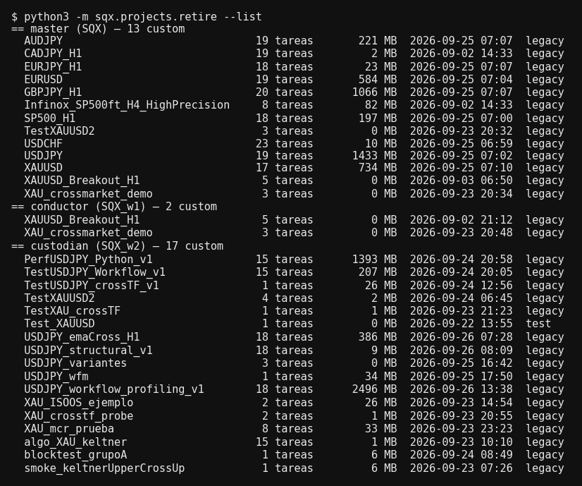
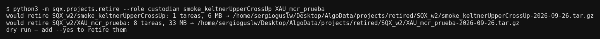

## 55. Retirar proyectos — quitar de SQX los custom projects que ya respondieron

### Qué pregunta responde

¿Qué custom projects hay en cada instalación, cuántas tareas tiene cada uno, cuánto ocupa y para qué
se creó? Y, cuando uno ya no sirve, lo quita de SQX sin perder su configuración: el `project.cfx` se
guarda comprimido en AlgoData y la carpeta desaparece de `user/projects`.

### Lo normal: no haces nada

**Cada lunes a las 03:00** (la noche del domingo al lunes) el agente `projectJanitor` pasa solo
(`bin/weekly-project-cleanup.sh`, en el crontab). Aplica la regla de `sqx/projects/sweep.py`:

| se retira | se queda |
|---|---|
| todo proyecto `Test_` de w1 y w2 | todo proyecto `Trade_` |
| todo proyecto antiguo de **menos de 10 tareas** (un workflow entero tiene 15-18) | lo tocado en las últimas 24 h |
| lo que tú apuntes en `AlgoData/projects/retire-queue.txt` | todo lo de una instalación encendida |
| | del máster, todo lo que no esté en la cola |

Antes de retirar, el agente busca señales de vida que la regla no ve: un encargo abierto que nombre
el proyecto, una línea de `OPEN.md`, o un ledger o un pipeline escritos esa semana. Si encuentra
alguna, se queda con la duda y no lo toca. No arranca, no para ni consulta ningún SQX.

Te deja el resumen en `audit/AAAA-MM-DD-proyectos.md`: qué se fue, qué se quedó y por qué, y
cuánto disco se liberó. El log está en `AlgoData/logs/weekly-project-cleanup.log`.

**Para que se lleve un proyecto concreto**, incluido uno del máster, añade una línea a la cola:

```
custodian USDJPY_emaCross_H1
master    XAU_crossmarket_demo
```

Una vez retirado, su línea desaparece de la cola.

### Cuándo lo usas a mano, y cuándo no

- **Al terminar una tarea que creó un proyecto `Test_`.** Quien lo crea, lo retira. Es la regla.
- **Cuando `--list` enseña proyectos de pocas tareas** que quedaron de pruebas sueltas.
- **No** para un proyecto `Trade_`: ese se queda hasta que tú digas.
- **No** en el máster, salvo un proyecto que tú hayas nombrado.
- **No** para "hacer sitio" en un proyecto que se va a volver a correr: vacía sus databanks, no lo
  borres.

Lo que un run encontró **no vive en el proyecto**. Métricas, trades, curvas y veredictos ya están en
parquet en `AlgoData/raw/`, `harvest/` y `reports/`, y retirar el proyecto no los toca. Lo único que
se pierde son las estrategias de los databanks. Si quieres conservar las de la última prueba (la
WFM), añade `--keep WFM`.

### Antes de empezar

- **La instalación del proyecto tiene que estar parada.** Un SQX encendido tiene el proyecto en
  memoria y lo reescribiría al salir (regla dura 4). El comando lo comprueba y se niega si no lo
  está: el puerto en los workers, cualquier proceso que corra desde `~/Desktop/SQX` en el máster.
- **Nadie puede estar usándolo.** Si el proyecto cambió hace menos de 60 minutos, el comando se
  niega, porque puede haber otra sesión cosechándolo.

### Cómo se ejecuta

Ver qué haría el pase semanal si corriera ahora (no toca nada):

```bash
python3 -m sqx.projects.retire --sweep
```

Ver qué hay:

```bash
python3 -m sqx.projects.retire --list
```

Retirar (sin `--yes` solo dice lo que haría):

```bash
python3 -m sqx.projects.retire Test_XAU_keltner_humo --role custodian          # prueba en seco
python3 -m sqx.projects.retire Test_XAU_keltner_humo --role custodian --yes    # de verdad
python3 -m sqx.projects.retire Trade_XAU_keltner_H1 --role custodian --keep WFM --yes
```

| flag | obligatorio | qué hace |
|---|---|---|
| nombres | para retirar | uno o varios proyectos de la misma instalación |
| `--list` | no | lista los custom projects de las tres instalaciones y no toca nada; es lo que hace sin nombres |
| `--role` | no | `custodian` por defecto; `conductor` o `master` |
| `--keep` | no | un databank que se guarda junto al `.cfx`, p. ej. `--keep WFM`; se puede repetir |
| `--sweep` | no | aplica la regla semanal a las tres instalaciones; con `--yes`, la ejecuta |
| `--yes` | no | lo hace de verdad. Sin él, prueba en seco |

Tarda segundos y no arranca SQX.

### Qué produce

- `~/Desktop/AlgoData/projects/retired/<instalación>/<proyecto>-<fecha>.tar.gz`: el `project.cfx`
  y los databanks de `--keep`.
- La carpeta `<instalación>/user/projects/<proyecto>` **se borra**.
- En `~/Desktop/AlgoData/projects/registry.csv` la fila del proyecto queda con la fecha de retiro y
  la ruta del archivo. Si el proyecto era anterior al registro, se le añade una fila.

### El registro y los nombres

Desde el 2026-09-26, `sqx.projects.builder` solo acepta dos prefijos:

- **`Test_...`**: una prueba de funcionamiento. Se retira en cuanto ha respondido.
- **`Trade_...`**: un proyecto con intención de dar frutos reales. Se queda.

Además pide `--purpose "una frase"`. Cada proyecto que crea deja una fila en `registry.csv`: nombre,
tipo, instalación, fecha, propósito, símbolo, timeframe, plantilla y si lleva el workflow entero.
En `--list`, la columna `legacy` marca los proyectos anteriores a esta regla.

### Cómo se lee el resultado



Cada fila es un proyecto: nombre, tareas, tamaño en disco, último cambio, tipo y propósito (si está
registrado). Con el workflow entero, un proyecto tiene 15 a 18 tareas. **Uno de 1 a 5 tareas es una
prueba suelta**, y es lo primero que conviene retirar.



La prueba en seco dice, por proyecto, cuántas tareas y megas se van y a qué archivo irían.

### Un ejemplo completo

1. `python3 -m sqx.projects.retire --list`: ves `smoke_keltnerUpperCrossUp` en el custodio, con
   1 tarea y 6 MB.
2. Compruebas que el custodio está parado (`bin/sqx-worker.sh --role custodian status`) y que
   ninguna otra sesión lo está usando.
3. `python3 -m sqx.projects.retire smoke_keltnerUpperCrossUp --role custodian`: la prueba en seco.
4. Lo mismo con `--yes`. La carpeta desaparece y su `.cfx` queda en
   `AlgoData/projects/retired/SQX_w2/smoke_keltnerUpperCrossUp-<fecha>.tar.gz`.

Para recuperarlo: `tar xzf <archivo> -C ~/Desktop/SQX_w2/user/projects/`, con el custodio parado.
Vuelve con su configuración y sin estrategias (salvo las de `--keep`).

### Qué NO te dice

- **Si un proyecto sigue haciendo falta.** El número de tareas y la fecha orientan, pero no saben si
  una ficha de knowhow cita ese proyecto como ejemplo. La ficha sigue siendo válida porque los datos
  están en parquet, aunque el proyecto ya no esté en SQX.
- **Si otra sesión lo va a usar mañana.** La guarda de 60 minutos solo protege lo que se está
  moviendo ahora.

### Si algo falla

- `the custodian is up ...`: el worker está encendido. Páralo con `bin/sqx-worker.sh --role
  custodian stop`, pero solo si no hay nadie más usándolo.
- `... changed less than 60 min ago`: alguien lo está tocando. Mira `ListAgents` y el log del día.
- `... is a stock project`: `Builder`, `Retester` y los demás de serie no se retiran nunca.
